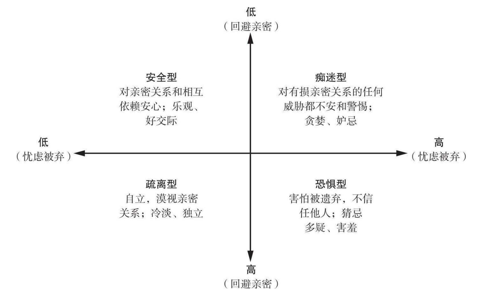
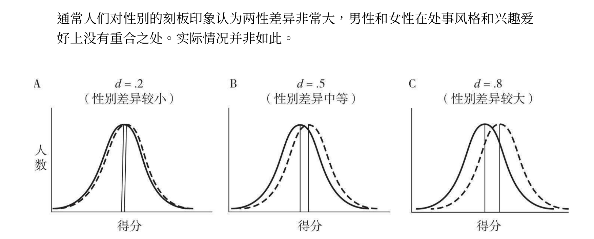
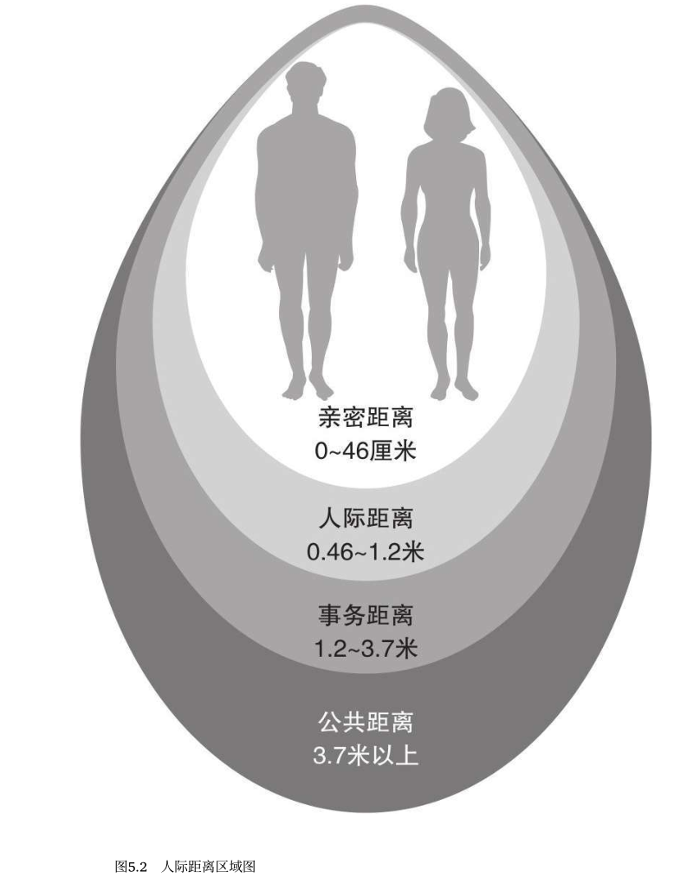
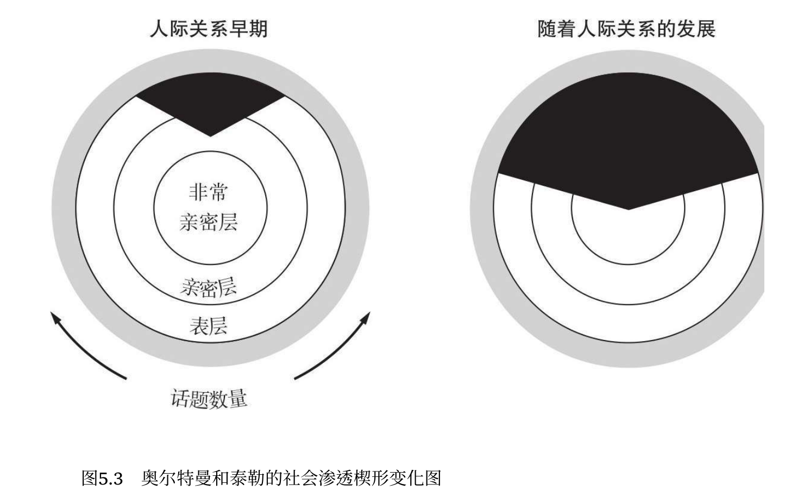
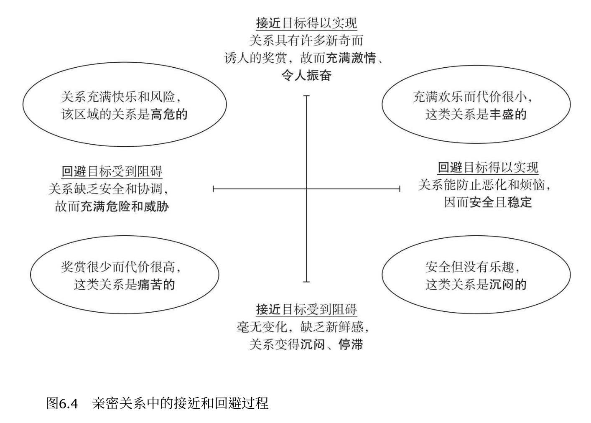
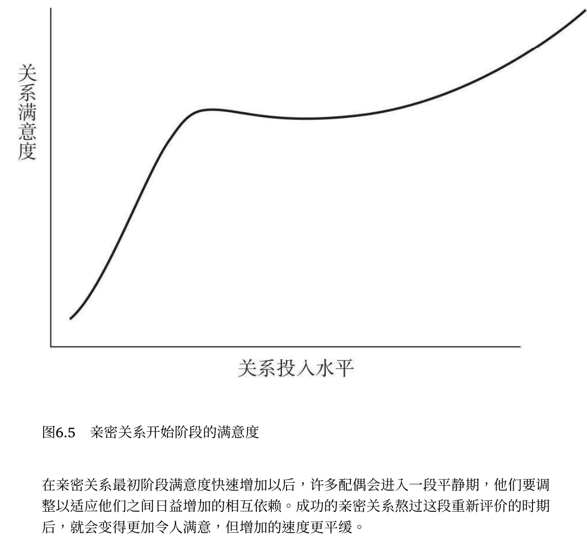
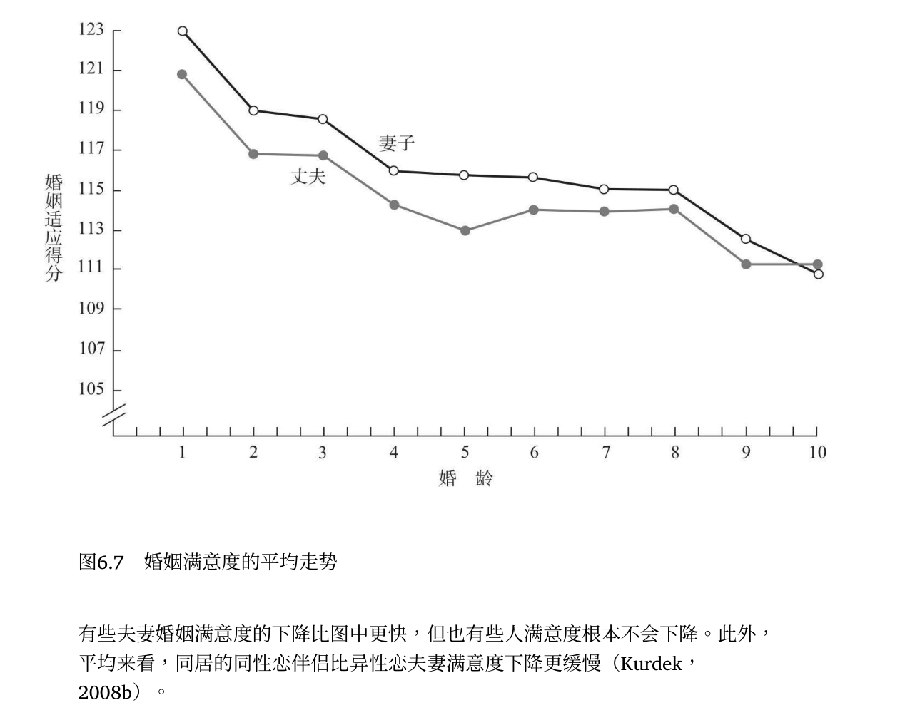
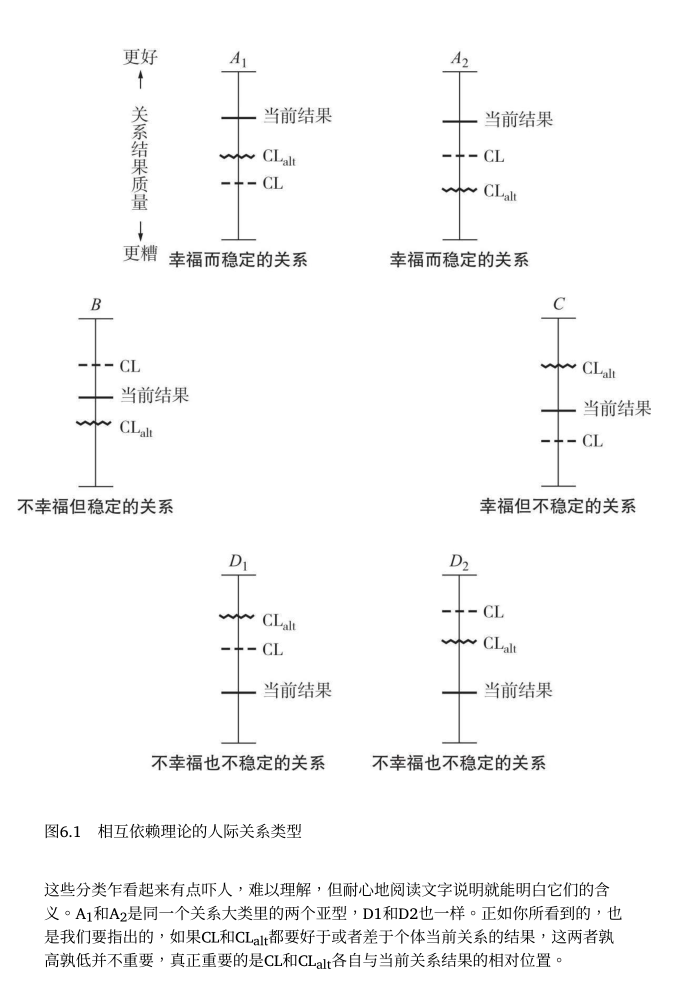
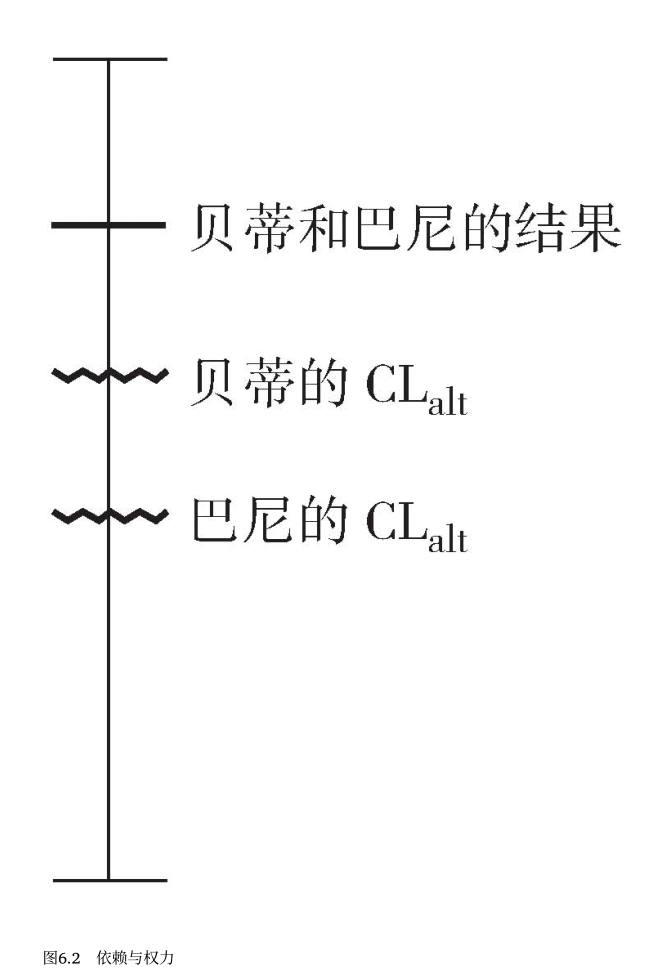
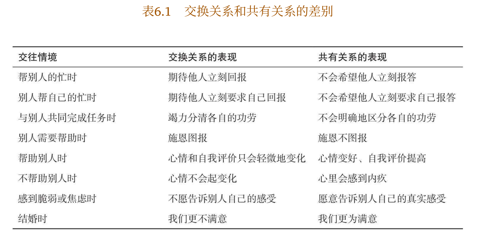

# 人际关系的构成(第一章)

## 幸福的六大方面

- 1.了解

    - 他们熟知彼此的经历、爱好、情感和心愿，而且一般不会把这些信息透露给其他人

- 2.关心

    - 亲密的伴侣关心对方，彼此能从对方身上感受到更多的关爱

- 3.相互依赖性

    - 一方的行为会影响另一方的行为目标和行动能力。亲密伴侣的相互依赖性是指他们彼此需要的程度和影响对方的程度，这种相互依赖是频繁的（经常影响彼此）、强烈的（彼此都有显著的影响）、多样的（以多种不同的方式影响彼此）和持久的（彼此影响的时间很长）。人际关系变得相互依赖时，一方的行为在影响自己的同时也会影响对方

- 4.一致性

    - 由于这种紧密的联系，亲密伴侣常认为他们是天造地设的一对，而不是两个完全分离的个体。他们表现出很高的相互一致性，这意味着他们认同双方在生活上的融合，自称为“我们”，而不是“我”和“他/

- 5.信任

    - 使得亲密关系易于保持的另一个特点是信任，期望对方会善待和尊重自己

        - 人们相信亲密关系不会带来伤害，并期望伴侣能满足自己的要求，关注自己的幸福

        - 如果丧失了这种信任，亲密伴侣也常常会变得猜忌与疑虑，以致损害亲密关系特有的开朗、坦诚和相互依赖

- 6.承诺

    - 希望他们的关系能持续到地老天荒，并为此不惜投入大量的时间、人力和物力

- 这六个方面未必全部出现在亲密关系中，任何一个要素都可以单独出现于亲密关系之中。例如，一对单调乏味、缺少情趣的夫妻可能相互依赖的程度很高，在日常生活的琐事上紧密合作，但却生活在缺少关爱、坦诚或信任的心理荒漠中。他们当然比一般的熟人要亲密，但毫无疑问，他们会觉得彼此不如过去那般亲密了（比如他们决定结婚时），那时他们的关系中存在更多的亲密成分。

## 归属需要

- 人类是非常社会化的动物。如果剥夺了和他人的紧密接触，这会令人很痛苦，人类社会属性的核心部分正是对亲密关系的需要。

    - 这也是监狱有时用单独监禁来惩罚犯人的原因。

- 具有亲密关系的人较之单身生活的人更幸福、健康、 长寿

    - 相形之下，缺乏亲密关系可能会导致各种健康问题

- 归属需要也和我们伴侣是谁并无太大的关系，只要他们能给予我们持续的关爱和包容，我们的归属需要就能得到满足。

    - 因而，即使一段重要的亲密关系终结，我们也往往能找到替代伴侣（尽管新人和旧人有很大的差别），而且能满足我们的归属需要

## 影响人际关系的因素

- 相比1960年代初期

    | 行为         | 趋势     |
    |--------------|----------|
    | 结婚         | 越来越少 |
    | 结婚的年龄   | 越来越大 |
    | 同居         | 越来越多 |
    | 未婚生育     | 越来越多 |
    | 离婚         | 越来越多 |
    | 全职家庭主妇 | 越来越少 |
    | 单身主义     | 越来越多 |

    - 离婚率在高学历的人中已经缓慢下降

    - 单身主义：

        - 大多数单身人士的确渴望拥有爱侣；只有少数单身者（4%）喜欢一个人过

        - 但有些独身者，他们并非是不正常的孤独者：

            - 某些独身者有着积极的社交活动和紧密、支持式的友谊，这给他们提供了所期待的亲密感情。他们之所以不成家，是因为看重独身的自由和自立。他们认为并非所有人都需要稳定的伴侣或知音

    - 经济的影响：

        - 社会工业化程度越高、越富足，就越能 接纳单身、包容离婚和支持晚婚

        - 结婚率在赤贫人群中却在下降，没有稳定的收入人们并不愿意结婚

    - 西方个人主义的影响：

        - 这种对自我实现的重视会让我们期望从亲密关系中 获取比上一辈更多的东西——更多的快乐和享受，更少的麻烦和付出。而 与上一代不同（他们往往会“为了孩子”而勉强生活在一起），我们只要对 婚姻不满意，就会理直气壮地结束夫妻关系，重新追求满意的亲密关系

    - 东方集体主义的影响：

        - 人们与家庭和社会团体的联系更为紧密。集体文化国家（如日本）的离婚率比美国低得多

    - 新科技的影响：

        - 妇女还能掌控生育，只在她们愿意时生小孩

    - 性别比率的影响：

        - 高性别比率的社会(男多女少)：

            - 倾向于支持老式、传统的两性性别角色，即男主外女主内，妻子在家相夫教子，丈夫外出工作养家。这种文化形态在性生活上也相对保守。理想的新娘应该是处女，未婚先孕让人蒙羞，公开同居几乎绝迹。妇女更早结婚，离婚不受欢迎。

            - 原因：妇女稀缺。假若某男幸运地得到某女的芳心，他当然想长相厮守。方法之一是鼓励该女子成为家庭主妇，从而使她在经济上要依赖丈夫；方法之二是反对离婚（这正是20世纪60年代的情形）

            - 维多利亚 时期的英格兰性别比率高，以贞洁守礼而著称

        - 低性别比率的社会(女多男少)：

            - 倾向于颠覆传统，也更为宽容。鼓励妇女外出工作以自立，默许（虽不提倡）婚外性关系的存在。如果不慎怀孕，成为未婚妈妈也无可厚非

            - 原因：妇女过剩，男人就不太想被一个女人拴住。这样，妇女就得工作，推迟结婚，不满意的话还可方便地离婚。

            - 古罗马时代性别比率低，以骄奢淫逸而闻名

            - 美国喧嚣的20世纪20年代性别比率低，是随心所欲、恣意寻欢的十年

            - 20世纪60年代**晚期**，性别比率非常低，出现“性解放”和“女权运动”

## 同居的利弊

- 利：考察彼此能否真正和睦相处

- 弊：

    - 同居情侣彼此的承诺一般不如已婚夫妻，毕竟同居情侣还有选择的机会。

        - 所以同居情侣比已婚夫妻经常面临更多的问题和不确定性。

        - 他们往往会遭遇更多的冲突、嫉妒、出轨和身体攻击，所以同居与婚姻相比，往往充满变数，前景难料。故而，人们同居的时间越长，对婚姻的热情越低，越容易离婚。

            - 婚姻的基本模式则完全不同。夫妻婚期越长，离婚的可能性越低

## 婴儿期经历形成的依恋类型

- 婴儿对其主要照料者（常为妈妈）的依赖表现出不同的模式：

    - 1.安全型依恋：他们快乐地与他人交往，很容易与他人发展出轻松信任的人际关系。

        - 婴儿哭喊时，慈爱的照料者 总是如约而至，得到此种呵护的小宝贝们就能舒心地依赖他人，觉得他人可以信任，能从别人那里获得安全和友善。这些儿童就发展出安全型依恋

    - 2.焦虑—矛盾型依恋：这些孩子由于不能确定照料者是否以 及何时会回来关照自己，与他人的关系就会变得紧张和过分依赖，表现出 对他人的过分贪求。

        - 如果大人对孩子的照料无法预测而且并不持续，照料者有时热情关注，有时却心不在焉、焦急烦躁，有时根本就不出现。这些孩子就会对他人产生焦虑、复杂的情感

    - 3.回避型依恋：回避依恋型的孩子经常怀疑和迁怒他人，不容易形成信任和亲密的人际关系。

        - 照料者在关照孩子时，带着拒绝或敌对的态度勉强为之。孩子就会认为他人是靠不住的，因而在与他人的关系上畏缩不前

    | 依恋类型        | 面对危险的陌生环境时                                                 |
    |-----------------|----------------------------------------------------------------------|
    | 安全型依恋      | 儿童会跑向妈妈，很快安静下来，然后开始勇敢地探索陌生的新环境         |
    | 焦虑—矛盾型依恋 | 儿童则会大哭大闹，紧紧抱住妈妈，完全不顾父母的安全保证               |
    | 回避型依恋      | 儿童往往躲开大人，保持和父母的距离，即使在害怕时也不愿意发生亲密接触 |

- 调查美国丹佛市《落基山新闻报》的读者：

    - 此外，受访者还要报告童年经历和目前对亲情、爱情的态度，结果表明这些和他们的依恋类型是一致的。

    - 约40%的人认为自己不安全，他们要么很难信任和依赖伴侣，要么十分担心自己的亲密关系能否持续。

- 婴儿和成人的行为表现都会反过来影响到对方对待自己的行为，这是一个双向的过程。

    - 个性和情绪性的天生差异也使儿童的养护难度高低有别

    - 妈妈对儿童依恋类型的影响在学前期之后仍未结束

    - 故而安全型的妈妈往往有安全型的孩子，而不安全型的妈妈 则往往也有不安全型的孩子

    - 然而，我们并不会被动地受童年经验的束缚，因为依恋类型不断地受 到我们成人后经历的影响

#### 成人的四种依恋类型

> 在亲密关系中感到舒心和轻松的人，回避亲密的程度就低；而与伴侣亲密接触时烦躁不安的人，其回避亲密的程度就高。

- 四种依恋类型：

    - 1.安全型：在与他人亲密接触的过程中非常安心，不会担心别人会苛刻对待自己；因而能积极快乐地寻求亲密、相互依赖的人际关系

    - 2.痴迷型：渴望亲密接触但害怕被拒绝

    - 3.恐惧型(回避型1)：因为害怕被拒绝而极力避免和他人发生亲密关系。虽然他们希望有人喜欢自己，但更担心自己因此离不开别人

    - 4.疏离型(回避型2)：认为和他人发生亲密关系得不偿失。他们拒绝和他人相互依赖，因为他们相信自己能自力更生，也不在乎他人是否喜欢自己

    - 5.对于忧虑和回避都适中的人，套用上述四种依恋 类型的任何一种都是不适合的

    

    - 不要绝对化地理解图所示的依恋类型：

        - 应该这样来理解依恋的复杂性：存在忧虑和回避这两个重要因素，它们塑造了人们在人际交往中 表现出的全部适应性行为

- 依恋类型既可随时间发生变化，也可永久保持稳定：

    - 变化：

        - 一次悲痛欲绝的分手会让原本安全型的人不再安全

        - 一段如胶似漆的恋情也能慢慢让回避亲密的人不再怀疑和戒备亲密感情

    - 稳定：

        - 尽管依恋能改变，但它们一旦确立后，既稳定又持久，并影响人们新建立的人际关系，加强已有的行为倾向

        - 如果没有大起大落的新经历，人们的依恋类型可以持续数十年

#### 依恋类型的匹配

- 某些依恋类型的匹配可能比其他的匹配要好得多

- 痴迷型的人会因对方的感情疏远而气馁，而疏离型的人则会因对方的依赖和干涉而烦恼。

    - 双方都不如与安全型的爱人相处时轻松。

- 安全依恋型的人比不安全型的人更有吸引力。痴迷型的人（忧虑被弃的人）偏爱恐惧型或疏离型的人（回避亲密的人），但这两种依恋类型的人都不如安全型依恋的人更有吸引力

- 安全型的人与不安全型的人相比，还会进行更多的**自我表露**， 保留更少的秘密，更诚实地表达自己的情感

- 疏离型或恐惧型依恋的丈夫和妻子尤其可能觉察不到伴侣为他们做的积极、关爱的事情

- 快速约会研究：

    - 结果发现，忧虑被弃的人在约会一开始就会给人留下糟糕的印象。他们看上去忧心忡忡、紧张兮兮、没有主见、沉默寡言，那些见过他们的人不大可能考虑与其约会。快速约会的这种要么接纳要么拒绝的突出特征，使依恋类型偏忧虑的人特别受挫，而痴迷型的人在这种情境下的表现也不出色。

    - 回避型的人会怎样？我们无法确定，因为回避型的人根本不会参加快速约会

- 在面对令人痛苦的信息时：

    - 痴迷型依恋的人在伴侣检视迷人的照片时，他们对伴侣的判断实际上却更加准确。然而，准确的知觉却让他们不得安宁，因而他们对自己亲密关系的准确评价并没有多大好处。

        - 这种知觉的敏感性或许是痴迷型的人长期对亲密关系感到焦虑的原因之一

    - 疏远型的人则表现良好，因为他们转移了自己的注意力，对此视而不见

        - 这能保护他们的感情，但也使得他们对真实情况的了解相当迟钝

- 相互依赖：

    - 安全型的人在共有情形下舒适自在，只要伴侣需要，他们就会提供关心和支持，他们乐于接纳伴侣对自己的依赖

    - 回避程度高的人更关注他们的替代选择；他们会留心任何其他可能的爱情选择，并且更容易被新结识的人所吸引

        - 因而，他们的CLalt往往比其他人更高，这使得他们不太忠于目前的伴侣

    - 回避型的人还珍视他们的自足和独立，所以他们的接近动机较弱；他们较安全型的人也不太热衷于追求伴侣关系的成就感

        - 他们对奉行共有规范的人不怎么有兴趣；他们宁愿将来的伴侣不给他们提供帮助，因为他们不打算反过来作任何报答，他们认为别人帮助他们是出于义务而非善意

    - 忧虑被弃的人则过度担心伴侣会离开自己，所以他们有着强烈的回避动机，整天提心吊胆地防止出现冲突和其他代价过高的关系

- 有些人更擅长于提供社会支持：

    - 安全型的人能轻松地接纳与他人相互依赖的亲密关系，往往能提供有效的支持，安慰和鼓舞受援者，他们这样做是出于利他和同情

    - 不安全型的人则更为自私，他们往往是出于义务或者为了回报才提供帮助。而且他们的社会支持效果往往较差，这要么是因为（就回避型的人而言）他们比安全型的人提供的帮助更少，要么是因为（就焦虑型的人而言）他们的帮助太冒失而有控制性

- 受援者需要的支持模式：

    - 安全依恋型的人一般喜欢感情支持

    - 疏远型的人则偏好具体的建议和意见

    - 朋友真正能帮助不安全型的人，他们仍可能认为朋友的帮助和鼓励是不充分的

## 个体差异

- 有些两性差异的确存在，但非常小：类似于身高，大部分人的身高都在同性平均身高的3~5 厘米上下浮动

    - 男女两性的认识都存在刻板印象，把两性在兴趣、风格和能力上的差别过度夸大了。

        - 畅销书《男人来自火星，女人来自金星》把男女说成是两种不同的动物

        - 认为男女两性差异很大的人，当面临冲突时（这无法避免）不太可能去努力修复自己与异性的亲密关系。认为异性是来自另一世界的外星人不仅是错误的，更是有害的，它阻碍了对伴侣观点的理解，妨碍了双方协作解决问题。

    

    - 图A代表男女两性第一次发生性行为的年龄（男性一般比女性小一点）
    - 图B代表男女两性手淫的频次（男性比女性手淫次数更多）
    - 图C代表实际上并不存在、假设的较大性别差别。最近有项大数据研究分析人类的性行为，涉及87个国家共1419807名参与者，结果在男女两性的性态度和行为上并没有发现任何如图C所描绘的那么大的差异

- 四种个体差异：

    - 1.性别差异：

        - “性别差异”这种说法具有误导性，因为它只强调两性之间的差异性，而忽略相似性，这容易使人产生错误的认识。

        - 两性性别内的行为和观点差异通常远大于两性之间的平均差异：

            - 男性较女性更能接受随意、短暂的性关系，这未必表示所有男性都喜欢随意的性关系。有些男人喜欢与陌生人发生性行为，但也有些男人根本不喜欢这样做，这两组男性在性生活上的相似程度远不如男性和女性的平均水平。

    - 2.性认同差异：

        - 性认同差异指的是由文化和教育引起的两性在社会性和心理上的差异，或者叫社会性别

            - 文化的影响持续而广泛，它通过社会化和榜样学习（而非生物学上的性别差异），促使我们期待所有的男性都应该有阳刚之气，所有的女性都应该温柔细腻。

        - 要分清性生理和性认同的差异殊为不易，因为加诸于男性和女性的社会期望、教育训练和他们的生物学性别差异常常混淆在一起：

            - 许多男性和女性一样充满柔情、富有爱心地关心下一代，但如果我们希望和鼓励女性成为儿童的主要照料者，那么我们就会在养育风格上人为地制造文化上的性认同差异，这种性认同差异并非与生俱来的自然天性。
            - 女性能哺乳而男性不能，所以人们往往以为半夜为新生儿哺乳的一定是妈妈，而且妈妈肯定比爸爸做得好，即便婴儿吃的是奶粉，只需要把奶瓶放到微波炉加加热！

        - 双性化：

            - 相当多的人（约35%）并不是完全的“男子气”或“女人味”，他们既自信又热情，既敏感又独立

                - 这些人同时拥有**传统上**认为应该属于男性和女性的特质

                - 研究者常用其他词汇来代替：

                    - 把与任务有关的“男子气”的才能称为工具性特质
                        - 传统期望的男人应该具有高工具性、低表达性的特质，他们是坚忍而强悍的铁血真汉 子。
                    - 把与社交和情感有关的“女人味”的技能称为表达性特质
                        - 传统的女人表达性高而工具性低，她们热情友好，但不够自信主动。

                    - 这两类特质可以同一个人身上出现：在职场激烈的薪酬谈判中能有效而强悍地捍卫自己的利益；但回家后又能细腻而温柔地安慰刚刚失去宠物的孩子。大多数人只擅长一种技能，在一种情境下显得游刃有余，另一种情境下就不会那么轻松。而双性化的人在两种情况下都能驾驭自如

                - 剩下的人（约15%）要么具有在传统上属于异性的技能（称为“跨类型”），要么缺乏这两组技能（称为“未分化”）**在双性化、跨类型和未分化各类型内的男女比例大体相当**

            - 类型匹配：

                - 传统对传统：

                    - 传统型的男女双方很少说话，很少注视对方，甚至看不到笑容，事后报告喜欢对方的程度也没有其他配对高。
                    - 对婚姻满意度的调查发现，坚持传统刻板性别角色的夫妇一般不如非传统的夫妇婚姻幸福

                    - 与表达性低的人结婚就不如与那些更敏感、贴心和友善的人结婚过得满意

                    - 低工具性的人（缺乏自信和个人魄力的人）往往不如那些高工具性的人（任务导向的技能高的人）自尊程度高和适应能力强

                - 传统对非传统：

                    - 如果双性化的男人遇上传统型的女人，或双性化的女人遇上传统型的男人，或者两个双性化的男女碰到一起，他们都比两个传统型的男女相处更为融洽。

                    - 讽刺的是，人们往往会给那些不完全符合“恰当”性别角色的人很大的压力：

                        - 妇女如果表现得如男人那般好强、自信，很容易被人认为霸道、无礼和“不像个女人”，在工作中也更容易受到性骚扰。
                        - 如果男孩子娘 娘腔十足，大家就会很担心了

    - 3.人格差异：

        > 人格特质较稳定，长期也只会缓慢地变化

        > 人格影响人际关系的程度远大于人际关系影响人格的程度

        - 外向、随和和尽责的人比在这些特质上得分低的人拥 有更丰富、更愉快的人际关系：

            - 外向的人坦率开朗，随和的人善良友好，他们往往招人喜爱

            - 尽责的人努力工作，做事有条理，他们往往会墨守成规，因而他们在高中并不太受人欢迎，但他们长大成人后，能成为值得依赖、信守承诺的亲密伴侣

                - 尽责心不够的人会透支他们的信用……取消计划、怨天尤 人、疏懒嗜睡、违背承诺

        - 五大人格特质：

            | 五人格特质 |                                                               |
            |------------|---------------------------------------------------------------|
            | 开放性     | 富有想象力、不墨守成规、艺术 气质，相对应的是拘泥、僵化和教条 |
            | 外倾性     | 开朗、合群、热情、喜欢社交，相对应的 是谨慎、内敛及害羞       |
            | 尽责性     | 勤劳、可依赖、有序，相对应的是不 可靠、粗心大意               |
            | 宜人性     | 同情心、合作性、对人信任，相对应的是 易怒、暴躁和充满敌意     |
            | 神经质     | 善变、容易担忧、焦虑和愤怒的程度                              |

            - 次序是按重要性从低到高排列的：

                - 最重要的却是那个有消极作用的特质：神经质

                    - 婚姻生活满意和幸福的程度10%可由他们订婚时的神经质得分来预测。神经质越弱的夫妇越幸福。

    - 4.自尊差异：

        > 怀疑自己的人往往也会怀疑自己的亲密伴侣，其亲密关系一般不如高自尊的人安全

        - 自尊水平高：对自己的能力和特质持正面评价

            - 如果他人喜欢我们，我们就喜欢自己；如果他人积极地对待我们并看重与我们的关系，自尊水平就高

            - 高自尊的人因为对伴侣给自己的爱恋和关心充满信心，即使亲密关系出现困难也能和伴侣拉近距离

            - 高自尊者对同样的小磕绊完 全不以为意，信心十足地期待伴侣对自己的接纳和正面评价

        - 自尊水平低：怀疑自己

            - 如果我们不能吸引别人的关注——如果别人似乎并不在意我们是否会介入他们的生活——自尊水平就低

            - 低自尊的人则持续地怀疑伴侣对自己的关心和信赖，所以一旦关系变糟就从伴侣身边离去，以保 护自己免受伤害

            - 低自尊者的自我怀疑和敏感脆弱使他们从无数的琐事中制造出堆积如山的问题。他们错误地以为爱情之路上的磕磕碰碰是伴侣拒绝承诺的不祥之兆。然后，又表现出令人反感、自我打击式的伤害和愤怒，完全隔断了自己渴望的伴侣的安慰

            - 低自尊好像既来自人际关系，又影响着随后发生的人际关系

                - 最终的结果非常不幸，低自尊一旦形成后就很难克服；即使结婚10年后，低自尊的人仍倾向于认为自己的伴侣不如恩爱夫妻那般爱恋和接纳自己

        - 高自尊的人一般比低自尊的人活得更健康、更幸福

#### 同性恋：

- 同性恋者和异性恋者是非常相像的：

    - 比如男同和女同与异性恋者在依恋的类型和人数比例上也一样，他们也一样与有较高（而非较低）表达性特质的人相处更愉快

    - 比如男同和女同相爱的过程与异性相爱是一样的

- 同性恋者往往受教育程度更高，更为开明

- 在刚确定恋情时，男同比异性恋情侣有着更频繁的性事，而异性恋情侣又比女同的性事更多

    - 但这可能是因为男性比女性有着更高的性驱力，而不是因为男同有什么其他特别之处

- 男同和女同却是亲密关系的完胜者，他们的亲密关系要好于异性恋：

    - 男同比异性恋的男士有着更高的表达性特质
    - 女同比异性恋的女士有着更高的工具性特质
    - 因此同性恋者比异性恋者更不可能固守传统的性别角色

    - 他们非常公平地分配彼此分担的家庭杂务，遭遇的 冲突更少，感到更加情投意合，更加亲密无间，对爱人也更为满意

    - 读者著：由于同性恋的特点，男女不平等的社会文化对同性恋造成的影响更小

#### 人类本性的影响(演化心理学)

- 人际关系中一些更基本的、反映人类共有的动物本性的问题

- 演化历经无数代塑造着我们的人际关系，潜移默化地使每个人都表现出一定的倾向性

- 性选择：

    > 它指动物比其他同类更能有效地应对天敌和环境挑战 （如食物匮乏）的天赋优势。性选择意味着能更成功地繁殖后代的优势

    - 那些寻求与他人亲密合作的早期人类可能比那些不合群的孤独者更容易繁殖后代和遗传基因。长此以往，到了一定程度时，与他人交好的愿望就具有遗传性

- 两性生物学差别，导致的不同演化：

    > 男女双方在生养孩子上的养育投入的生物学差别，引起了男女双方在选择配偶时进化出不同的策略

    - 1.选择性伴侣差异（性选择）：

        - 男人一生可以生养数百个孩子

            - 男性刚好相反，那些追求和利用每一次交配机会的乱交式的男人繁殖就更为成功。如果他们频繁地变换性伴侣，其后代可能不容易存活，但是这种（养育）质量上的不足可以用（孩子）数量来弥补。

        - 女人只有在绝经前才能生孩子， 每生养一个孩子都需要投入大量的时间和精力

            - 那些认真挑选配偶的女性祖先繁殖就更为成功（她们有更多的孩子存活下来，又去繁殖自己的孩子），而那些挑选配偶不太认真的女性祖先繁殖就没有这么成功。

        - 结论：在选择性伴侣时比男性谨慎得多。她们要求男性伴侣聪明、友善、有名望、性情稳定，而男性选择女性伴侣则不会这么苛刻

        - 文化影响决定了演化形成的行为模式是否具有适应性——并且文化的变化比演化快得多：

            - 通过性接触而传染的致命病毒（引起艾滋病的人类免疫缺陷病毒）的传播。

                - 如今，对于男人而言，对多个性伴侣的渴望可能不如数百万年前那般具有适应意义了。现代男性要想繁殖得更为成功，只有表现出更多的兑现承诺的能力和忠于一夫一妻

    - 2.看待不贞行为的差异：

        - 女性总是能确知某个孩子是否是自己亲生的

        - 男性则会遭遇父系不确定的困扰

        - 结论：男人对于红杏出墙的威胁分外警惕，这一点较女人为甚

    - 3.追求短期还是长期性关系的差异：

        > 好情人未必是好丈夫和好妻子

        > 男女两性对短期性伙伴的要求，远不如对长期伴侣的要求那么挑剔

        - 男人选择短期时：更嗜好与多个伴侣保持短期的风流关系，建立新的亲密关系后，也比女性更早地发生性关系

            - 男人比女人更渴望短期的性关系

            - 男人在猎艳时，看起来性感且“容易”得手的女人特别有吸引力

        - 男人选择长期时：常常偏好贞洁的女人作为将来的伴侣，即使这个男人仍然认为在偶然的性关系中放荡的女子是最理想的目标。比女人更看重外貌，随着年纪增长，老男人更加喜欢与更年轻的女子结婚

                - 年轻之所以重要是因为女性到了中年绝经后就不能再生育了，漂亮之所以重要在于它与健康的身体有大致的关联

        - 女人选择短期性伙伴时——尤其是发生婚外情时：更看重性感、有魅力、强势等有许多阳刚之气的男人

        - 女人选择长期时：但当评价有潜力的丈夫时，都把经济前景作为首选， 有稳定和较高收入和资源的男人想必能给她们的孩子带来安全的成长环境，即使这些男人并不是备选丈夫中最性感的家伙

            - 因为男性只要活着就有生殖能力

            - 挥金如土的男人比吝啬的男人能吸引更性感的伴侣：

                - 但是在美国（这种文化中聪明的女性有能力掌握自己的工作机会）女性越聪明，其寻找有财富和社会地位的爱侣的欲望越低

#### 人际互动的影响

- 人际关系由每一个参与者的经历和才能组合而成，这些总和也许比构成它们的个体简单相加要大得多。

    - 化学家常常以这种方式来思考：把两种元素结合在一起（比如氢和氧）就得到化合物（如水），这个化合物与组成它的任何部分都不一样。

- 信任是流动的过程而非静止不变的事物，它在你所有的人际关系中时起时落：

    - 信任是双向的过程，同时受到你和伴侣双方性情的影响。而且，它来源于你每天和伴侣不断付出以及不断接受的动态过程

## 思考题

读者著：马克和温蒂的关系属于传统与传统匹配的关系。马克属于工具性特质，温蒂属于表达性特质；这样的传统婚姻关系，根据婚姻调查显示，他们比非传统的关系更不快乐。

# 研究方法(第二章)

- 掌握一些研究方法的基础知识对于正确理解人际关系科学十分有必要

    > 如果你能辨析真实可信的科学结论和小道传播的经验之谈，就能避免不必要的精神和物质损失

    > 人际关系学中的错误信息给人们带来的伤害远大于其他科学。

    - 举例来说，与其他领域相比：

        - 在人际关系方面似乎有更多一知半解、不懂装懂的所谓专业人士吸引着你的眼球。

        - 在书店里或者在网络上，充斥着指导人际关系发展的各种建议和意见，大部分所谓的专家根本就没有研究过人际关系，他们要么根据自己的个人经历得出结论，要么直接凭空虚构

# 吸引力（第三章）

- 人与人之间产生吸引力最基本的假设是：他人的出现对于我们有奖赏意义。

- 有两种类型：

    - 与他人交往产生的直接奖赏：

        > 直接奖赏指的是他人提供给我们的所有显而易见的愉悦

        > 多数情况下，人们提供的直接奖赏越多，对我们的吸引力就越强

        - 如果他人给予我们许多兴趣和赞许，我们就会对这种关注和接纳感到非常高兴

        - 如果他人聪明又美丽，我们就会享受这些赏心悦目的个人特征

        - 如果他人能给我们带来物质利益如金钱或地位，我们更会乐于接受这些好处

    - 仅与他人有关的间接利益：

        - 吸引力还受到很多不易觉察的因素影响，这些因素只与人们外在的友善、俊美的长相或怡人的个性有间接的关联。例如，我们大多数人都喜欢自己，而新结识的人如果与我们有着某些共同点

        - 人们更有可能爱上名字和自己名字类似的人

            - 这类奖赏是间接、微弱的，我们有时甚至意识不到它的存在

        - 即使人们不刻意去做，还是会去追求那些更可能使自己繁殖后代、遗 传基因的伴侣，从这些特殊的伴侣身上同样能获得间接利益

            - 人们常常被那些能为将来的后代提供生存优势的人所吸引，即使他们根本还没想过养育孩子的问题

- 吸引力的基础是与他人发生的有奖赏意义的经历，但这些愉快经历表现的渠道多种多样，我们未必总能意识到这些影响我们选择的所有因素

    - 1.临近因素

## 临近因素(喜欢身边的人)

- 空间上的临近和人际吸引之间有着显而易见的联系；当人们面对面地交往时（在身体上，而且在心理上都更接近），这样的人际关系奖赏价值更高

    - 一米左右的距离就会造成很大的差别

    - 住宿生成为好友的可能性与他们房间的距离有紧密的关系

    - 对建筑楼群的研究也得到类似的结果：人们更可能喜欢和结识与他们更靠近的公寓楼里的人

    - 结论：如果他人在我们身边，我们很容易得到他们提供的各种奖赏。如果其他条件相同，身边的伙伴比遥远的伙伴更有优势

        - 与远距离的伙伴交往消耗的金钱和付出的努力——诸如手机话费、汽油费和路上的耗时等——使这样的人际交往比住家附近的交往成本更高。远距的人际关系奖赏价值也低；在文字或声音中表达出的爱意远不如脸颊上真实的一吻那样打动人。

        - 因而，分居两地的亲密关系一般不如朝夕相伴的亲密关系令人满意

### 伴侣先分离，后重聚的不稳定性

- 虽然空间临近使大多数爱情关系具有很高的奖赏性，但天各一方的爱人在重聚时或许会分外紧张：

    - 伴侣们不在一起时往往会谨慎地沟通；避开容易引起争议的话题，坚守对于彼此的好印象

        - 因此，彼此很可能在心中把对方描绘成绝对值得等待的理想化的人物

    - 但是当双方最终团聚时，这些美好的印象就破灭了，伴侣双方都不能满足对方极高的（有时还是不现实的）期望，失望就接踵而来

        - 还可能发生其他意想不到的烦恼：爱侣现在已在身边，这会失去一定程度的自主性和自由支配的时间，因而难以预计的冲突就有可能发生

        - 遥远伴侣在重聚后一起生活的3个月内大约有三分之一分手了

## 重复接触(喜欢熟悉的人)

- 空间上的临近也使两个人更可能相遇，彼此变得更加熟悉。重复地接触他人（甚至只要看到他人照片）通常能增加我们对他们的喜欢程度，而不会导致厌烦，此即**曝光效应**

    - 即使我们从来没有与陌生人说过话，我们仍倾向于喜欢见过很多次的面孔，而非不熟悉的面孔

    - 在大学学期开始时，研究者让女大学生在某些课堂上分别出现15 次，10次或5次：结果非常清楚：越熟悉的女生（即出 现次数越多的女生）对学生越有吸引力，她们比那些从未看到过的女生更 让他们喜欢

    - 真正认识同性恋的人与那些与同性恋没有（或不想有）任何接触的人相比，前者对同性恋者的态度更积极

    - 但如果我们与他们的接触令人失望或者不快，那还不如保持距离的君子之交呢

        - 很少有人会说他们讨厌住在几栋楼之外的人。相反，鄙视那些常惹他们厌烦的近邻，这些近邻要么大声地放音乐，要么让宠物随意乱走等等

## 长相吸引力（喜欢长的好看的人）

- 长相吸引力对人们第一印象的形成有着重要的影响。一般来说，且先不管对错，我们倾向于认为外貌俊美的人更讨人喜欢，更好相处

    - 而且我们似乎自动地做出这些判断，没有丝毫有意识的思考；我们看到俊美面孔的那一刻就已开始了对它的正面评价

        - 我们往往认为自己与俊美之人有着许多**共同点**——但我们通常错了，要纠正这类错误的知觉需要时间

    - 新生儿也偏好成人认为漂亮的面孔：婴儿还很小，不会受到社会规范影响，但他们盯住漂亮面孔的时间远长于不漂亮的面孔

    - 有吸引力的人由于更受欢迎，他们往往不怎么孤独，拥有更好的社交技能，比其他人更快乐些，并且如果他们愿意，他们能和更多的人发生性关系

    - 长相的吸引力甚至还能解释影响人们一生适应能力和幸福生活变量的10%

    - 美丽的女人比姿色平庸的女人的约会次数更多

        - 为了和美女约会，男人不惜虚报和歪曲自己的兴趣、性格和收入，而对于姿色平庸的女人，男人不屑于虚构自己的形象

        - 因此，俊美之人常常认为别人在“拍马屁”、奉承讨好自己，开始谨慎地怀疑别人，对别人的溢美之词都会打上几折。所以，俊美之人常常能与他人愉快交往，但不如长相平庸之人那样信任别人

    - 男人的长相和他们与女人交往的次数及时间存在相关

--------

- 即使每个人都希望自己的伴侣长相俊美，但只有那些容貌也俊美的人才能得偿所愿：

    - 人们或许都想找到俊美的伴侣，但最终结果通常是与自己容貌相当的人配成对

    - 有时运气好的话人们偶尔能与长相胜于自己的人约会，但这种恋爱关系并不稳定，也很难发展到订婚，因为双方并不是“同一类人”

    - 亲密关系越严肃、投入程度越多时，匹配就越明显。

--------

- 人们与网友的会面往往具有很大的不确定性：

    - 人们在写个人说明、上传自己图片时都把自己最好的一面呈现出来，所以你在网络上所看到的未必就和最后面对面所得到的印象一样

    - 如果我们发现网友实际的样子和我们认为的相反，他们对我们的吸引力常常会减弱

### 对美丽的偏见还可能使人混淆容貌和才能

- 智力比相貌对收入的影响可能更大，但不论你多聪明，相貌仍可能对你的收入有一定的影响

- 在职场中，貌美之人比一 般长相的人工资更高、晋升更快。平均而言，与中等相貌之人相比，貌美 的雇员多赚5%，而丑陋的家伙少挣9%

- 在大学校园，学生对有魅力的教授的教学评价更高

- 美国政治人物越有吸引力，人们对其才能的评价更高

- 甚至在法庭上相貌好的人都会留下更好的印象；在德克萨斯州因犯轻罪而罚款的人中，相貌俊美的人比相貌一般的人罚的钱更少

### 演化对不同的美貌偏爱

- 文化差异表现在方方面面，但世界各地的人对于美丑的评判仍趋向一致

    - 这种偏爱是演化而来的倾向，它根源于人类的本性而不是特定文化传承的结果

- 人们对美貌的偏爱通常符合演化心理学的观点：

    - 1.面容英俊的男性比面容丑陋的男性的精子更健康，更有活性

    - 2.有着对称面孔的人与面孔不对称的人相比，往往也拥有对称的体型，他们的身体和心理也更为健康

    - 3.荷尔蒙通过调节脂肪在人体的分布而影响腰臀比例

        - 腰臀比例接近 0.7（最吸引人的标准）的妇女，其体内带有特定比例的雌二醇和黄体酮混合激素，比缺少曲线美的妇女更容易受孕、身体也更健康

        - 腰臀比例接近0.9标准的男性可能比大腹便便的男性更健康

    - 4.年轻的妇女比年老的妇女更可能留长发，并且头发质量和身体健康有关

        - 男人偏爱的长发与女性配偶的健康有关

    - 5.女性喜欢哪种男人脸型取决于她们的月经周期：

        - 当处在排卵前的受孕期，她们会觉得不修边幅、具有男子气特征的面孔更吸引人，但其他时间则更喜欢青春型、具有孩子气特征的男性面孔

        - 当处在受孕期时，妇女比其他时间更偏爱男子气的面孔、低沉的嗓音、有着对称体型男子的体味以及更大胆、更傲慢、更有领袖魅力的行为

        - 但在这个月的其他时间则偏爱温情脉脉、和善友好、谦虚保守的男子

        - 如果女性没有排卵（如服用避孕药），这种周期性的变化则不会发生

    - 6.妇女在每个月的受孕期都变得对男人更有吸引力：

        - 她们会穿上红色的衣服，装扮妖娆性感，显露更多的肌肤，变得风情万种。她们更愿意接受陌生人的邀请跳舞，对随意性关系也更为感兴趣

            - 事实上，在夜总会跳艳舞的女子每个月受孕期的那几天比其他时间赚的钱更多

        - 这一切对男子也有影响：给他们嗅受孕期女子穿过的T恤时，睾丸激素含量会上升，脑子里也会 浮现与性有关的想法

### 文化对不同的美貌偏爱

- 随着社会经济和文化条件的变化，吸引力的标准无疑也会受到影响

- 全世界只有在富足的年代，人们才认为苗条的女子更迷人

    - 文艺复兴时期绘画中的女人看起来显得过于肥胖？在经济困难时期，食物供应都成问题，人们都饿着肚子，苗条的妇女的确不如丰满的女子更吸引人

- 不同种族人群的文化审美标准也会有所差异（也许部分地受到不同的经济发展水平的影响）：

    - 在美国，黑人妇女和拉丁裔妇女可接纳的体重比白人妇女要重些，并且黑人和拉丁裔男性的确比白人男性更喜欢稍胖点的妇女。

        - 不过请注意：他们都喜欢同样的曲线美即 0.7的腰臀比例，这一身材对所有男性都有吸引力

## 礼尚往来（喜欢那些喜欢自己的人）

- 人们似乎注意到别人接纳和喜欢自己的可能性，他们更可能与那些愿意接纳而不是拒绝他们的人接近

- 喜欢那些喜欢我们的人这一倾向是与吸引力的奖赏模型一致的

- 平衡理论：

    - 如果两个人彼此都喜欢对方，他们的感情契合可以说取得了“平衡”。如果两个人都讨厌对方也是一种平衡状态
        - 我们就倾向于喜欢与我们态度一致的人

        - 我们还常常指望敌人的敌人就是我们的朋友， 即使我们还没见过他们

        - 导师友好地对待让大学生愉快的实验者，或者粗鲁地对待让大学生不快的实验者，这两种情况下大学生们都对这位导师更有好感——也就是说，这两种人际交往取得了平衡。

    - 但如果某人喜欢一个人但得到的回报是厌恶时，就是一种不平衡状态。

- 人们“故作清高”的行为会造成什么样的结果，这方面最近的研究结果和传统研究相差很大

    - 因为人们乐意被人喜欢，装作冷若冰霜却只对某个人略微有点兴趣，这是一种默默地吸引人的方法

    - 一味故作清高没有什么作用。真正有用的是选择性地故作清高——也就是说，除了你想吸引的人之外，任何人想要得到你都是可望而不可即的

--------

- 开场白：

    - 女性观看录像中的男人使用这些开场白时，她们最不喜欢的是幽默的开场白

        - 如果一位男子在单身酒吧里使用中性或直接的开场白，有70%的次数得到女性的肯定回应，而幽默式的开场白成功率只有24%

        - 带有性挑逗意义的开场白（比如“虽然我不是完美男人，但我敢打赌能让你在床上疯狂”）则往往会带来更糟的后果

    - 男人喜欢女性先主动示好，不会在乎女人使用什么样的开场白

## 同性向吸（喜欢和自己相似的人）

- 如果能遇上和我们恰好相像的人，与我们有同样的背景、兴趣和品位，也令人感到愉悦快乐

    - 遇见和我们相像的人通常令人心安、具有奖赏价值

        - 发现他人与自己相像令人快慰，提醒我们这样子是没有问题的。我们也往往赞成那些与我们相像的人；毕竟他人与我们一致

    - 研究者刻意安排一些社会政治观点相似或不相似的男生和女生进行盲约。每对学生边喝饮料边聊天，相互了解。45分钟的盲约之后发现，观点相似的学生比不相似的更加喜欢对方

    - 结论：我们喜欢能使我们快乐、支持我们的伴侣，但我们讨厌使我们感到沮丧、阻碍我们的伴侣

- 首先就是在年龄、性别、种族、教育程度、宗教信仰和社会地位等人口统计学上的相像

- 其次是态度和价值观的相像

    - 那些在家庭背景、性格、长相吸引力以及态度上相像的人比不相像的人更有可能互相吸引

- 类似性格的人比性格迥异的人更加喜欢彼此：

    - 两位爱好交际的人或两位害羞内向的人首次相遇往往比内向和外向的人彼此相遇更愉快

- 家务和性别角色的相像：

    - 同居的情侣如果对家务劳动的分派有分歧，他们比观点相似的情侣更可能分手

    - 共同分担家务劳动的夫妻比家务分配不公平的夫妻对婚姻更加满足

    - 大男子主义的丈夫和小女人味十足的妻子（他们显然有着不同的性别角色）彼此感受到的理解更少、情义更少，久而久之在婚姻中体验到的爱恋和满足也越来越少

- 相像起作用的另一微妙之处在于，那些我们渴望成为的人对我们有吸引力。我们往往喜欢那些与我们的理想自我相像的人

    - 如果那些人超过了我们的理想自我，让我们相形见绌，就具有威胁意义和令人不快了

    - 不过，只要其他人只比我们好那么一点点—— 那么他们带给我们的就是默默的鼓励而不是羞辱——我们就能被那些与我们当前状况的确有点差异的人所吸引

### 异性向吸

> 需牢记的重点是，相像的伴侣可能比不相像的人都更能满足我们的需求

- 人们是在用一种优势交换伴侣的另一种优势，以便得到伴侣类似的社会地位：

    - 1994年，26岁的《花花公子》年度女郎安娜嫁给了89岁的亿万富翁马歇尔。在这种情况下，伴侣们在很多方面并不相像，好像相异反能相吸

- 差异可能随着时间而减少：

    - 有些差异是在夫妻共同体验到令人信服的经验时自动减少的

    - 但也有一些是在伴侣有意识地寻求和谐和满足的过程中人为减少的

    - 结论：相异并不相吸，但夫妻如果因其他原因待在一起，某些差异会逐渐消退。并且久而久之，新发现的相像有助于伴侣们聚在一起，即使他们最初共同点并不多

--------

- 某些相像或许十分重要，而另一些相像 （或者相异）可能无关痛痒：

    - 如果伴侣在一些重要的议题上能和我们保持一致，将特别具有奖赏价值

        - 宗教就是这样一个议题：如果伴侣双方在宗教上都非常虔诚，共同的宗教信仰就非常有满足意义

    - 如果伴侣双方都不太看重这种差异的话，相异或许一点影响都没有

        - 双方都不是积极的信徒，宗教上的相像就没什么影响，甚至有分歧也不重要

    - 例子：跨种族的亲密关系

        - 不同种族的伴侣在年龄、教育和吸引力上通常是相像的，而他们的关系与其他大多数的亲密关系一样，也是建立在共同的兴趣和脾性相投的基础之上

            - 他们婚姻成功的可能性也和其他伴侣一样

            - 他们亲密关系的运转方式也和普通人一样

--------

- 互补性，它能弥补我们的不足，因此具有吸引力：

    - 大多数互补行为其实是相似的：

        - 热情随和的人在得到热情幽默的回报时最为快乐

    - 如果伴侣 一方要在亲密关系起带头作用，当另一方愿意顺从时才最快乐：

        - 如果一方非常自信，会希望伴侣听从自己的忠告

        - 如果一方需要帮助和建议，会希望伴侣能够给予

    - 互补性需要时间：

        - 例如，大学新生住在一起数周后，他们的人际交往并没有出现任何互补性的迹象；他们仍按自己的习惯来行事，没有发展出能适应室友风格的行为模式。然而，15周之后互补性就很明显了

            - 室友如果冷漠、疏远，其他室友也与他保持距离

            - 室友如果热情、随和，其他室友则回报以友好、和蔼

            - 室友如果言听计从，其他室友就发号施令、掌控一切

### 亲密关系的发展

- 亲密关系发展的三个不同阶段（刺激—价值观—角色理论）：

    - 1.当伴侣第一次相遇，彼此的吸引力主要建立在“刺激”信息基础上，包括年龄、性别、长相等明显的外部特征

    - 2.随后就进入“价值观”阶段，吸引力取决于彼此态度和信念的相像程度，人们开始了解彼此是否喜欢同样的比萨、电影和度假方式

    - 3.再往后，“角色”的相容性才变得更重要，此时伴侣们最终发现他们在养育方式、事业、居家等基本的生活要务上是否一致。问题是伴侣们对彼此的政治观点、娱乐格调可以十分满意

    - 4.但可能根本意识不到对于定居在什么地方、是否生养子女、生养几个存在根本的分歧。有时候重大的差异只有在婚后才凸现出来；尽管存在这些差异，夫妻仍可能生活在一起，但这并不是因为相异而相吸

    

- 时间和经验的影响还表现在致命的吸引：

    > 如果伴侣最初吸引人的品质逐渐变成最惹人厌烦、 恼怒的特点，致命的吸引就产生了。

    - 例如，伴侣开始交往时看上去主动而风趣的行为，可能到后来却变成了不负责任的愚蠢之举

    - 一开始很享受伴侣高度注意和奉献的人，到后来或许觉得伴侣占有欲太强而反感这些行为

    - 最初看起来令人羡慕、渴望得到（故而花钱大手大脚的月光族最初可能会欣赏锱铢必较的吝啬鬼），但随着时间的推移人们认识到这些相异没有吸引力了

    - 结论：重要的是，这类致命的品质往往是伴侣一方所没有的；这些例子中，令人厌烦的特征并非隐而不显的秘密，只不过人们领悟不到自己的判断会随着时间发生改变

--------

- 我们很少真正地如自己认为的那般了解伴侣：

    - 即便是多年的老友或结婚很多年的夫妻，他们认为彼此有着许多共同点，但实际上并非如此他们过高地估计了彼此的相像

    - 耐人寻味的是，知觉到的相像程度和关系满意度，高于真实的相像和关系满意度

        - 就知觉到的相像所涉及的错误知觉来说，这种错觉也能解释有时相异看上去也能相吸：

            - 如果努力营造这种错误知觉，人们可能觉知到根本不存在的相像，并被实际上和自己很不同的人所吸引。知觉到的相像的确能把人们聚在一起，至少能维持一段时间，即使他们之间的差异在旁观者眼里非常明显

        - 在某种程度上，人们似乎是和幻想中的伴侣（把伴侣刻画成类似于自己的精神配偶）结婚——他们爱上的是另一种人，却认为自己的伴侣就是这种人——当他们真正了解彼此在很多方面存在严重分歧时，或许会很失望

## 障碍（喜欢得不到的）

- 心理抗拒理论：如果人们失去行动或者选择的自由，会奋力争取重获自由

    - 因而，如果我们面临失去某种事物的危险时，我们可能反而想得到更多

- 罗密欧与朱丽叶效应：

    - 父母越是干涉子女的恋爱自由，他们彼此之间就会越加相爱

        - 父母反而起到了推动作用；当然，这种效应并非总会发生

        - 这种情况下父母最好的行为或许是温和地表达自己的不满，或者干脆听之任之，什么也不做

- 打烊效应：

    > 这只会发生在那些还在找寻恋人的人身上；已经拥有亲密关系的人不会表现出这种行为模式

    - 如果你在寻找一位约会的对象，当酒吧就要关门而你或许又要再次形单影只时，你会觉得那位潜在的对象越来越有吸引力。

        - 这种现象和饮酒无关，人们不喝酒时也会发生同样的现象

## 思考题

读者著：如果追求短期关系会同意约会，如果追求长期关系则不会

# 社会认知（第四章）

- 人们理解人际关系的思维方式

    - 人们对伴侣及其行为的判断怎样影响亲密关系后来的发展

    - 人们为影响和控制伴侣对自己的看法会做出何种努力

    - 如果人们的判断一直能保持正确，则没有什么不良后果

        - 然而，解释某一事件通常有各种合理的理由，即使我们信心十足地自以为掌握了事实的真相，仍会犯错误

            - 正如第一印象的研究结果所示，也许人们从相遇的那一刻起就已经开始发生认知错误

- 假设你身患重感冒，在家卧床不起，你的恋人一整天都没打电话了解你的情况。你感到很失望，为什么恋人不打个电话表示关心？难道不爱你了吗？还是说明恋人只是个以自我为中心、缺乏同情心、令人沮丧的对头冤家？抑或这正是恋人的可爱和体贴之处，怕打扰你的休息？

    - 有很多可能的解释，你可以选择宽恕的理由、责备的理由或者折中的理由

    - 重点是，选择权就掌握在你的手中；同一个事实可以有很多不同的解释。但不论你选择何种解释，你的判断都可能非常重要。其结果是你的认知既可能巩固也可能损害你们之间的关系。

## 第一印象

- 不管对还是错，第一印象盘踞不去，这就是它如此重要的原因

    - 辨认陌生人的面部表情是否愤怒所花的时间，只要39毫秒。人们就能判断出陌生人的长相是否有吸引力、有多么可爱、是否值得信赖，这一判断的准确性和仔细审视该陌生人的面孔一分钟后得出的完全一样

    - 只要观察该陌生人和异性5秒钟的聊天场面，人们就能确定他/她的外向程度、良知水平和智力高低

    - 人们妄下结论的速度太快，太快了

- 温暖的双手比冰冷的 双手更能使研究参与者对陌生人产生热情的看法

    - 研究的参与者完全没有意识到，他们双手即时的温度会左右他们的判断

- 研究者让大学生观看一段录像，然后确定小女孩“汉娜”所属的社会阶层

    - 由于对汉娜所属社会阶层持有不同的先入之见，从而对同样的行为做出了迥然不同的解释，得出了迥然不同的结论

    - 人们常常会表现出验证性偏差：他们常常寻找那些能够证明自己正确的信息，而不是那些证明自己错误的证据

    - 因而，人们不仅会坚持那些错误的轻率判断，而且还常常自以为对他人的看法正确无误

- 你或许认为人们能对自己的亲密关系做出最好的判断，但当事人只关注自己亲密关系的优点而忽略了缺点

    - 如果让大学生本人、室友和父母来预测该学生恋爱关系的将来发展，很显然，父母和室友做出的预测都要比大学生本人更准确

    - 实际上，对异性恋爱关系预测最准确的往往是女当事人的朋友

## 知觉的力量

- 正如第3章所述，大多数人都希望自己的伴侣热情而诚信、忠诚而多情、俊美而活泼、富有而强大。人们对情侣的满意度取决于他/她接近这些理想的程度。但人们的现实爱侣与理想中的却总有些差距。那么，人们究竟要怎样才能与爱恋自己的人快乐相处呢？

    - 一种方法是建立对伴侣善意和大度的认知，突出他们的美德而缩小他们的缺陷。人们经常以积极错觉来评价自己的爱人，尽可能地用积极眼光来描述伴侣。**这种“错觉”混合了对伴侣现实的认识和理想化了的知觉。**他们并不会忽视伴侣真实的缺点，只是认为这些缺憾并不如其他人认为的那么重要

        - 满意的夫妻都认为伴侣的缺点是局部的、有限的瑕疵，远不如他们的优点和长处重要和有影响力。他们了解所有的实情，但做出的解释却与众不同。他们将伴侣理想化，比其他人更积极地评价伴侣，甚至比伴侣对自己的评价还更为积极

            - 我们能慢慢地让伴侣相信，他们实际上正是自己所信任的最优秀的人，因为我们的高度评价也会提高他们的自尊。总之，随着时间的推移，理想化的爱人形象总是和更多的满意、关爱、信任和持续的亲密关系联系在一起

        - 对爱人持有这么积极的看法是否会带来危险？答案取决于积极错觉与现实不符合的程度

            - 保护自己免遭幻想破灭的聪明方法是：随着对伴侣了解程度的增加，不断调整自己对理想伴侣的期望，这样，对伴侣的期望标准就能切合伴侣的现状

--------

- 某些归因、信念和期望也许是习惯性的。但它们仍是能意识到的过程：如果你把注意力指向它们，就能识别它们，感觉到它们的作用

    - 不过，亲密关系对我们的某些影响，我们可能完全意识不到。从与他人的亲密接触中学到的经验，会影响我们之后的行为，而我们却可能从未注意到

        - 如果我们碰到的新朋友类似于过去的伴侣，我们对待他们的行为方式往往反映了过去习得的经验或担负的心理包袱

        - 如果新结识的人类似于曾经苛待过我们的人，我们会在意识不到的情况下自然而然地冷漠地对待他们

### 归因过程

- 归因能确定事件的起因，强调某些因素而忽视其他因素的作用

    - 成绩好的学生通常把成功归结于内因，如充足的准备和自己的能力

    - 成绩不好的学生则把失败归罪于外因，如试题太难或评分不公

- 安全依恋型的人倾向于宽容地采用改善关系的归因，而不安全型的人则更为悲观

- 自我服务偏差：

    > 人们都能估计到他人存在，而看不到自己也存在

    - 欣然地把成功归功于自己，而极力推脱自己在失败中的罪责。事情顺心时人们很容易认识到自己所起的作用，而情况变糟时则喜欢寻找外部理由

        - 当双方如胶似漆时，则常常认为自己居功至伟；当双方反目成仇时，则认为自己仍无可厚非

        - 如果发生了婚外情，人们往往认为自己的风流韵事不过是无伤大雅的逢场作戏，但却认为对方同样的出轨行为伤风败俗、令人痛彻心扉

    - 判断别人则仅仅依据他们的行为，完全无视他们行动的意图：

        - 设想丈夫上床睡觉时想道：“我敢打赌明天老婆躺在床上看到早餐时肯定很高兴。”他打算为妻子做点什么，并为自己是个体贴周到的伴侣而沾沾自喜。但当他睡过了头，不得不飞奔去上班，根本没有任何善意之举，却可能仍感觉良好：毕竟自己有颗为对方着想的心。相形之下，妻子只能从丈夫的行动来评价；她又不会读心术怎能懂得丈夫心中所想，这里没有任何证据证明丈夫的好心好意。

- 不同的归因方式对亲密关系的影响：

    - 快乐满意的伴侣：放大了伴侣的友善行为，而缩小了伴侣的冷漠行为，并且只要伴侣的不端举止的确仅仅是偶尔之失，那么这些善意的解释就能使双方愉快相处

    - 痛苦不满的伴侣：反其道而行之，夸大了坏处而缩小了好处

        - 人们常常能深切地感受到影响自己行为的外部压力，因而对自己行为的解释容易做出外部归因。但他们注意不到同样的环境也会影响他人，从而在解释他人一样的行为时，常常归因于他们的内部原因，如意图或性格

            - 它使伴侣们忽略了他们在彼此身上观察到的行为正是自己所引发的

        - 更糟糕的是，伴侣双方可能意识不到彼此归因上的这种差异，每个人都可能认为另一方会像自己一样看问题
            - 如果伴侣有意识地去努力了解对方的观点，行动者/观察者效应就会减少，但很少会完全消失

        - 不幸的伴侣做出了维持苦恼的归因，认为伴侣的负面行动都是故意的、习惯性的，而正面行动都是无心的、偶然的

### 重构性记忆

- 清晰地表明：随着新事件的发生，即便貌似生动形象的记忆，人们也会对其进行篡改和更新。所以对过去事件的记忆往往混杂着过去真实发生了的和最近才知悉的信息

- 伴侣当前的感情状况会影响双方对共同往事的记忆：

    - 如果当前幸福，人们倾向于忘记过去的不愉快

    - 但如果伴侣感到痛苦，亲密关系在走下坡路，人们会低估过去曾经的幸福和情意

### 关系信念（心理结构又叫图式）

- 人们还带着人际关系的固有信念步入亲密关系。这些信念以心理结构的形式组织起来

- 不现实的关系信念是如此的理想化和过于乐观，没有任何亲密关系能达到它的标准

- 依恋类型不同的人具有不同的“心理模块”：

    > 他们亲密关系的观念不一样；对伴侣行为的预期不一样；对伴侣行为结果的评价也不一样

    - 安全型：

        - 他们也不太可能持有不良的关系信念，如宿命信念

        - 更信赖自己的伴侣，认为伴侣会给予自己更多的支持，对亲密关系的未来展望也更为乐观

        - 他们比不安全型的人也更可能记起过去发生的积极事件

        - 安全型的人梦境中的人更容易接近、更具有支持性、更能安慰人

#### 浪漫主义

- 浪漫主义者认为爱情应该是选择伴侣的最重要的依据：
    - 1.与伴侣的爱情是完美无瑕的
    - 2.每个人只能有一个完美的“真”爱
    - 3.真爱能克服一切障碍
    - 4.一见钟情是可能存在的

    - 结论：浪漫情侣比不浪漫的情侣体验到更多的爱意、满足和承诺——但随着时间的推移会慢慢削弱。现实中的亲密关系很少能满足这么高的期望

#### 有害的关系信念

- 有害信念：

    > 它们对亲密关系有不利影响，使伴侣对亲密关系更不易满足

    - 1.争吵具有破坏性。争吵就表明伴侣爱自己还不够深。如果彼此深深相爱，就不会发生任何争执

    - 2.“读心术”很重要。真正彼此关爱的伴侣仅凭直觉就能知道对方的需要和偏好，根本不需要告知对方自己的所思所想。如果必须告诉伴侣自己的想法和愿望，那只能说明伴侣爱自己还不够深。

    - 3.伴侣是不会发生改变的。一旦亲密关系变糟，就无法得到改善。如 果爱人曾伤害过你，毫无疑问还会一而再，再而三地伤害你。

    - 4.每一次的性生活都应该是完美的。只要爱情是忠贞的，每一次的性生活都应该是神奇美妙、令人满足的。伴侣应该经常渴望并为性生活做好准备

    - 5.男人和女人就是不一样。男人和女人的性格和需要非常不同，很难真正理解对方

    - 6.好姻缘天注定。根本无需努力来维护美满的夫妻关系。夫妻要么彼此脾性相投、快乐到老，要么格格不入、争执一生

    - 结论：当亲密关系出现问题时，持有这些错误观念的伴侣并不会采取建设性的行动来改善关系。由于相信伴侣不会改变、真爱天注定，他们就不会设法去解决问题，而只会逃避问题。他们更愿意结束不幸福的亲密关系，而不会努力去修复亲密关系

#### 宿命信念和成长信念

| 题目编号 | 读者评分 |
|----------|----------|
| 1        | 1        |
| 2        | 7        |
| 3        | 4        |
| 4        | 1        |
| 5        | 1        |
| 6        | 7        |
| 7        | 1        |
| 8        | 7        |

- 奇数题为宿命信念；偶数题为成长信念

- 宿命信念：

    - 从僵化呆板的角度来看待亲密关系：认为伴侣要么是天造地设的一对，婚姻生活注定幸福美满；要么不是冤家不聚头，婚姻生活注定痛苦悲惨

        - 这种爱情往往表现在好莱坞电影中的浪漫情侣身上，而迷恋这类影片的人通常认为真爱天注定

- 成长信念：

     - 只要努力付出，几乎任何亲密关系都能取得成功

        - 如果伴侣一起努力战胜挑战、克服困难，良性的亲密关系就能逐渐建立起来

        - 你很少在电影中看到

#### 期望

- 自我实现的预言非常生动地说明了知觉的力量，因为预言中的事件之所以发生，只是因为人们期望它发生，并且被期望的人就像所期望的那样去行动

    - 人们却能期望他人做出某些特殊行为，即使这些期望一开始是错误的，后来却能变成现实

- 持赞许性期望的知觉者与持否定性期望的知觉者相比：

    - 前者与目标交往的时间更长、更频繁，有着更多的眼光接触，坐得更近，更多微笑，问的问题更多，鼓励更多的反应等

- 长期对他人持有不同期望的人逐渐会制造出截然不同的社会环境：

    - 悲观主义：经常忧虑被他人拒绝的人，其行为方式往往更可能遭人拒绝。对拒绝高度敏感的人经常会紧张地感受到别人的怠慢，即使没有人有意冷落他

    - 乐观主义：即总是期望好事发生。长期乐观的人比那些不太有希望的人享有更满足的亲密关系，因为他们的积极期望对伴侣关系有所裨益。与悲观主义者相比，他们感受到伴侣更多的支持，自信能和伴侣一起紧密合作，创造性地完美解决所遇到的问题

- 例子1：研究者让明尼苏达大学的男生相信和他们在电话里聊天的女生有的非常漂亮，有的则非常丑陋。主试让每位男生看一张他们即将结识的女生的假照片

    - 认为自己在和美女聊天的男生比认为和丑女聊天的男生有着更高的期望，在交往开始时他们更为热切和投入
        - 女生又是如何应对男生的这些行为呢？她们并不知道自己已被贴上漂亮或丑陋的标签，但肯定知道与自己交谈的男生是热情还是冷漠。结果，男生得到了他们所期望的

    - 相形之下，被认为丑陋而且被男生淡漠对待的女生听起来相当乏味

    - 结论：在这两种情况下，无论男生的期望是否正确，他们都从女生那里看到了自己所期望的行为

- 例子2：研究者会提前给陌生人一些关于参与者的虚假个人信息。研究者先误导参与者的期望：陌生人要么喜欢他们，要么讨厌他们，然后让他们与该陌生人交谈

    - 预期自己将被人喜欢的参与者与陌生人打招呼时富有魅力，开朗而积极——他们的言谈举止讨人喜爱——并且真的得到了陌生人的喜爱

    - 预期自己被人讨厌的参与者则显得小心翼翼、戒心重重、畏畏缩缩，对方也的确讨厌他们

    - 结论：错误的期望再一次使他们的行为变为现实——积极的期望对人际交往有所裨益，而消极的预期则相反

### 自我概念

- 自我概念包含广泛的自我了解和自尊

    - 自我概念的所有组成部分都和我们与他人的人际关系有着密切的联系

    - 正面自我概念的人们身上，具有两种不同的动机：

        - 1.自我提升：从他人那里寻求能提升自我概念的反馈

            - 我们都喜欢听到关于自己的正面信息，并设法与那些能帮助我们树立正面自我形象的人保持联系。
        - 2.自我证实：如果听到与自己信念矛盾的信息会令人不安，所以我们还需要能支持自我概念的反馈

            - 不断地面对与自我形象矛盾的信息则会令人感到气馁。因此，人们还会从他人那里寻求与自我看法一致的反馈，这能证实他们现存的自我概念

        - 自我提升的动机看上去是自动化的、相对无意识的、主要为情绪性的反应

        - 自我证实动机却根源于深思熟虑的、有意识的认知

    - 负面自我概念的人们身上，**偏爱自我证实的反馈**

        > 与正面自我概念的人相处方式则刚好相反

        - 正面评价使他们感觉良好，但却会威胁到他们的负面自我形象

            - 希望逃离喜欢和赞同他们的室友；他们宁愿室友不喜欢自己
            - 如果发现爱人不断表扬和欣赏他们，他们逐渐会找出各种办法尽可能地逃避自己的配偶

        - 负面的反馈和批评确证了他们的自我概念，但感觉糟糕

            - 即使伴侣贬低自己，他们也能够亲密相处
            - 他们觉得能证实自己糟糕的自我观念的伴侣更理解自己、感觉更亲切

        - 如果人们认真地选择伙伴，他们会选择那些支持他们现存自我概念的亲密伴侣，不论自我概念是好是坏
    - 负面的自我概念显然对亲密关系有不利的影响，但过于正面的自我概念（自恋）亦会产生问题

        - 自恋者常以“致命的吸引”形式出现，一开始或许具有吸引力，但长期来看却是要人命的

        - 自恋者容易受到强烈的自我服务偏差的影响

        - 因为自我膨胀，一旦他们认为别人不尊重或不关照 自己，就会觉得非常委屈，进而做出比常人更愤怒、更具攻击性的反应

        - 傲慢的特权感促使他们四处寻找比当前伴侣更合意的对象。他们也不会努力取悦自己的伴侣，却总是 认为自己应该得到“更好”的待遇

## 印象管理

- 印象管理：

    - 有时我们会仔细地选择自己的动作、言语、穿着和背景，企图给他人留下精心策划的好印象；甚至会仔细挑选自己的好友以呈现某种公共形象

    - 另一些场合，虽然我们并没有刻意去追求某种人际印象，但我们仍然会表现出以前习惯的行为模式，这种模式把我们刻画成令人喜欢的形象

    - 所以，不论我们是否能意识到，我们总是在进行着印象管理，试图影响别人对我们的印象

    - 它对人们的社会生活有着广泛的影响。他人对我们的评价非常重要，与人交往时，我们很难不关心对方对我们的看法

- 例子：

    - 女性与自己心仪的男子约会时，比与自己的闺蜜在一起时吃得更少

    - 男性若想打动女子，他们会在滑板上做高危动作，展示更惊人的碰撞，更慷慨地做慈善，炫耀奢侈品

    - 在性生活中，女性会夸张地叫喊以示愉悦，男女两性偶尔都会假装性高潮（在美国堪萨斯州的样本中约有四分之一的男性和三分之二的女性这样做过）

    - 女性会在网上的个人页面上误报自己的体重，男性则会误报身高

    - 只是表明自己的部分态度，而不提及其他，这样人们看上去与自己遇到的任何一个人都有某些共同点

- 人们通常会用到四种印象管理策略：

    - 1.如果要寻求他人的接纳和喜欢，会用到逢迎讨好策略：帮别人的忙，夸赞别人，谈及共识，装作可爱而大方
        - 逢迎讨好是恋人最常用的印象管理策略：只要这些努力不明显带有操控性质或者虚伪不实，一般都能得到对方的良好回应

    - 2.如果我们希望自己的能力得到他人的认可和尊重，就会使用自我推销策略：来向他人描述自己的成就，或颇具策略地公开展示自己的技能

        - 自我推销是职场最常用的印象管理策略

        - 然而在求职面试中，自我推销比逢迎讨好给面试官的印象更好，而这两种策略结合使用效果更佳

    - 3.通过恐吓：人们把自己描绘成无情、危险和凶恶的形象，以使他人顺从自己

        - 这样的行为令人反感，会使人避而远之

            - 不过如果只是偶尔为之，或者对待的是儿童和无家可归的流民，恐吓或许能达到一些目的

    - 4.最后，使用恳求的策略：人们看上去显得无能或体弱，以逃避责任或求取他人的帮助和支持。人们声称经过“一天辛苦的工作”感觉“太累了”而不能洗碗，使用的就是恳求的策略

        - 如果前面两个策略起了作用，大多数人会避免使用恐吓和恳求。因为我们都希望自己讨人喜欢和受人尊敬，而不是让人害怕或者要人怜悯

- 自我监控能力高的人其印象管理更为灵活多变：

    - 自我监控能力高的人善于调整自己的行为，以适应各种情境下的不同规范

        - 他们对社会线索敏感，知道自己应该做什么，他们愿意也有能力灵活地调整自己的行为以适应当前的情境
        - 高超的印象管理能力似乎有助于他们与许多不同的人轻松自在地交往

            - 第一次见到别人时，比低自我监控者体验到更为紧密的交往；他们善于找到谈话的共同点，也擅长和人私聊

            - 但另一方面，他们在每个朋友身上所花的时间较少，所以与低自我监控者相比，他们的人际关系维持的时间更短、投入程度也较小

    - 自我监控能力低的人不太在乎社会规范，缺少变通，应变能力差

        - 故而所有情境下都表现出一成不变的行为，即使并不适合当前的情境仍保持原来固定的形象

    - 自我监控能力高的人常比自我监控能力低的人 有着更多的朋友，但和这些朋友的共同点并不多

| 题目编号 | 答案             |
|----------|------------------|
| 1        | 对               |
| 2        | 错               |
| 3        | 对               |
| 4        | 错               |
| 5        | 对               |
| 6        | 错               |
| 7        | 错               |
| 8        | 对               |
| 9        | 错               |
| 10       | 对               |
| 11       | 对               |
| 12       | 对               |
| 13       | 对               |
| 14       | 对               |
| 15       | 错               |
| 16       | 错               |
| 17       | 对               |
| 18       | 对               |
| 得分     | 11分属于平均水平 |

- 在已经了解并喜爱我们的人身边，我们可以放松，无拘无束。但这也意味着人们对亲密伴侣常比对普通人更为坦荡不羁

    - 人们与伴侣认识的时间越长，他们在约会聚餐时，在洗手间里梳洗打扮自己所花费的时间就越少

    - 在谈恋爱时显得非常端庄得体的人——不沐浴更衣、穿戴整齐后决不出来吃早饭——常常在结婚后变成这样的配偶：穿着内衣坐在桌旁，没有洗漱，又是抓痒又是剔牙，还叉走了最后一个炸面包圈

    - 这很有讽刺意义。人们在谈恋爱时，凭借优雅的举止赢得浪漫伴侣的爱情后，却再也不肯努力在爱人面前保持风度

## 我们了解伴侣的程度

- 我们对伴侣认知的准确度如何呢？我们有多了解自己的伴侣呢？

    - 答案很简单，“不像我们所认为的那样准确”

    - 我们相信他们经常会同意自己的意见，但实际上没那么频繁，我们还过高地估计伴侣的人格特质与自己的相似度
    - 这些错误知觉也有些好处。的确，我们在伴侣身上感知到的相似和理解越多，我们与他们的亲密关系就越令人满意

    - 不过，我们对伴侣的误解远远超过我们所能认识到的程度。某种程度上来说，我们对伴侣的认知是一种虚构的形象，把伴侣描绘成另外一种人

- 随着亲密关系的发展及伴侣在一起的时间增加，双方确实对彼此更加了解

    - 已婚的夫妻对彼此的认知比恋爱中的情侣或一般朋友更为准确，熟人对彼此的判断也比陌生人更准确

    - 然而，我们对他人的认知并不一定随着时间的流逝就必然变得更为准确

        - 实际上，结婚时间较短的配偶在推测伴侣的心思方面，比婚龄更长的配偶更准确

- 如果我们了解他人的动机很强就能更准确地了解他们：

    - 我们对俊美之人往往比对普通长相的人更为了解，这是因为他们俊美，我们会更加努力地进行了解

- 具备优秀社交技能的人往往擅长评价和判断他人，这可能是因为他们的情绪智力

    > 情绪智力指人们觉知、利用、理解和管理情绪的能力

    - 如果人们有较高的情绪智力，就能驾轻就熟地调控自己的情感，从而在遭受打击和挫折时避免过度反应。他们还能敏感地体验到别人的感受，所以他们的人际交往更加满意和亲密

    - 女性往往比男性的情绪智力更高

- 知觉他人的能力低下可能引起不良后果：

    - 例子：研究者请已婚男士观看妇女讨论她们离婚的录像

        - 有些男士能更好地读懂这些妇女的心思和情感。录像充满着紧张的情绪反应，这些男士也不认识录像中的妇女。那些能准确辨别妇女真正恼怒和愁苦心境的男士，其婚姻往往更为美满。

        - 相形之下，有些男士知觉到的敌意情绪比她们的实际情况更严重；他们在这些妇女的中性言谈中觉知到批评和拒绝，而其他男士却不这么认为。这些男士殴打老婆的可能性也更高

    - 令人欣慰的是，通过训练和实践人们可以提高自己理解伴侣的能力

        - 在一项研究中，参与者参加了为期10小时的同理心训练课程，在6个月后他们就能更准确地理解伴侣的想法和情感。他们的伴侣对彼此的亲密关系也更为满意

- 亲密伴侣彼此的了解当然比一般熟人的了解更准确

    - 但如果伴侣的情感和行为令人困扰和不安，他们就不愿意去了解对方

- 人们有时就像雕塑家，试图把现实中的伴侣塑造成心中理想的形象：

    - 如果他们认为伴侣不是自己所期望的那种人，他们会鼓励伴侣做出某些行为，避免另一些行为，从而改变伴侣

    - 如果伴侣萎靡不振，我们会努力给他加油鼓劲

    - 如果伴侣狂妄自大，我们则会努力让他脚踏实地

## 思考题

- 读者著：马修因为听到盖丽的人很好的说法，所以对盖丽产生了过高的期望。而当两人见面时，此时刚好盖丽生病了，表现不佳，让马修的期望落空，并产生了不好第一印象。当盖丽病好后，再次见面时，马修由于有了不好的第一印象，甚至可能产生了对这段关系的悲观主义想法，导致即使盖丽热情了，但马修却从热情变为冷漠了；那么这冷漠可能也会导致盖丽对马修产生了糟糕的印象，未来两人估计走不到一起。

# 沟通（第五章）

- 人际隔阂更可能出现在亲密关系之中，而非陌生人之间

    - 我们常常认定自己发出的信息会产生我们所期望的作用，但我们却很少真正能确知它的效果。

    - 从信息传递者的意图到信息对接受者产生的影响，这中间会涉及多个环节，其中就有可能产生错误或误解

    - 例子：假设有位害羞的大学男生找到了机会，向某位女同学表白自己的爱慕之意

        - 课后闲聊时，他进行了一次胆怯而天真的试探——“这个周末你有什么安排？”——心里认为自己的示爱意图显而易见，希望得到对方热情的回应。很不幸，他可能认为自己的求爱目的对于心上人是再明显不过了，但实际上并非如此。

        - 如果她没有注意到他对约会的暗示，做出了无动于衷、含糊其辞的反应，他或许认为自己清楚的表白和邀请（女生实际上并未接受到）遭到了对方明确的拒绝。心灵就会受到伤害，从此和该女生保持距离，而她或许永远不知道究竟发生过什么。

## 非语言沟通

- 非言语行为所传达的大量信息：

    - 如果你戴着令人讨厌的帽子，女服务员或许不会像往日那般热情而愉快地招待你。商场上擦身而过的人会瞥你一眼，目光中满是鄙夷唾弃之色。即使没有人提及你的帽子，他们的行为足以明确无误地表明他们不喜欢见到你

- 非言语行为具有提供信息的作用：

    > 提示着人们的情绪状态和所说话语的真实意图

    - 比如你在和人调侃时，你的面部表情和说话的音调、节奏是对方判断你是否具有敌意的唯一线索

- 非言语行为还能表达亲密、传递权力和地位的信号：

    - 关系亲密的人彼此之间与一般熟人之间的非言语行为并不一样

    - 居于支配地位、社会地位高的人与下属的行为也不一样

    - 即使双方一言未发，旁观的人也能分辨出谁喜欢谁，谁是老板

- 行为模仿：

    > 如果交谈的双方采取了类似的姿势和风格、表现出类似的表情、使用类似的副语言

    - 如果一方用手抓了下自己的鼻子，另一方也很可能会这么做。一旦出现这种情形，交谈往往非常流畅顺利，更重要的是交谈双方更倾向于喜欢彼此，即使他们并没有注意到相互之间的模仿

- 非言语行为的这些不同方面也能让我们对交往的亲密程度进行精细调整：

    - 你与一位熟人同坐在一张双人沙发上，这时你们的谈话发生了重大转折，此人开始谈到亲密的私人问题。如果这种发展令你不自在（或许你不想听到这么多），你可以通过非言语的“退避”来调整交往亲密程度

        - 你可以转向一边、往后靠使两人之间保持更大的人际间距

        - 你可以转移注视的目光

        - 你也可以借助不太活跃的副语言和不太愉悦的面部表情来表明你的不舒适

        - 所有这些都用不着说一句话

- 非言语沟通的六大组成：

    - 面部表情

    - 注视行为

    - 身体动作

    - 身体接触

    - 身体距离

    - 副语言

    - 它们看起来好像是各自独立、分离的信息源。在某种意义上来说，它们的确是这样：每个部分对人际交往都有着自己独特的影响。不过，它们通常会彼此强化，共同作用以传递个体连贯一致的情感和意图

        - 如果人们的话语和动作之间存在不一致，言语背后的真实意图往往表现在非言语沟通当中，而不是言语沟通中

            - 我们讽刺别人时，往往会指桑骂槐：真实的意图并不会表现在我们的话语中，而是表现在动作和副语言上

### 面部表情

- 面部表情表明了人们的情绪和情感状态，不管你到了哪里都能辨认出他人表情的含义

    > 快乐和其他几种情绪（哀伤、恐惧、愤怒、厌恶和惊奇）一样会引起独特的面部表情，每种面部表情所传达的情绪在全世界都是一样的

    - 大学生在第一学年展示的笑容越灿烂，四年之后毕业时他们对自己的社会生活和学业生涯就越满意

    - 美国职业棒球大联盟选手1952年在团队照片里显示的笑容越饱满和真实，他们的寿命就越长

    - 人们有时会刻意控制以掩饰自己真实的情感：

        > 即在特定情境下为适合文化规范而展示面部表情

        - 如果打开礼物时你并不是很喜悦，但如果馈赠者在场，你会表现得非常高兴

        - 我们的文化要求“男儿有泪不轻弹”，男人应该显得很坚毅，不太容易被悲剧电影打动

        - 扑克牌高手就是这样喜怒不形于色，谁也猜不透他手里的牌

        - 亚军仍显得十分兴奋

        - 人们试图控制自己的表情，仍然会泄露真实的情绪：

            > 伪装的表情往往和真实的表情有着细微的差别

            - 真假微笑在时间进程和细微动作上仍有微妙的差别

            - 尽管我们努力控制，但真实情绪的自然闪现，即微表情在短暂的失控后显露无遗

### 注视行为

- 仅仅看着别人就表达出自己对其有兴趣，而表情友好的人如果能吸引我们的视线并继续看着我们，则比看我们一眼后马上转移视线显得更讨人喜欢和有吸引力

    - 如果在单身酒吧发现有人盯着你瞧，而你不想和他/她交谈，那么就应该看向别处，而不是与之对视

- 根据注视行为还能确定沟通双方的关系属于哪一种类型

    - 恋人比朋友会更多地相互注视

    - 朋友比一般熟人也会更多地相互注视

- 注视还能传递社会地位的信息

    - 居于支配地位的人在交往中会坚持，“我跟你说话时要看着 我！”

    - 有权力、地位高的人的表现却不一样——与一般人相比，他们讲话时看对方更多，而倾听时看对方更少

- 能判断性取向：

    - 有人只瞥一眼陌生男性的面孔半秒钟，就能以高达70%的正确率判断出他们是男同还是异性恋者

### 身体动作

- 不过身体动作有时能完全代替口语，只要身体姿势的含义大家都能理解

- 姿势的含义与面部表情不同，在不同的文化之间可能差别很大

    - 食指接触拇指，而其他手指伸直的手势：

        - 美国表示“行”或“好”

        - 法国表示“零”

        - 日本表示“钱”

        - 中东表示猥亵的侮辱（就像美国人竖起中指一样）

- 身体语言能有效传递信息的原因之一是它比面部表情更难以控制

    - 它更具“泄露性”，也就是说即使我们企图加以掩饰，它仍可能暴露我们真实的感受

    - 美国海关的检查员就是利用旅客不安或焦虑的身体信号，而不是面部表情，来检查其箱包是否携带走私物品

- 身体姿势能显示人的性取向：

    - 异性恋的男人步行时昂首阔步，摆动着双肩，而异性恋的女人步行时如弱柳扶风，摆动着臀部。具有异性典型动作特征的人非常有可能被判断为同性恋

- 身体姿势还能显示人的地位高低：

    - 地位高的人常表现出开放的、不对称的姿势，身体的左右两侧摆出不同的姿势

    - 地位低的人常表现出封闭、对称的姿势

### 身体接触

- 握手

    - 握手时满握、有力和持续时间长的人与软弱无力的握手者相比，往往更加外向和开放，神经质较低。握手有力的女性往往更随和

- 身体接触显露的情绪往往非常明确

    - 喜爱（会使你轻触对方的手臂）和同情 （会使你会轻拍对方）等支持式的积极情感引起的身体接触

    - 表达厌恶 （推开对方）或者愤怒（击打对方）的身体接触

- 当两人的关系变得更加亲密时，彼此身体的接触也往往会增多

    - 这是好事，充满爱意的身体接触实际上有益于我们的健康：

        - 经常与伴侣接吻能降低你的胆固醇

        - 一周进行3次30分钟的头部和颈部按摩可以降低你的血压和应激荷尔蒙的分泌

### 身体距离

- 人们交往时的距离可以确定他们之间关系如何：

    

    - 北美人际交往的模式：

        > 不同文化，距离的大小有差异

        - 亲密区：0-46厘米

            - 不幸福的配偶比满意的配偶保持的人际距离更大

            - 如果两人面对面如此接近地站立着，他们之间的关系只有两种可能，非常亲密或十分仇视

        - 人际区：距离我们身体46厘米到1.2米之间。在人际区，朋友之间可能在较近的距离内交往，而一般的熟人则离得较远

        - 事务区：1.2米到3.7米，在这一人际距离里的交往更倾向于事务化

            - 如果相隔1.5米与好友私下交谈就显得很怪异

            - 面向面试官或者教授隔桌而坐

        - 公共区：超过3.7米，这种距离的交往往往非常正式，主要适用于结构式的交往

            - 如课堂上师生的互动

    - 男性往往比女性保持的人际距离稍大

    - 人们与社会地位高于自己的人保持的距离，通常比与权力和声望较低的人所保持的距离更远

### 副语言

- 副语言指除了言语过程中的词语之外，个体发出的各种声音特征：

    - 如节奏、音调、音量和速度，比如说话时气喘、嗓子沙哑或者尖溜、哧哧笑、整句话带鼻音、某个字音拉得很长、结结巴巴说话不连贯等等

    - 此外，诸如喊、叫、哭、笑、叹气、咳嗽、沉默等

- 副语言还可以确定人际关系的性质：

    - 情人之间和朋友之间彼此谈话的节奏并不一样

        - 情人之间延迟应答的时间更长，谈话间经常有沉默，总体上说得更少

    - 面对陌生人，人们面对俊美的人和容貌平庸的人说话方式也不一样

        - 男女两性在给俊美而非平庸的异性留下声音短信时都会使用更低频的声音，而且这样做他们感觉更愉悦

- 某些嗓音往往很诱人，有着魅力嗓音的人往往也有着吸引人的面孔和身材：

    - 他们与人发生性关系时的年龄更小，次数也更多

    - 倾听女性在月经周期不同时间录制的磁带，内容只是从1数到10，你会发现女性在排卵前几天的声音听起来更吸引人

        - 可能是因为女性荷尔蒙的变化对其咽喉声带造成的影响，如果服用避孕药就没有这种效应

### 非言语的敏感性

- 如果非言语交流失败了，可能是编码或解码出错：信息的传递者可能发出了让人难以解读的混淆信息（即编码不良），或者接受者没能正确解释人人易懂的信息（即解码不良）

    - 比如短句“我冷，你呢？

        - 可以是充满温情的邀请（“过来拥抱我，你这个小可爱”）

        - 也可以是蔑视的抱怨（“把暖气 打开，你这个小气鬼！”）

- 非言语沟通不良的夫妻往往对婚姻不太满意：

    - 而且如果出现这类问题，一般都是丈夫的过错：

        - 女性往往在这两方面都有优势，因为如果不存在欺骗，女性一般比男性更像个娴熟的编码高手、精明的解码高手

        - 与婚姻幸福的丈夫相比，不幸福的丈夫传递了更多混淆的信息，也发生了更多的解码错误。在妻子们中间却没有这种差别

        - 处在婚姻困境中的丈夫，竟然会误解妻子传递出的连陌生人都能清晰解读的信息。

        - 更糟糕的是，他们对自己的错误竟然一无所知，还认为自己在和妻子的沟通中做得很到位，自信地以为夫妻之间彼此是相互理解的

        - 这里有个小点子：请看别人的眼睛。女性比男性花更多时间看别人的眼睛，这似乎是她们能更准确地解读他人表情的一个原因

    - 公平地说，婚姻中非言语方面的沟通不良，并不全部是丈夫的过错：

        - 在另一项研究中比较了配偶在解读伴侣和解读陌生人信息方面的情况。结果发现，在不幸福的婚姻中，夫妻双方都能更好地理解陌生人，却不能很好地理解彼此

    - 结论：非言语的敏感性不足和关系的不满意形成了恶性循环，每一方都加剧了另一方

        - 伴侣的关系满意度可能决定他们在沟通中努力的程度；关系差会引起沟通不良，而关系好则会促进良性沟通

            - 只要伴侣变得不满意，他们就倾向于不理会彼此，这使得他们的沟通更显笨拙

        - 非言语信息的不敏感使伴侣一方的奖赏价值更低，否则他/她的奖赏价值会变得更高

        - 苦闷的夫妻尽管有能力和其他人进行非言语交流，但彼此之间却存在沟通不良

## 言语沟通

- 言语交流是亲密关系非常重要的一部分，一开始就与亲密关系发展密不可分

### 自我表露

- 向他人透露个人信息的过程就是自我表露

    - 它是亲密程度的指标之一：如果两个人彼此之间不共同拥有一些相对秘密的私人 信息，他们的关系就称不上亲密

    - 例子：你会遇见一位陌生人，你的任务是逐渐地向此人透露越来越多的关于自己的个人信息

        - 比如描述你与母亲之间的关系，曾经的尴尬时刻或者深深的遗憾。陌生人也这样做。45分钟后，你们彼此有了许多个人细节的了解。

        - 相比于同样的时间内你们只进行浅谈，你会更喜欢这个陌生人吗？

            - 答案当然是肯定的。这样的实验常常会让参与者产生直接的亲密感

        - 在实际生活中，有意义的自我表露所需要的时间远不止45分钟。大多数人际关系是以肤浅的信息交流（即“浅谈”）为起点的，然后再逐渐地转到更有意义的披露

            - 人际关系的这种运行方式就是社会渗透理论研究的主题

#### 社会渗透理论

- 社会渗透理论认为人际关系通过人际沟通的系统性变化而得以发展：

    - 初次相识的人或许只会随意地讨论一些不带个人色彩的话题：
        - “你是哪儿的人？”
        - “你的专业是什么？

        - ”不过如果这类肤浅的问题有奖赏价值，人们可能通过拓展沟通的范围来进一步接近，沟通范围的拓展体现在以下两方面：

            - 1.沟通的广度：所讨论话题的多样性
            - 2.沟通的深度：所讨论话题对于双方的个人意义

- 如果用图形来表示结交某个人的全部过程，人际关系刚建立时，自我表露可能是个又窄（讨论的只是少数几个不同的话题）又浅（透露的只是不带个人色彩的信息）的楔形

    - 然而随着人际关系的发展，这个楔形变得更宽（讨论更多的话题）更深（透露更多有着 私人意义的话题）
        - 人们透露自己信息的程度，则往往取决于不同的对象，在不同的人际关系间也有很大的变化

        - 这往往也是个渐进的过程，新伙伴们通常分阶段地转到更深层次的话题，而不是一步到位。一次说太多、太快是危险的；因为这样会突破别人的期望，常常会给人留下糟糕的印象

            - 最好的策略通常是保持耐心，让可以感觉到的相互作用逐渐地增加你们交往的亲密感

    

    - 当我们对他人敞开心扉，我们希望自己的表露能引起他人明显的兴趣、同情和尊重。也就是说，我们希望他人表现出应答性，以证明他们理解和关心我们：

        - 如果他们应答适当，就能建立互信，表露会加深，亲密感也会增加

        - 反之如果他们看来漠不关心或心不在焉，我们就会向后退缩，表露就会减少

            - 如果我们认为伴侣不关爱、不理解、不尊重自己，就不会把自己 的秘密告诉他们

        - 两个人要变得亲近，必须满足三个条件：

            - 1.他们必须进行有意义的自我表露。开诚布公一般有益于人际关系

            - 2.他们必须对彼此 的个人信息有兴趣和同理心
                - 在异性恋的关系中如果男性能做到这一点尤其有价值

            - 3.双方必须都认识到另一方具有应答性。判断出自己的伴侣理解和关爱自己（即所谓的感知到 的伴侣应答性）

- 即使人际关系变得非常亲密，人们也可能保留一些只属于自己的秘密：

    > 长期来看，没有任何关系能够维持全部的开放和坦诚，即使尝试这样做都是错误的

    > 亲密的自我表露和选择性地保留一些秘密都能促成婚姻的美满

    - 要成功地保守秘密往往需要努力，也有一定的风险：如果人们得知自己的伴侣隐瞒了某些事情，关系会受损
        - 为什么还要不厌其烦地保守秘密？

            - 如果人们认为保守秘密弊多利少，他们常常过不了多久就会把秘密透露给其他人了

            - 如果人们担心自己或者其他人会受到伤害，觉得没有必要透露事实真相，他们就会努力地永远隐瞒

    - 伴侣双方还有一些完全不想讨论的重要话题。无论是明说还是暗示，伴侣们都会有意避开禁忌话题：

        - 令人奇怪的是，最常见的禁忌话题是亲密关系本身的状态：

            - 在一项调查中，68%的应答者承认，最好不要提及他们爱情关系的现状及未来

            - 人们经常对自己恋爱关系的未来非常感兴趣，也迫切想知道伴侣的期望和意图，但他们不会明问。相反，他们会对恋人的承诺和投入程度进行秘密测试：

                > 这一切好像是自寻烦恼，他们只要直接询问伴侣就能得到这些问题的答案—— 他们的确常常请教伴侣的朋友——但是在很多伴侣之间，这些内容过于微妙不好公开谈论。的确，这样做往往给伴侣们带来切实的紧张
                - 他们会仔细观察恋人对有吸引力的异性反应怎样（即“三角测试”）

                - 他们煞费苦心地制造困难让恋人来克服，以验证恋人对感情的忠贞（即“耐力测试”）

                - 他们还会找到暂时分开的理由来考察恋人欢迎自己回来时的热忱（即“分离测试”）

                - 结论：亲密关系中禁忌话题越多，伴侣间的满意度就越低，除非他们认为避开敏感话题能改善和保护他们的亲密关系

        - 其他常见禁忌包括与其他伴侣的关系状况：

            - 31%的受访者避开了此问题，25%的人避开了过去的亲密关系

            - 受访者通常还会避谈过去的性经历

--------

- 女性开启话题的能力一般好于男性。在开启者量表上，女性的平均得分是31，而男性则为28

    | 题目编号 | 读者评分 |
    |----------|----------|
    | 1        | 4        |
    | 2        | 3        |
    | 3        | 2        |
    | 4        | 2        |
    | 5        | 3        |
    | 6        | 3        |
    | 7        | 3        |
    | 8        | 4        |
    | 9        | 1        |
    | 10       | 1        |
    | 总分     |26(开启能力有待提高)|

#### 同性恋（LGB）

- 对大多数LGB 来说，公众对他们性身份的承认仍然是很重要的里程碑式的事件，不过他们出柜时常常小心谨慎，思虑周全（如果他们会这样做的话）

    - 第1种出轨发展轨迹：许多男同和女同（平均）在12岁时就意识到同性对自己的吸引力，数年后才发生同性性行为。

        - 同性恋最典型的事件序列是：在16 岁左右认识到自己是男同、女同或双性恋；一年之后有了第一次同性性经验，在快要到18岁时第一次出柜。

            - 因为倾吐心事的对象一般是值得信赖的朋友，所以他们的第一次表露通常进展顺利，得到积极的、支持式的回应。

        - 平均一年后，刚好在快到19 岁时，他们会第一次把自己的同性身份告诉父母，通常是母亲。

            - 这样做通常很困难，需要不少的勇气，有着安全型依恋的LGB 比不安全型的人更可能向父母公开其同性身份
            - 接下来父母的反应可能多种多样，最普遍的是震惊、愤怒和拒不承认，少数父母（4%）拒绝接纳自己的子女，禁止他们在家庭出现。也有些父母是支持的，不过大多数父母需要时间来调整。

    - 第2种出轨发展轨迹：

        - 这种模式下个体注意到同性吸引的年龄更晚（平均16 岁）

        - 在第一次同性性经历（23 岁）之前会发生异性性体验（19岁）

        - 男同、女同或双性恋的自我识别要到25岁左右，先向朋友表露，不久之后告诉父母（如果会告诉父母的话）

### 言语沟通中的性别差异

- 言语沟通中的性别差异：

    - 女女之间的谈话：

        - 比男性更可能讨论她们亲密关系中的情感问题，以及生活中的其他私人问题

        - 在女性的谈话和即时通讯中，经常出现的是情感和人物话题

    - 男男之间的谈话：

        - 男性倾向于谈论更客观、不带个人色彩的内容，比如物品和活动，聊些名人和政治人物而非朋友，找些乐子而非支持和忠告。因此，与女性之间的谈话不同，男性彼此倾向于不太亲密和不带私人色彩的话题

    - 不过，男性和女性彼此互动时，这些差异并不如你认为的那般明显

    - 男性对女性伙伴进行的亲密自我表露一般多于对同性伙伴（如最要好的朋友）的表露

        - 男性对女性较为开放，女性彼此之间也较为开放， 但男性不怎么对其他男性进行自我表露

        - 男性常常依赖于从女性那里得到温情和亲密

        - 结果是有女人参与的人际交往通常比只有男性参与的交往更加亲密、更有意义

    - 结论：女性可能与男女两性伙伴都有着亲密的、开放的和支持性的联系，而男性则可能只与女性共享最有意义的亲密情感。因而，男性一生中或许需要与女人交往来 避免孤独，但在这方面女性通常并不需要男性

- 谈话风格：

    - 女性说话有时不如男性那般强硬，她们更为间接，表面上不太确定

        - 她们会使用模棱两可的话来缓和主张，询问而不是直截了当地提要求

            - 例子：“女人是某种较男人更具试探 性的动物，不是吗？”

        - 然而事实证明，只有在与男性谈论男性话题时她们才更具试探性

        - 当男性与女性谈论女性话题时他们比女性更具试探

    - 当男女两性在另一方的主场时言谈都不太强势，而男女彼此讨论中性话题时则不存在谈话风格差异

    - 男性不如女性那样经常畅所欲言、抒发观点，但一旦男性开谈就滔滔不绝，容不得别人打断

    - 女性虽然说话较多，但很少做长篇独白式讲演

- 自我表露上的两性差异是**性认同差异**，这种差异更多地与性别角色而不是生理性别有关

    - 女性之所以能与信赖的伴侣进行亲密的言语沟通，是因为她们往往有更高的表达性，可以轻松自在地谈论自己的情感。具有高表达性的男性自然也能这样，正如双性化的男性就能像女性一样容易和两性都建立有意义、亲密的交往

    - 双性化的男性（既自信果断又热情外向）能很轻松地向男性和女性进行自我表露，从而体验到与所有朋友交往的乐趣；结果他们不会感到孤独，与表达性低、传统型的男人相比，他们会花费更多的时间与女性交往

- 交谈反应性高的健谈女性和沉默寡言的男性在刚相遇的时候相处不错

    - 男方无需讲太多话语，因为 女方一直在很快乐地说话——但如果他们想安顿下来在一起生活，这样的配对就存在危险

    - 出现冲突时，女方很可能会控制整个讨论的进行，这种模式违反了男人是一家之主的传统社会期望。但这种模式并不会给开明的、双性化的男人造成什么麻烦，但却打击了传统型的大男子

## 沟通障碍及其应对

- 我们说出心里话，努力与伴侣沟通，并不总会带来积极的结果

    - 我们常常认识不到，在那些听我们唠叨的人的心里面产生了人际隔阂，这会导致他们的误解和困惑

- 不幸福的伴侣在表述意图上表现得很糟糕：

    - 如果他们抱怨某事，很少能准确到位；相反，他们倾向于数怨并诉

        - 即同时谈及几个问题（以至于谈到许多问题反而忘记了刚刚抱怨过的事情）

    - 例如，如果因为伴侣迟还录像店的影碟被罚款而感到恼怒，他们可能会说，“不只是因为你粗心，都是你和你那帮狐朋狗友瞎玩，对家里的事情从来不上心”

    - 因而，他们的谈话经常偏离主题，从一个问题转到另一问题，以致谈话从来不能在一个问题上维持足够长的时间：“我说的你从来不去做。你和你母亲一样顽固，你老是站在她那边。”在一长串关心的问题上扯来扯去，结果一个都不能解决好

- 不幸福的伴侣在彼此倾听方面也表现得很糟糕：

    - 他们很少有耐心仔细思索伴侣所说的话，反而仓促地得出结论（常常假设最糟糕的情形），并根据自己揣测的伴侣意图突然改变做法

    - 其表现之一就是读心术，即人们想当然地认为无需询问就能理解伴侣的思想、情感和观点

        - 所有的亲密伴侣都会表现出某种程度的“读心”

        - 苦恼的伴侣却以挑剔和恶意的方式来“读心”；中性或积极的动机往往被他们解读为存心不良：“你这么说就是要惹我生气，是因为昨天的事向我报复”

    - 不幸福的伴侣比幸福的伴侣更多地以消极方式打断对方的谈话。打断谈话并不都会引起人的反感，为了表示赞同或者要求解释而打断伴侣，沟通实际上仍能愉快而有效地进行。但如果打断谈话是为了表示反对意见或转换话题，就可能会显得不够尊重和欣赏伴侣

    - 苦恼的伴侣总是能在对方所说的任何事情上都找出纰漏或不可行性：

        - 总是使用是的“不过”句式，它不断地传达出对伴侣观点的批评：“是的，我们可以试一试，不过这并不 可行，因为……”

    - 不幸福的伴侣还会进行反向抱怨，避开对方关注的问题，只用自己的抱怨来应对伴侣的抱怨，而不是对伴侣所说的话表示关注

- 不幸福的伴侣在交谈时常常表现出消极情感：

    - 他们常常对伴侣的抱怨报以讽刺挖苦，贬低和鄙视伴侣的人格

        > 不良沟通还包括经常以侮辱、嘲笑或者充满敌意的幽默等形式表现的蔑视

        - 这不仅于事无补，反而使问题变得更加严重。这类有破坏性的交往通常以批评开场，攻击伴侣的人格和品德，而不是针对引起抱怨的具体行为

            - 比如不去讨论某个特定的令人懊恼的事件（“你把用过的湿毛巾丢在地板上让我很生气”），而是全面指责对方的性格缺陷，这样的批评只能使伴侣交往的矛盾更加激化（“你就是烂人一个！”）

    - 伴侣对这类攻击通常的反应是防卫：

        - 伴侣通常会寻找借口或者拒绝反向抱怨，激烈地发起反攻，以保护自己免受不合理攻击的伤害，而不会认为这种话糙理不糙的抱怨合情合理

            - 接下来伴侣可能会出现拒绝回答问题或者拒绝合作的石墙，面对乱糟糟的情境退守到石头般冷漠的沉默中

                - 人们或许会认为不再争辩会改善当前的情形，但伴侣没有反应更令人生气

    - 结论：事实上，研究者只要观看婚姻冲突录像的开头3分钟，就能以高达83%的正确率预测哪对夫妻会在6年后离婚

        - 婚姻注定失败的夫妻比起那些能长相厮守的夫妻，明显地表现出更多的蔑视、防卫和交战状态。

### 精确表述

- 那些批评伴侣人格和品德的抱怨会贬低伴侣，往往是小题大做，把小问题看成严重、不容易解决的难题

- 行为描述：

    > 正确的行为描述专指某一特定事件，不会涉及普遍性

    - 尽可能清楚明白、详细具体地指 出惹怒我们的特定行为，伴侣间的沟通就会变得更为明智、准确

    - 这样不仅能告诉伴侣自己的想法，还能把谈话重点集中在可处理的、单独的某个行为上，而行为比人格更容易改变

    - 在沟通中指出问题时不应该使用总是或从不这样的词语：

        - “你总是打断我！从不让我把话说完！”，这样的表达并非正确的行为描述

- 使用第一人称陈述，来明确说明自己的感受：

    > 第一人称陈述的句子以“我”打头，然后描述清楚明白的情感反应

    - 这种句式能驱使我们辨识自己的情感，这对伴侣双方都有好处，也有助于我们“拥有”并承认自己的情感，而不是把关注全部放在伴侣身上

        - 因而我们应该说“我现在感到非常生气”，而不要说“你真惹怒我了”

- 把行为描述和第一人称陈述结合起来的简单方法是：

    - 把它们整合成XYZ 陈述，从而更清楚而准确地进行沟通

        - “当在Y情境下做X的时候” （标准的行为描述），“我感到Z”（第一人称陈述）

- 当碰到刚刚失去挚爱亲人而痛苦的人时，很少有人知道该说些什么。我们想表示同情和支持，但却常常找不到适当的词语

    - 试试“我很抱歉”或“为你感到悲痛”，然后打住

    - 不要用展望乐观的未来来安慰丧亲者

    - 不要暗示亲人的死并不是最悲惨、最可怕的那种类型

    - 也不要就所谓的化悲痛为力量提供详细建议

    - 结论：这些做法可能出自好意，但它们最终会侮辱丧亲者正在遭受的痛苦。只要表达衷心的同情就可以了。点头致意，耐心倾听，不要判断评价

### 积极倾听

- 第一是要准确地理解对方话语所表达的意思，第二是要向对方传达关注和理解，让他知道我们对他的话是在意的

- 复述对方的话并向对方重复地说出，从而花些时间来检查自己的理解是否正确

    - 这看起来会使沟通不太流畅，但它确实是避免争吵和冲突的非常好的方法，不这样做就容易引起误解和错误

- 知觉检验，它与读心术恰恰相反

    - 人们要求伴侣阐述自己说过的话，澄清某些说辞，从而能评价自己对伴侣的感受所做的推断是否准确

        - 这表达了自己的专注和兴趣，也鼓励了伴侣更加开放：“你好像对我说的话感到很不安，对吗？”

### 礼貌沟通

- 不美满的配偶与美满的配偶相比，更经常地陷入负面情感相互作用的沟通困境中，彼此蔑视对方，根本不把对方说的任何话当回事

    - 幸福的伴侣偶尔也有这样的行为——大多数的亲密关系中都可能会发生尖酸刻薄的蔑视——但是他们比起不幸福的伴侣能更快地摆脱这些恶性循环

    - 实际上，在争吵不断升级之初就进行化解是非常有益的，但却不太容易做到

        - 研究者发现，一旦人们开始变得愤怒，头脑里根本想不到运用这些技巧。当你处在“痛恨伴侣，想要报复，感到心被刺痛而想反击”的心理状态时，要想做出第一人称陈述非常困难，甚至根本不可能

            - 所以只要有可 能就应该事先允诺与伴侣彼此以礼相待，这也是（试着）减少使人愤怒的事件的好方法。你或许愿意和伴侣定期地会谈，双方（礼貌地）表达各自的不满；如果你知道伴侣会设法解决你提出的问题，你在这周的其他时间里就都能轻松愉快地和伴侣相处。

            - 在任何情况下，双方都不应该彼此来回反复地侮辱和讥讽。如果你发现自己处在这样一种消极情感相互作用的状况，可以暂停一下以打断这种恶性循环。要求休息片刻——“亲爱的，我太生气了，想不清楚。给我10分钟让我冷静一下”——等你不再那么激动的时候，再回来讨论刚才的问题。独自一人待着，每分钟最多做6个深长的呼 吸，你就能更快地平静下来

        - 被伴侣激怒的时候能保持清醒，在开始生气的时候能冷静下来，都是非常可贵的技能。如果把愤怒诠释为只是思考问题的另一种方式，你的沟通会更好

- 对伴侣的确认，即承认他们观点的合理性，表达对他们立场的尊重，一直是亲密交往中值得拥有的目标

    - 确认并不需要你一定与伴侣观点一致。即使与伴侣的观点相左，你也能对其观点表示适当的尊重和认可

    - 以下三种抱怨的回应方式：

        - 巴尼：我讨厌你那样做。

        - 反向抱怨贝蒂：我讨厌你和汤姆喝醉酒。

        - 赞同贝蒂：好吧，你说的对，我不会那样做了。

        - 认可贝蒂：是的，我明白你的感受。你说的话有道理。但我希望你也能理解我的感受。

        - 结论：只有最后一个回应既承认了巴尼观点的合理性，又表达了贝蒂自己的情感，从而能开启坦诚而平等的对话。即使我们与伴侣持有不同的意见，也不需要虚假或谦卑地屈从伴侣的意见。

## 思考题

读者著：朱迪并没有在言语表诉上表达自己的不满的情感，可见朱迪并不会使用行为描述和第一人称陈述；但朱迪的表情，语气能透漏出不满情感，可惜的是吉米并没有领会到，甚至以为朱迪的言语表达就是她真实的情感，因此吉米属于非语音沟通不敏感的人。他们的婚姻并不美满

# 相互依赖（第6章）

- 如果你现在维持着与伴侣的亲密关系

    - 为什么你还会保持下去？是因为某些原因让你觉得有义务继续吗？

    - 还是你仅仅在等待出现更好的结果？

- 本章从经济学的观点来看待我们与别人的交往过程：

    > 为了得到有价值的人际奖赏，我们会依赖他人，他人亦会依赖我们

    - 做一名核算人际交往的会计师，仔细考虑人际交往收支平衡表中的盈亏。这样做可以深刻地洞察亲密关系的运作过程

    - 我们在寻求以最小代价获取能提供最大奖赏价值的人际交往，我们只会与那些能提供足够利益的伴侣维持亲密关系：

        - 人们就像购物那样在人际商厦里浏览。所有人都在寻找最合意的商品

        - 不过，由于每个人都这样做，所以亲密关系中的伴侣双方都必须满足自己的利益，否则亲密关系不可能持续下去

## 奖赏和代价

- 人际交往中的奖赏和代价：

    - 奖赏：

        > 交往中任何值得拥有和受人欢迎的事物，这能给接受者带来愉悦感和成就感

        - 人际奖赏的形式多样，既有和个人感情无关的好处，如你迷路时陌生人为你指点方向，又有带个人色彩的亲密感，如从你爱的人那里得到的接纳和支持。

        - 注意：情侣们未必注意到他们的爱人表达爱心和温情的行为。一项研究连续四周追踪测量了伴侣们的知觉，发现两性对其伴侣所说的正面行为的注意还不到四分之一

            - 疏离型或恐惧型依恋的丈夫和妻子尤其可能觉察不到伴侣为他们做的积极、关爱的事情

    - 代价：

        > 交往中所有令人沮丧或苦恼的后果都是代价

        - 包括金钱支出，如为约会的饭局买单；或身体受伤，如鼻青脸肿

        - 不过亲密交往中最重要的代价是心理负担：对亲密关系发展不确定性的担忧，对伴侣的缺点感到的沮丧和因为身处亲密关系而不得不放弃某些事物而感到的遗憾

        - 长期保持的亲密关系显然会发生很多生气和恼怒的事件，这点或许超过一些人的想象

            - 例子1：根据正在恋爱的大学生的自我报告，每周平均会发生8.7次恼人的吵闹，算起来每天都会有至少一件令人沮丧的麻烦事发生

            - 例子2：根据婚姻生活中配偶的自我报告，每月一般会发生一两件不愉快的争执

            - 已婚伴侣在一起生活的日子里，对待彼此的方式可能比对待其他任何人更刻薄

            - 如果与自己不太了解的人讨论问题，参与者显得彬彬有礼、意气相投；他们会压抑批评、隐瞒异议并且掩盖自己的受挫感。相反，与伴侣在一起时，人们就会表现得比较令人讨厌。他们打断爱人的讲话，贬低其观点，公开唱反调

    - 结果=奖赏-代价：如果某种人际交往的奖赏大于代价，就会得到正值的结果

        - 人际交往的结果是正还是负并不重要，重要的是我们评价结果的两个标准：

            - 第一个标准是我们的期望

            - 第二个标准是假如没有现在的伴侣，我们认为自己会过得怎样

    - 我们喜欢得到，但我们更憎恨失去：

        > 要想亲密关系兴旺繁荣，需要更多的奖赏而不是减少代价

        - 爱人分别表扬和批评了你一次，它们的效果并不会彼此抵消。表扬能够削弱批评带来的打击，但两者加在一起你还是会略微有点苦恼。坏的比好的更有力量

        - 要保持满意的亲密关系，我们或许需要保持至少5:1的奖赏代价比率

        - 例子：93%的已婚夫妻报告做爱的次数远高于争吵的次数，而没有一对痛苦的夫妻是这样做的

    - 注意：奖赏和代价不是亲密关系的一切。过于关注伴侣交往过程的奖赏和代价，会使我们忽视其他影响伴侣关系成败的重要因素

        - 比如，你在重要的亲密关系中能否最终取得成功，有时或许取决于你适应外部不可控压力的能力

- 奖赏和代价并不是一块硬币的正反面；实现了接近目标所带来的愉悦，并不是回避目标失败所带来的痛苦的对立面：

    > 愉悦和痛苦各自独立地起作用，它们涉及不同的脑机制并且引起不同的情感和行为

    > 有争议性的结果是，在任何亲密关系中愉悦和痛苦可以共存，也可同时缺失

    > 因为愉悦和痛苦并无关联，安全可靠的亲密关系未必就令人满意，令人满意的亲密关系或许并不安全可靠

    - 寻求奖赏时：我们企图满足自己喜好体验的欲望即接近动机

        - 例如，性爱的接近动机就让人与伴侣相处感到亲近，享受身体上的体验

    - 回避代价时：我们同时还寻求避开惩罚或逃离痛苦

        - 性爱的回避动机就让人回避拒绝或者终止暴躁伴侣的挑逗

    

    - 垂直线是接近维度：

        - 充满正面事件的亲密关系令人兴奋而又爽快（顶端）

        - 那些正面结果极少的亲密关系则令人感到空虚和死气沉沉（底端）

            - 实际上并不痛苦，只是没什么乐趣罢了

    - 水平线是回避维度：

        - 不论是否具有奖赏， 某些亲密关系总会充满冲突和危险（左边）

        - 不过如果伴侣关系只是安全和没有负面结果，并不必然意味着就有乐趣（右边）

    - 当前的沉闷与后来的不满意有关联：

        - 例子：结婚数年之后认为自己婚姻变得单调乏味的配偶们（图片里的右下），较之不乏味的配偶在9年之后更不幸福

    - 亲密关系中即使不存在冲突和批评，也并不必然意味着关系快乐而充实，正如快乐和充实的关系中未必没有冲突和批评

    - 有着较高接近动机的人一般也很少会有孤独感，他们感到很满足：

        - 具有接近动机的人：愿意追求和伴侣更多的亲密感；他们对自己的行动感觉良好，其亲密关系也就能获益

            - 人们做出很小的牺牲来取悦伴侣（比如和伴侣去看一场自己不怎么喜欢的电影）

        - 具有回避动机的人：会努力避开冲突；他们很吝啬，不愿意做出些许牺牲，其亲密关系也就会受损

- 自我延伸模型：

    - 我们需要做的不仅仅是避开痛苦的冲突和其他代价。我们还要克服沉闷的亲密关系：必须尽力满足他们的接近目标，为伴侣提供快乐的、有趣的、兴奋的经验

    - 该理论认为：扩展我们的兴趣、技能和经验的伴侣关系就能吸引我们。新奇的活动、新才能的发展和新的思想观点的获得都具有内在的满足性

        - 这就是为什么刚刚恋爱的人常常会快乐无比的原因所在：新建立的亲密通常包含有知识的增加和能促进自我概念发展的相互关系

        - 但一旦新的伴侣逐渐变得熟悉起来，自我延伸往往会变慢，这时许多人会开始觉得伴侣关系比起当初刚建立时显得更为枯燥和平庸

        - 保持快乐的关键是创造性地发现持续你个人成长的方法，从而消除关系的沉闷

            - 因而，在继续寻求新奇的活动和挑战之外，请思考刻意创造搞笑和娱乐新方法的价值？

                - 在日常事务中一起开心地大笑

- 伴侣的发展变化：

    > 在最初的幸福阶段（其特征为满意度快速地增加）之后，大多数亲密关系——即使那些注定会成功和亲密的关系——会遭遇一个平静期，伴侣的愉悦程度在一段时间内会止步不前

    

    - 随着伴侣在一起的时间越来越多，他们打断了彼此的生活常规：

        - 例子1：伴侣一方可能想当然地认为他们会待在家里过周末，而不是接受邀请到外面去约会，这可能干扰另一方的计划

        - 例子2：伴侣还可能碰到来自朋友的阻力，因为新的亲密关系占用了他们太多时间，很少探望老朋友。

    - 伴侣双方都想知道亲密关系将走向何方，未来会怎样，他们越不确定，关系就可能越混乱

        - 总之，根据紊乱模型，在亲密关系发展到中等程度的亲密度时，随着伴侣学会协调自己的需要和适应彼此，可能会出现调整和重新评价的动荡期

    - 成功的亲密关系在熬过动荡的过渡期后，伴侣作为配偶的新身份得到了认可。随着亲密关系继续发展，满意度开始重新但却缓慢地增加

- 婚姻的发展变化：

    > 婚姻幸福的典型轨迹表现为欢乐逐渐衰退，导致数年后婚姻变得更不满意

    

    - 坏的一面：结婚4年和20年之后婚姻满意度的不同轨迹，结果发现许多夫妻（约为六分之一）对婚姻的满意度急剧下降。有些新婚夫妻发现他们的美梦很快就破灭了

    - 好的一面：很多夫妻（约为五分之一）的婚姻满意度根本不会下降。大部分婚姻并不会持续25年之久，但有些婚姻却能历久弥坚，显然有些夫妻自结婚之后仍能一直幸福地生活在一起

    - 哪些因素能区分婚姻幸福与欢乐减少的夫妻呢？

        - 相互依赖

            - 满意的夫妻往往具有低神经症和高自尊的特征；即使讨论棘手的难题也带着关爱和幽默，不会滋生愤 怒；他们遭遇的应激源（如经济困难和健康问题）也相对较少

            - 另一些夫妻则更为烦躁、粗暴、不安全， 麻烦不断，不堪重负

        - CL值

            - 最幸福的夫妻是那些一开始就对婚姻生活有着最现实看法的人

                - 幸福的配偶会控制其期望，故而他们的CL不会太高

            - 那些持有不现实的积极期望的夫妻一旦蜜月期结束，往往会非常失望

                - 婚姻开始时夫妻抱有极高的期望，梦想婚姻生活有多么特殊和美妙，在结婚数年之后将变成最不幸福的夫妻

        - 花心思

            > 问题在于，如果他们愿意，就能控制好自己——他们只是怕麻烦不想费力那样做

            - 比如一旦求爱成功、拥有了伴侣，人们或许不再会去努力一直保持风度翩翩

            - 在盲约中从不大声放屁的人，可能会在成为夫妻后就随意地在餐桌旁放响屁，并且会说“对不起，我控制不了”，以此开脱自己的失礼

        - 相互依赖会放大冲突和摩擦：

            - 比如我们更多地受到亲密伴侣的情绪或工作压力的影响，而来自其他人的类似困难则没有这么大的影响力

        - 亲密意味着伴侣了解你的秘密、缺点和劣势：

            - 如果发生冲突，这些就是伴侣用来嘲笑和伤害我们的武器。但是，即使他们并非有意要伤害我们，由于了解敏感信息他们实际上时常会意外地泄露一些秘密，伤害我们的感情，或者让我们难堪

                - 伴侣比其他人更可能不经意地伤害我们

        - 即使人们在结婚之前通常了解他们的大多数矛盾和存在的问题，但婚后仍有意料不到的麻烦：

            - 1.了解了那些我们自以为已知事情的真相

                - 结婚之初你知道甚至乐见自己的爱人爱好玩乐、天真率直，但在婚后数年当你要疲于应付抵押贷款、养育孩子时，爱人同样的行为就显得不负责任、轻浮多变和不可信赖，你是不会欣赏的

            - 2.你或许想当然地认为做父母很有趣，自己的孩子一定会很可爱，养育孩子会让你和伴侣更加亲近
                - 当孩子出生，冲突会增多，对婚姻的满意度（以及对伴侣的爱）会减少，这在全世界都普遍

                - 养育孩子是件无休止的工作，大多数父母会发现，一起快乐相处的时间急剧而意外地减少了

- 如果你想使珍视的亲密关系继续下去，确保伴侣对你的依赖和你对伴侣的依赖程度一样，这对你是非常有利的

    - 个体应经常对自己所依赖的人宽容大度，因为这样做合乎情理（而且很有价值）

### 奖赏的性别差异

- 两性显然对诸如洗碗和表达热情和爱意的行动有着不同的评价

    > 妻子们特别欣赏丈夫表示关爱的行为，而丈夫们则喜欢妻子任务指向的帮助行为

    - 询问配偶们如果他们能改善关系，最想改变什么时？

        - 妻子都表示渴望丈夫更多的感情和喜爱，而丈夫则都想更多的性事

    - 我所看重的或许对你并不重要

        - 一位丈夫表达出的关爱行为和平常一样多，当问他为什么时，他被惹恼了；他洗了妻子的小汽车，并认为这是向她表达关爱的最好的方式。但妻子却不这么认为。

## CL值和CLalt值

- CL值（比较水平）：

    > CL建立在过去经验的基础之上，是测量我们对关系满意程度的标准

    - 如果交往结果超过了你的CL，你会感到幸福

    - 如果交往结果低于你的CL，你会不满意

        - 即使你在与他人的交往中仍有所收益，如果这一收益没有大到足够满足你的期望，你仍不会感到幸福

            - 例如：你是个富有而又被人热捧的名人，你的CL就可能异常高，即使有一个能迷倒众人的极品伴侣，你仍会相当不满意

    - 结果- CL =满意度

- CLalt（替代收益）：

    > 如果我们抛弃目前的亲密关系，而转投可以选择的更好的伴侣或情境，所能得到的交往结果

    - 如果其他的亲密关系有希望得到比目前的关系更好的收益，即使我们对现状还满意，也有可能离开现在的伴侣去追求更大的收益

    - 我们对自己目前的亲密关系不很满意，在没有更好的替代选择出现之前，我们也不可能脱离现在的关系

        - 孤独一个人过。也可以是替代的选择

        - 然而，离开现有的亲密关系还会招致许多代价：

            > 即亲密关系结束时个体会失去的事物，也是决定个体是否持续关系的重要影响因素

            - 亲密关系结束时个体失去的投入既包括有形的物品，如要与前配偶分割的家具和餐具等等，也包括无形的心理收益，如姻亲和朋友的关爱和尊重

            - 不幸福的妻子可能克制自己不去提起离婚诉讼，这不是因为她没有可选择的其他好男人，而是因为她不想承担可能的代价，如烦恼的子女、愤恨的前夫、失望的父母、不解的朋友

    - CLalt是他/她主观认识的产物，从而存在一系列因素影响着人们对它的认知：

        - 自尊会影响CLalt：

            - 如果人们不喜欢自己，他们会怀疑自己的吸引力，从而会低估 自己与其他替代伴侣相处的前景

        - 信息的获取也会影响个体的CLalt：

            - 如果你是居家式的、不用工作的家庭主妇/夫，与每天到大城市上班相比，得到的替代选择信息就非常有限；因此，你的CLalt就会比走出家门、见多识广时要低

    - 对现有亲密关系满意的人并不怎么有兴趣四处寻觅其他情侣。结果他们认为自己的CLalt比更关注替代伴侣的人低

        - 这点可能很重要。留心自己的可选之人并密切关注替代恋人的大学生，相比于不太注意的大学生，会更频繁地更换自己的恋人

    - 离婚通常的发展轨迹：已离婚的夫妻在决定分手前，往往有相当长的一段时间在痛苦中煎熬

        - CLalt发生了变化：他们的CLalt最终超过了他们目前关系的结果

        - 归根结底，人们不幸福时并不会去离婚；但如果在别处的前景最终看来更加光明，不管怎样他们都会离婚

    - 结论：结果- CLalt =依赖度。我们总在追求可能的最好结果。所以，CLalt决定了我们对亲密关系的依赖程度。不管我们满意与否，如果我们认为现有的亲密关系是我们目前能得到的最好的关系，我们就会依赖现在的伴侣，而不会轻言离开

- CL和CLalt关系

    

    - 如果人们的关系结果超出他们的CL和CLalt。他们的关系是稳定的。他们不会移情别恋

        - 两种情况：个体的CL高于CLalt，另一种情况刚好相反

    - 如果人们的关系结果低于CL但仍高于CLalt。他们是不满意的。他们得到的关系结果要低于自己所期望的和认为自己应当得到的，但他们当前的关系仍要好于他们认为的替代关系。他们的亲密关系并不幸福却较稳定，他们不会弃现有关系而去

        - 如果你的工作非常糟糕、工资也低，你非常讨厌，但你不会辞职，因为这是你目前能得到的最好的工作，那么你就会理解我这里所讨论的情形

    - 上面的图片描绘的只是亲密伴侣一方所面临的情形，但亲密关系却涉及两个人。他们各自的CLalt会怎样影响彼此的交往呢？

        

        - 假设有一对恋人贝蒂和巴尼，在他们的亲密关系中得到的结果是类似的，彼此相互依赖，但巴尼的CLalt比贝蒂低

        - 这意味着巴尼比贝蒂更需要对方；如果亲密关系结束，转到下一个最佳对象时巴尼要比贝蒂失去更多。不过因为他们都不想离开现在的亲密关系，这一点看上去就微不足道

        - 这种依赖程度上的差异使得贝蒂在亲密关系中拥有了更多的权力

- CL的升高：

    > 实际关系中的行为、社会文化会升高CL

    - 每晚你回家的时候，伴侣为欢迎你例行地为你按摩、揉脚，还为你准备了精美的食物。你满意吗？ 当然满意。但在连续几个月都享受到这种幸福之后，可能会出现什么情况呢？

        - 某晚你回到家时，因为爱人遇到交通堵塞而没有早回家，你没有了温柔的按摩，没有了美味的食物。“嘿，”你可能会想“我的美食呢？我的按摩呢？”你已经在期望这些美妙的待遇

        - 这表明你的比较水平提高了。但当你的CL升高而关系结果维持不变，满意度就会下降

            - CL是建立在我们过去经验的基础上，所以它往往会随着我们得到的关系结果而不断波动

    - **你根本不应期望引领你步入婚姻殿堂的那种幸福会无限地延续下去**

        - 例子1：一项出色的研究追踪了荷兰5500多名年轻人18年，结果发现他们开始约会、选择同 居和步入婚姻都与幸福的显著增加有关。但这些人的快乐在几年之后就会减少，14年之后就并不比他们遇到爱人之前更幸福
        - 例子2：另一项在德国的研究更令人吃惊，研究者追踪了3万多个人达18年之久；也发现步入婚姻让人更幸福，但只能维持一段时间。两年之后，婚姻的快乐大部分都会减少，配偶们通常来看只与他们结婚之前一样幸福
        - 结论：非常明显，找到你生命中的真爱并不能让你永远幸福

            - 糟糕的是，自打你一出生，社会文化的影响已经使我们的期望不断攀升：

                - 平均而言，美国人现在的婚姻并不如30年前的那般幸福，原因之一或许就是人们有着更高的CL

- CLalt的升高：

    > 文化的变化也会增加我们的CLalt

    - 女性更多地参与到劳动大军中，一方面可以接触到有趣的同事，另一方面拥有一定的经济资源，从而能让她们更容易离开不幸福的亲密关系

    - 我们甚至进入了一个“永远可得到”的时代，即使人们已经结婚了仍逗留在婚姻市场上，不断地估量自己所遇之人成为未来伴侣的可能性

        - 就不会为美国社会自1960年以来离婚率的急剧攀升而感到惊讶了；当CL和CLalt都很高的时候，人们更加可能认为自己的亲密关系既不幸福也不稳定。

## 交换关系和共生关系

- 交换关系：

    > 交换关系多为陌生人或一般熟人之间的关系，其典型的特征是肤浅、短暂、很大程度上是任务导向的

    - 人们为他人付出期望得到同等的回报。如果他们得到别人的善意帮助，就觉得有义务回报别人，做到两不相欠

    - 交换关系中的双方不喜欢欠对方人情；对共同做出的努力要分出各自的贡献；只有在认为自己有所得时才会关注对方的需要；即使拒绝帮助对方也不会感到内疚

- 共生关系：

    > 伴侣特别关注对方的幸福，彼此不期望任何回报地支持和关照对方

    - 寻求共有关系的人不会严格计算自己付出的代价，他们不会热切地希望自己的付出能立刻得到报答；即使没有机会得到好处

    - 人们常会为伴侣做出一些小牺牲，彼此帮对方的大忙，结果是他们享受到更高质量的亲密关系

    - 由于我们信任伴侣并预期关系将持续，所以我们也能等待更长时间以得到奖赏。在这个意义上来看，交换和共有的伴侣关系都是“交换”的关系，人们都期望自己得到的利益能配得上自己的付出；只不过在共有关系中交换的形式不同，表现得更不明显而已

    - 如果伴侣双方都美满幸福，似乎没有什么必要去明确地计算各自的奖赏和代价，为细枝末节而担忧：

        - 置身于幸福和稳定的亲密关系中的人们，可能不会去想“伴侣最近为我做了什么？”

            - 原因可能是伴侣已经做得足够多或者自己很幸福根本不介意

        - 如果他们的关系结果开始变糟，令人陶醉的收益蒸发时，即使（曾经是）共有关系中的亲密伴侣也会开始密切关注交换过程

            - 当出现不满意时，处于（曾经是）共有关系中的人们也常常变得对关系结果的些微不公特别敏感

## 公平理论

- 如果你的关系结果对贡献的比率和你伴侣的比率相似，关系就是公平的

    $你的关系结果 \over 你的关系贡献$ = $伴侣的关系结果 \over 伴侣的关系贡献$

- 一方过度获益，另一方获益不足（不公平）：

    - 相互依赖理论认为只要伴侣双方发展顺利，就没有太大的影响。但公平理论却认为 影响很大

    - 你可以改变你（或者伴侣）的 贡献或结果来恢复实际的公平

        - 该我休息了，轮到你做饭了

    - 你减少自己的贡献而希望结果保持原状。你甚至会故意阻挠伴侣，减少对方的 结果从而使其所得不再那么出格

    - 如果这些努力都失败了，你可以尝试恢复心理上的公平，改变你对亲密关系的认知，使你自己信服它毕竟就是平等的关系

        - 你可以说服自己相信伴侣比较特殊，应该得到好的待遇

        - 你会开始怀疑自己，认为自己只配得到这样糟糕的结果

- 一些研究认为公平是亲密关系运转的一个重要因素，另一些则不这么认为：

    - 研究结果相矛盾的原因之一或许是，某些人较之其他人更关注人际关系中的公平。在不同的亲密关系中，某些人始终比其他人更珍视公平，所以与其他人不同，这些人在存在公平时比不存在时更为满意

    - 但令人好奇的是，这些人对他们亲密关系的总体满意度并不如那些不太关注公平的人。他们或许太斤斤计较自己的奖赏和代价！

    - 但是，无论我们是上述的哪类人，公平在某些领域尤为重要：

        - 在家务劳动的分配和照料小孩这两个敏感问题上，保证公平是明智之举。如果这些杂务由双方平均分担，夫妻们往往都会对婚姻感到满意：“当平均分担了家务的重担，夫妻一方都可能会欣赏另一方的贡献，并且会有更多休闲时间来进行共同活动”

        - 如果伴侣一方承担大部分家务，“糟糕的情感就会肆虐，并影响到婚姻的质量”

        - 不幸的是，已婚女性在这些家务的分配上 很难得到公平对待；即使她们在家庭之外和丈 夫有着相似的工作职责，职业女性往往承担着两倍于丈夫的家庭杂务

        - 同居的情侣、男同和女同通常在这些杂务的分担上更为公平

- 当人们不满意时，公平问题才凸显出来，而当人们满足时，则会显得微不足道

    - 当亲密关系奖赏充足时，公平或许无足轻重。亲密关系进展顺利时，人们很少关注交换问题，也会随意地将自己注意到的任何不公平摒除掉

    - 无论真相如何，感到非常不满意的人可能会认为自己因为伴侣而获益不足

    - 结论：不公平或许并不会使人们感到不满意；相反，感到不满意会导致人们认为自己受到了不公正的待遇

## 女性主义

- 很多人仍然认为信奉男女平等的女性可能是相貌平庸、野心勃勃、没有浪漫情调的悍妇，在床上更是表现一团糟
    - 但是，恰恰相反，女性主义者的女子对男人的敌意要少于其他女性，与女性主义的女性结成伉俪的男性，与那些有着传统型妻子的男性相比，享有更稳定的亲密关系、更高程度的性满足

## 承诺

- 承诺的特征之一是指向长期发展，这能减少亲密关系遭遇坎坷时产生的痛苦

    - 如果人们认为他们的亲密关系会长久发展，就能很好地容忍一时出现的低奖赏和高代价，正如有着长期眼光的投资者在盈利较低的时期也会持有某种股票

- 三种类型的承诺：

    - 1.个人承诺：即人们受到伴侣的吸引、亲密关系令人满意，而希望关系继续时表现出的承诺

    - 2.强迫承诺：即因为离开关系的代价过高，人们觉得不得不继续现有关系时表现出的承诺

        - 人们害怕结束伴侣关系所带来的社会和经济后果，即使他们希望离开但仍旧维持着关系

    - 3.道德承诺：来自对伴侣或者亲密关系的道德责任感。人们认为结束关系不道德，或者违背自己的誓言和许诺，而觉得应该维持关系

        - 道德上承诺的夫妻倾向于信仰婚姻的神圣性，不管怎样都认为维持婚姻是一种庄严的社会或宗教责任

- 承诺的三种激励作用：

    - 1.促进顺应性行为，人们会克制自己不以愤怒来应对伴侣的愤怒

        - 具有顺应性的人能容忍伴侣的破坏性行为而不还击；他们吞下侮辱、嘲讽或自私的恶果而不报复。这样做，他们就避免了争吵和口角，有助于消除而不是加剧伴侣的糟糕情绪

        - 此类行为可能需要相当程度的自我约束，绝不是因为软弱使然；相反，顺应行为是要有意识地做出努力以保护亲密关系免受伤害

    - 2.表现出更大程度的牺牲意愿， 为了关系的融洽而牺牲自我利益

        - 为了使伴侣获益和促进亲密关系，他们会做那些如果只是为了自己就不会做的事情，还会克制自己不去做那些自己喜欢的事情

    - 3.会改变人们对伴侣关系的认知。承诺的人表现出感知到的优越感——他们认为自己的亲密关系比别人的更好

        - 他们认为在亲密关系中比别人享有更多的奖赏、付出更少的代价

## 思考题

读者著：从公平理论来看，在结婚前虽然贝蒂有邋遢的习惯，但由于贝蒂能为巴蒂做出好吃的饭菜，此时是公平的，所以巴蒂没有太在意。但结婚后由于贝蒂工作的原因，不能在为巴蒂做菜了，但依旧保持着邋遢的习惯，此时巴蒂会觉得收益不足，因此开始就邋遢习惯抱怨贝蒂。从cl值层面看，巴蒂在结婚后的实际关系值低于cl值，根据婚姻的发展理论，这几乎是必然的。如果贝蒂能为巴蒂的不满做出承诺，那么他们的婚姻满意度就能维持，如果无法说服贝蒂，那么婚姻的满意度会下降。

# 友谊(第七章)

- 即使人们结婚之后，友谊仍然非常重要。另一项研究采用体验式取样[1]跟踪人们的交往，结果发现参与者与朋友在一起时一般比独自一人或者与家庭成员（包括他们的配偶）在一起时，有着更多的乐趣

    - 如果配偶和朋友都在身边，那将是最美好的时光。但如果两者只能择一，朋友带来的快乐和兴奋往往比配偶带来的要多

- 怎么区分友谊和爱情？

    - 爱情：

        - 爱恋包含着比喜欢更复杂的情感

        - 喜欢和爱恋都包含对伙伴正面、热情的评价，但浪漫的爱情还包括对伴侣的着迷、性的欲望和比友谊强烈得多的排他性的愿望

        - 爱情关系还有着更严厉的行为标准；对待爱人应该比对朋友更加忠诚、更加愿意伸出援手

    - 友谊：

        - 调节友谊的社会规范较之爱情关系的规范约束力较小，友谊也更易于解体

        - 此外，朋友不太可能会公开表达正面情感，他们在一起相处的空闲时间一般也比情侣要少得多

        - 异性之间的友谊一般也不如爱情那么激情澎湃、忘我投入

        - 友谊一般比爱情承担的责任更少，情感强度更弱，排他程度更低。并且和爱情不同，友谊一般并不存在性的亲密

- 深厚的友谊虽然不如爱情充满激情，但仍然具有奖赏价值，包含着亲密关系的所有其他组成部分

    - 尊重

        - 当我们尊重别人时，我们会非常钦佩和重视他们。值得尊重的特质看来包括令人赞扬的道德品质、对他人的体贴入微、接纳他人、诚实、倾听他人的意愿等等

    - 信任

        - 当我们自信地认为朋友会仁慈地对待我们，无私地考虑我们最大的利益时，我们就对他们产生了信任

        - 这种自信需要时间来培育，但如果有人留意我们的愿望，无私、可靠地对待我们，信任就能建立起来

    - 资本化

        - 我们和好友分享快乐时，快乐倍增，不会减少。当我们交好运时，并不总能从别人那里得到热心的祝贺；偶尔我们会得到别人言不由衷的祝福，有时别人根本漠不关心

    - 社会支持

        - 我们还依赖朋友帮助我们克服困难，他们帮助和鼓励的方式很多

        - 个体接受的这4种社会支持越多，关系满意度和主观幸福感就越大：
            - 表现为关爱、接纳和安慰等形式的感情支持
            - 表现为拥抱或搂抱的身体安慰
            - 表现为资讯和指导形式的建议支持
            - 表现为金钱或物品的物质支持或有形援助

        - 伴侣温暖而关注的支持所带来的幸福感比金钱更大；你的收入对你快乐的影响可能还不如社会支持大

        - 伴侣新婚时的社会支持越大，10年后离婚的可能性越小

    - 例子1：与伙伴有着深情厚谊的人，与那些得不到多少鼓励和关爱的人相比，他们的血压、胆固醇水平和应激的荷尔蒙水平都更低

        - 在实验室研究中，他们把手臂浸入冰冷的水里体验到的疼痛感更微弱。如果人们处在紧张状态，只要心中能想起支持自己的朋友，一般就能降低心率和血压

- 朋友远比我们想象的更重要：

    - 朋友往往会影响我们爱情关系的走向：

        - 他们通常把我们介绍给可能的对象，并为此奔波忙碌，以帮助新恋情发展

        - 他们对我们发展中的恋情会给出褒贬意见，其看法有一定的作用

        - 如果朋友不赞成你们的恋情，恋爱关系会面临危险：即使年轻的恋人们（最初）对自己的关系满意，如果他们的朋友不赞成这段恋爱关系，7个月之后恋人们更可能分手

    - 朋友甚至还对我们快乐与否（或胖瘦与否！）都有着惊人的影响力：

        - 我们每拥有一个快乐的朋友，自己快乐的机会就会增加15%。我们朋友的朋友也很重要；我们的朋友每拥有一个快乐的朋友，我们快乐的机会就会增加10%，即使我们从未与此人谋面！

        - 我们每拥有一个不快乐的朋友，自己快乐的可能性就会减少7%。孤独更具传染性：如果有朋友先变得孤独，我们变孤独的可能性会增加52%，如果朋友的朋友变得孤独则会增加25%

        - 如果有朋友变得肥胖，你超重的概率会增加57%

## 社会支持

- 最好的支持应该切合我们的需要和偏好：

    - 无形支持：并非所有的社会支持都完全对受援者有益。即使提供支持的朋友动机良善，具有利他精神，他们的支持也可能不对路或者太过殷勤

        - 帮助行为可能威胁到我们的自尊或者显得冒失，而我们接受这类帮助时会讨厌这种受惠或蒙恩的感觉

        - 所以，社会帮助有时候会伴随有情感的代价，因此最好的援助有时或许是无形的支持

            - 当同居的情侣有一方正在准备紧张的律师资格考试时，双方把各自给予和得到的支持都记录下来，结果发现最能减少应试者焦虑的，是情侣提供而应试者并未觉察到的帮助

    - 有形支持：当受援者觉察到有形的支持时，如果这种支持能切合受援者当前的需要和目标就会更加有效

        - 物质支持 > 感情支持：备考律师资格的学生，结果发现物质支持——比如情侣为之下厨烹调——有帮助作用，而感情支持只会使应试者更加焦虑

        - 物质支持 > 感情支持：对视力受损的老年人的调查发现，他们会被物质支持惹恼（或许是因为物质支持使他们感到自己更加软弱无助），但感情支持 却使他们感到振奋

    - 安全依恋型的人一般喜欢感情支持，而疏远型的人则偏好具体的建议和意见

    - 结论：并没有适合所有情境的单一固定的支持模式；朋友所欣赏的帮助和支援的类型取决于他/她目前的需要、你的能力和友谊当前的状态

- 长期来看，真正起作用的并非朋友具体的帮助行为，而是我们对朋友帮助行为的认知：

    - 知觉到的支持比实际得到的援助与我们对伴侣的满意程度更有关联：当我们对朋友或爱人感到满意时，我们都会把他们视为支持式的良师益友；但当我们不满意时，则会认为他们麻痹大意、袖手旁观

    - 当人们认为自己的朋友不肯仗义相助时，则无论朋友是否真正如此都会感到苦恼

- 应答性：即在认知层面上对朋友的需要和兴趣表现出关注与支持

    - 感知到的伴侣应答性能提升亲密感，促进自我表露、信任和相互依赖，毫无疑问有益于人际关系

    - 对伴侣敏感应答对我们自己和伴侣都有益；努力理解和支持室友的大学新生比缺乏应答性的新生能更好地适应大学生活

    - 行动的应答性：
        - 1. 真正地对他人感兴趣
        - 2. 保持微笑
        - 3. 记住别人的名字，这是他能听到的任何话语中最甜美、最重要的声音
        - 4. 耐心倾听。鼓励别人谈论他们自己
        - 5. 谈论别人感兴趣的话题
        - 6. 让别人感到自己重要——诚心实意地这么做

        - 例子：拉美人普遍赞同和睦相处的文化规范，重视礼貌待人和意气相投，当他们在德克萨斯州与陌生人相处时，毫无疑问墨西哥裔美国人比美国白人和黑人的谈话、注视和微笑都要多，也更喜欢这种人际互动。

- 友谊规则：

    

    - 我们越是恪守这些规则，我们与朋友的关系就越是亲近、满意
    - 在友谊失败的大多数情形下，总会发现有人违背了这些规则

## 友谊的毕生变化

- 随复杂度增加，儿童对人际需要的变化也愈加显著

    - 小学低年级阶段的接纳需要

    - 青春期前期（9~12岁或小学高年级）的亲密需要

    - 青春期（13~19岁）的性需要：

        - 青少年与家人相处的时间越来越少，而与伙伴相处的时间越来越多

        - 青少年日益转向朋友来满足自己的依恋需要，这些依恋成分在年幼儿童和父母的关系中亦有所表现

            > 如果有事情令他们不安，他们在接近父母前会寻求朋友的帮助

            - 1.寻求亲近：指对依恋对象的趋近、保持临近和发生接触
            - 2.抗议隔离：青少年抵制把自己与伙伴分开，并因这种隔离而苦恼
            - 3.避风港湾：在危急困难时刻求助于依恋对象以获得安慰和支持
            - 4.安全基地：依托伙伴来探索新环境和进行其他大胆的尝试

    - 成年早期（20岁+）：

        - 学生在家乡建立的友谊逐渐消失，被随后在校园中新建立的人际关系所取代

    - 大学毕业之后：

        - 参与者离开学校后每周看望朋友的时间变得更少；具体来说，与同性朋友及与三个人或三个人以上的团队相处的时间减少了。与异性伙伴相处的总时间增加了，但异性伙伴的数量却减少了，在这点上男性尤甚

        - 人们往往只与少数几个朋友交往，但与朋友之间的人际交往层次更深、相互依赖程度更强

    - 中年期：

        - 当人们有了恋人时，他们与家人和朋友相处的时间会减少

        - 将会更频繁地看到爱人一方的家庭成员

        - 与异性朋友的友谊尤其会受到影响；异性朋友可能会被配偶另一方认为是潜在的情敌，所以已婚人士一般很少探望异性朋友

        - 人们投身于配偶和孩子时，他们的社会生活并不会完全萎缩破灭，但他们社交活动的重心的确从私人朋友转移到家庭和夫妻共同的朋友上

            - 如果夫妻双方没有共同的朋友，这样的婚姻通常很艰难

            - 如果夫妻双方都没有一个共同的朋友，配偶们就会面临更多的婚姻问题

    - 老年期：

        - 他们的亲密好友数量和年轻时一样多，但他们和一般的朋友以及不太重要的社交伙伴相处的时间更少

        - 老年人交际的目标指向友谊的质量而非数量；他们更注重精选出的深厚友情，不愿发生冲突，而让更普通的朋友关系自然消失

        - 社会情绪选择理论认为：任何人，只要认为自己的未来不长久，就会花更多的时间与少数几个亲密好友相处，而不是把时间用来和各种各样的普通朋友交往

        - 如果老年人不幸罹患残疾，紧密的友谊常与较高的康复率联系在一起。整体来看，有着亲朋好友的老年人比那些较少与人接触的鳏寡孤独者更健康、更长寿

    - 每一阶段需要的顺利解决都要求发展出新的特殊能力，这种能力会影响到儿童在后面阶段的应对方式；如果儿童没有获得这些技能，就会发生问题

        - 先前不被同伴接纳的儿童要克服孤立感，但如果他们做不到，就会生平头一遭地体验到真正的孤独

        - 能与照料者形成安全型依恋的婴儿往往在入学时招人喜爱；因此，他们在童年期能建立更丰富、更安全的友谊，这让他们在青 年期恋爱时更容易建立安全而舒心的亲密关系

        - 成人应对友谊问题时丰富和复杂的方法都是历经岁月锤炼的结果

## 最好的朋友

- 比普通的友谊更加亲密，包含亲密关系的所有构成成分（第一章）

- 他们常常知道我们的秘密，而这些秘密是其他任何人都不了解的，甚至包括我们的配偶

- 信任程度：我们一般期望能从最好的朋友那里获得最大的支持，所以最好的朋友就是“不管怎样都为你守候的人”

- 相互依赖性：当我们最好的朋友就在身边并且能够接近，我们就会设法探望他们，次数要远多于探望其他的朋友

- 忠诚度：我们通常期望最好的朋友是永远的好友

## 宠物能成为我们的朋友吗？ 

- 宠物的确可以成为我们的朋友

- 人们无疑真把宠物当做朋友来看待：心爱宠物的出现能帮助人们克服紧张的情境，效果甚至要好于人类朋友

    - 朋友越少的人，拥有宠物获益的程度越大

    - 例子：参与者要进行5 分钟的心算任务

        - 独自一人做任务时，他们的心率和血压都大幅度地上升

        - 当配偶在场时，参与者的上述生理数据剧增。观众（即便是爱人）使人们在面临可能引起尴尬的任务时变得更为紧张

        - 但是宠物的陪伴则使任务不再那么劳神费力

- 猫和狗并不能提供人类朋友所能给予的同样的应答性、尊敬和信任。但人们常常会想象他们的宠物具有人类的特质和品格，人们还能感受到自己与宠物的关系与朋友关系一样亲密

    - 当宠物主人悲伤时，他们更可能向自己的宠物寻求安慰，而不是找父母、同胞、孩子或（人类）朋友倾诉-

    - 如果一定要他们做出选择，七分之一的宠物主人宁愿失去其配偶也不愿意丢下自己的宠物

## 男人和女人能否“仅仅做朋友”

- 大多数人都曾和许多异性有 过亲密的友谊，这种朋友关系在大学生之间更是司空见惯

- 异性友谊还会遭逢同性友谊通常不会遇到的障碍：必须做出选择，是继续保持纯洁的异性友谊呢？还是转变为爱情？

    - 友谊通常没有排他性，没有性含义，是平等的伙伴关系

    - 在一项调查中有五分之一的女性和四分之一的男性报告，他们最讨厌异性友谊中的“性紧张”

        - 女性一方通常会低估男性朋友想和她上床的意愿程度，所以经常会发生一些误会：“大多数女性并不会回应男性朋友的性渴望，尽管有时男性会自我欺骗地认为女性朋友会在性事上报答自己”

    - 性挑逗有时又是人们最喜欢异性友谊的方面，在一项研究 中60%的年轻成人报告，他们至少和一位并非恋人的朋友有过性关系

        - 大多数情形下，异性朋友认为性事能改善他们之间的关系，使他们彼此更加亲近，而不会从朋友变成恋人
