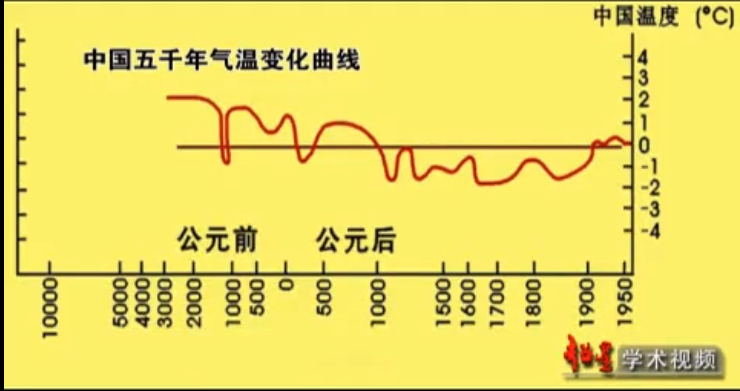

# 《中国近五千年来气候变迁的初步研究》 -- 竺可桢

- 有人据此推断在三千年前, 黄河流域同今日长江流域一样温暖潮湿。近三千年来, 中国气候经历了许多变动, 但它同人类历史社会的变化相比毕竟缓慢得多, 有人不了解这一点, 仅仅根据零星片断的材料而夸大气候变化的幅度和重要性, 这是不对的当时作者也曾根据雨量的变化去研究中国的气候变化, 由于**雨量的变化往往受地域的影响**, 因此很难得出正确的结果

- 气候因素的变迁极为复杂, 必须选定一个因素作为指标，如雨量为气候的重要因素, 但不适合于做度量气候变迁的指标。原因是在东亚季风区域内, 雨量的变动常趋极端, 非旱即涝，再则邻近两地雨量可以大不相同，相反地, 温度的变迁微小, 虽摄氏一度之差, 亦可精密量出, 在冬春季节即能影响农作物的生长。而且冬季温度因受北面西伯利亚高气压的控制, 使我国东部沿海地区温度升降比较统一, **所以本文以冬季温度的升降作为我国气候变动的唯一指标。**

    

- 中华文明多源化, 中华文明不单单是起源于黄河流域, 还有长江流域, 西辽河流域

- 在公元前5000年, 气温比今天暖, 类似于亚热带气温

    - 黄河流域:

        - 仰韶文化, 是黄河流域影响最大的一种原始文化

            - 彩陶

    - 长江流域:

        - 河姆渡文化(长江下游)

            - 榫卯结构

            - 中国最早的人工栽培水稻

        - 三星堆文化(四川)

            - 青铜器

    - 西辽河流域:

        - 红山文化

# 时空二唯视角下的历史地理学 -- 韩茂莉

- 公元1000 - 1100年, 燕山以北的地区气温上升1-2度, 使生活在此的契丹人(辽国), 发展出大量的农田, 农耕与游牧相结合
