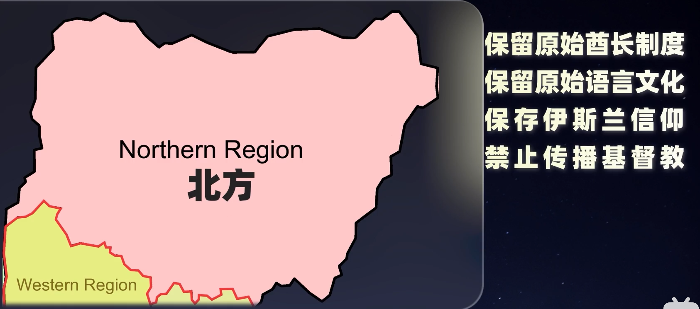

# 非洲

- 工业原料除了石油和铝外, 其他原料的储量和开采量几乎是世界第一

# 埃及

- [【合集】一口气看完古埃及的历史！](https://www.bilibili.com/video/BV1GV411p79Y?p=2)

- [骁话一下：埃及如何将黄金开局玩得山穷水尽](https://www.bilibili.com/video/BV1i441137Y4?from=search&seid=6260950388400924007&spm_id_from=333.337.0.0)

- [埃及人上辈子捡了什么宝，能碰上敢这么盘国家的鬼才？](https://www.bilibili.com/video/BV1sp4y1t7Hz?from=search&seid=7655240677397749241&spm_id_from=333.337.0.0)

    - 苏伊士运河:

        - 货轮占全球30%

        - 贸易量占全球12%

        - 欧亚海上贸易量占全球80%

        - 石油海运量占全球25%(2.38亿顿)

        - 收费:

            - 最便宜的7.6万顿散货船要20万美元

            - 疫情期间: 埃及攒了56亿美元的外汇(gdp的2%)

    - 波斯征服埃及, 大流士一世自称万王之王 -> 亚历山大大帝 -> 托勒密王朝 -> 罗马

    - 7世纪: 阿拉伯征服埃及, 贸易衰败, 亚历山大港成为鬼城

    - 法国骗取埃及统治者的信任, 取得开凿苏伊士运河的权力

    - 1859年: 运河开工

    - 1869年: 运河完工

        - 阿里去世后, 英国入侵埃及

    - 一战: 埃及加入同盟国, 失败后彻底沦为英国的傀儡

    - 1928年: 教育工作者哈桑班纳成立穆斯林兄弟会(埃及宗教民族主义)

        - 希望以伊斯兰信仰为中心, 团结对抗英帝国主义, 最后建立伊斯兰政权. 军方代表人物是纳赛尔

    - 二战结束后: 由于反帝思想的传播

        - 席卷中东, 北非等阿拉伯国家

        - 军队出现自由军官运动(泛阿拉伯主义)

            - 主张建立民族政权

            - 领袖为纳赛尔

        - 知识分子出现泛伊斯兰主义

            - 主张建立宗教政权

        - 两者都有反帝反封建的共同点

    - 1952年: 纳赛尔发动兵变推翻国王

    - 1954年: 纳赛尔成为总统

    - 1956年: 纳赛尔引入美国和苏联, 逼退英法以三国联军, 成功夺回运河

        - 主张: 阿拉伯民族主义, 世俗主义

            - 与穆斯林兄弟会对立

                - 为了对立: 军队享有各种宪法特权, 有独立于国库的财政制度, 自主编列预算, 有治外法权军队经商控制了3分之一的经济

        - 大饼政策: 1美分就可以吃大饼

            - 大量棉花田改为小麦田

            - 每年要花30亿美元进口小麦, 成为最大进口小麦国

            - 大饼工厂来至于军方

            - 人口从建国3000万到2021年1亿

                | 年龄     | 2021  |
                |----------|-------|
                | 25岁以下 | 51.2% |
                | 25-65    | 44.5% |
                | 65岁以上 | 4.3%  |

    - 1979年: 埃及和以色列签署和平条约, 萨达特总统将一些企业给退役军官经营, 给裁军作准备

    - 1981年: 革命领袖萨达特总统被渗透进军方的穆斯林激进分子杀害, 军人出身的穆巴拉克副总统, 成为总统

        - 穆巴拉克为了获得支持:

            - 从中央到地方各级把大量退休军官弄进政府

                - 2011年: 穆巴拉克下台时, 退役军官的职位有: 最高法院院长; 27个省有18个省长; 首都开罗25个区长有14个; 埃及文物局88个顾问

                - 有3大集团控制的40001家子公司, 穆巴拉克下台前不用交税

                    - 覆盖食品, 建筑, 运输, 房地产, 服务业, 家用电器...几乎所有经济领域

                - 哪怕允许军队经商, 政府每年掏出几十亿和美国每年援助的十几亿来补贴军队

            - 允许腐败: 卢克索省长把5830万美元的体育馆, 以730万贱卖...

            - 直接发钱: 用国家财政发一个效忠津贴, 1991年发了3.3亿美元, 2005年累计20.75亿美元

    - 2010年: 粮食危机, 国际粮价上涨, 埃及爆发阿拉伯之春

        - 每吨小麦价格从157涨到355美元

    - 2011年: 年轻人多, 失业率高, 多个省份爆发反政府示威, 导致穆巴拉克下台

        - 穆兄会领导人穆尔西当选总统

            - 动军方蛋糕:

                - 组建穆兄会商业组织

                - 调动17个省长

    - 2013年: 国际粮价下跌, 军方领导人塞西发动政变, 扶持傀儡政府

    - 2014年: 塞西靠选票当选总统

        - 宣布穆兄会为恐怖组织

        - 指定埃及2030年愿景, 开始搞发展(实际是乱搞)

            - 税改(加税): 7000多家企业停工停产, 失业潮 -> 物价不稳定

            - 2016年: 全面放开汇率, 导致兑美元汇率翻了一番

            - 2017年: 通胀率接近30%, 最后增发131亿埃镑新货币

                - 导致老百姓去黑市屯美元

    - 2018年: 大饼政策难以持续, 快要闹饥荒

        - 沙特国王访问埃及期间: 塞西把两座无人岛主权卖给沙特, 以获取援助

        - 塞西发现自己不会搞经济, 选择了芝加哥学派(自由主义经济学派), 开始了私有化进程

            - 导致军队私有化

        - 曾经的四大经济支柱, 旅游, 桥汇, 石油, 运河

            - 旅游, 桥汇由于军政府政治动荡, 没了

            - 石油由于外资出逃, 没了

            - 只剩运河了

                - 塞西开始建设所谓新运河, 为了快点收钱, 要求1年内完成3年的工期, 导致各种都豆腐渣工程

                    - 导致2021年3月23苏伊士运河货轮搁浅事故

# 利比亚

- [【天图府】利比亚历史（1951-2022）](https://www.bilibili.com/video/BV1aS4y157zp?from=search&seid=13739708477033157907&spm_id_from=333.337.0.0)

- [骁话一下：8年内战将北非天堂打成人间地狱，卡扎菲的黄粱一梦](https://www.bilibili.com/video/BV1cJ411a7TE?from=search&seid=17310569718505346767&spm_id_from=333.337.0.0)

    - 1551年: 奥斯曼入侵

        - 地方总督支持海盗活动, 靠抢劫中饱私囊

        - 与美国发生过两次战争

    - 1911年: 意大利打败奥斯曼建立意属北非

        - 带来大量意大利移民, 占人口20%

    - 二战期间: 由于意大利法西斯缺少兵源, 允许让利比亚人加入法西斯党

        - 成立了两个步兵师

    - 二战结束后: 英法两个管理

    - 1950年: 反意大利法西斯的领袖伊德里斯, 被西方扶持上台成为国王

    - 1969年: 去土耳其看病时, 被卡扎菲政变, 建立阿拉伯利比亚共和国

        - 利比亚对历代的统治者来说都属于边缘地区, 并没有建立郡县志, 而是类似于中国的羁縻制

            - 给地方土司授予官职, 要求定期拉贡外, 其他军事, 民事都归土司自治

            - 利比亚对首都以外的部落也使用羁縻制

            - 政治体制非常脆弱, 因此卡扎菲控制首都就控制中央, 控制首都重要部门就控制首都

        - 卡扎菲:

            - 中学时期崇拜纳赛尔, 军校毕业后, 效仿纳赛尔在中下级建立自由军官

            - 参加过反意大利法西斯的游击队

        - 政变后: 卡扎菲拜访偶像纳赛尔, 提议合并伊拉克, 埃及, 利比亚

            - 没过多久纳赛尔死了, 也就没有了下文

        - 经济上:

            - 1.发现石油后: 经济中心从港口的城市转移到沙漠(占领土94%)

                - 石油来自于部落控制的沙漠自治区

                    - 石油攒的钱也并没有分配到部落手中

            - 2.宣布石油减产, 欧佩克对此跟进, 全球石油价格上升

                - 政府获得10亿美元

            - 3.英资油田国有化, 对外资银行采取要么滚蛋, 要么合资的政策

                - gdp开始快速增长

        - 外交上:

            - 亲苏, 关闭大量美军基地, 废除前朝和美国签订的协定, 从大使级降到代办级

    - 1973年: 废除所有法律, 肃清了政敌, 取缔官僚机构, 宣布人民自治

    - 1977年: 国号改为阿拉伯利比亚人民社会主义民众国, 取消各级政府, 宣布人民直接掌权

    - 苏联倒下后: 推动泛非洲主义

    - 1988年: 洛克比空难, 被西方制裁15年

        - 依赖石油的经济立刻崩溃

        - 大量部落开始造反

    - 2003年: 萨达姆被推翻

        - 卡扎菲与西方示好, 推行私有化

    - 2007年: 法国总统萨科齐被爆出接受了卡扎菲的贿赂, 支持率大跌

    - 2008年: 石油价格大跌, gdp也随之大跌

    - 2011年: 阿拉伯之春爆发

        - 萨科齐为了支持率, 开始在美国之前轰炸利比亚

    - 2012年:卡扎菲死后, 利比亚全国过渡委员会禁止赞颂卡扎菲思想, 违反者将入狱

    - 目前:

        - 各路军阀争夺油田控制权

        - 4股势力:

            - 穆斯林兄弟会领导的政府(泛伊斯兰组织)

                - 有土耳其和卡特尔(波斯湾西部的一个国家)支持

            - 哈夫塔尔军阀

                - 有沙特, 埃及, 阿联酋支持

            - 趁乱进入的恐怖组织

            - 分裂势力

# 苏丹

- [在苏丹，政变是一种循环【轩讲】](https://www.bilibili.com/video/BV1NY411b748?from=search&seid=14628286081995131928&spm_id_from=333.337.0.0)

    - 地理:

        - 北方: 半干旱沙漠

        - 南方: 热带雨林

        - 尼罗河冲击平原适合, 种长绒棉

    - 公元6世纪: 基督教传入

    - 公元8世纪: 阿拉伯帝国崛起伊斯兰教传入

    - 1820年: 奥斯曼帝国埃及总督觊觎黄金和奴隶, 出兵苏丹

        - 此时: 北方信伊斯兰教, 南方信基督教

        - 等级制度

            - 

        - 200万苏丹人成为奴隶

    - 1881年: 教士艾哈迈德发动起义

        - 自称是伊斯兰教苏菲派救世主"马赫迪"

        - 一方面反抗殖民者, 另一方面又宣称要让不信伊斯兰教的黑人成为奴隶

        - 在南方打杀劫掠, 用阿拉伯人对待自己的方式, 去对待南部的黑人

        - 起义最后被英国镇压

    - 1899年: 颁布《英埃共管苏丹协定》(由于埃及归英国管, 实际便是英国管理制)

        - 经济重北轻南, 工程都集中在北方, 加剧南北不平等

            - 独立时: 北方首府喀土穆的人均gdp是南方的10倍

        - 分而治之:

            - 北方: 伊斯兰教, 教授阿拉伯语

            - 南方: 基督教, 教授英语

                - 驱逐在南方的阿拉伯人

                - 禁止北方进入南方

                - 北方人称南方人为奴隶, 南方人称北方人为掠奴者

            - 

            - 苏北搞独立运动时:

                - 在南方成立"赤道军团", 招募基督教徒入伍, 用南方对北方的仇恨遏制独立运动

    - 1952年: 埃及的纳赛尔政变上台, 第二年和伦敦签署协议

        - 确定三年内实现苏丹自治

        - 通过公投来决定苏丹是独立, 还是并入埃及

            - 由于南北长期对立, 对于南方而言: 独立只是换个统治者而已, 甚至更糟

                - 800名官员只有6人来自南方

    - 1955年: 北方自治政府发布命令, 让南方的赤道军团北上, 再派遣500名士兵进驻南方

        - 赤道军团叛变, 爆发长达17年的第一次南北内战

        - 内战爆发后, 自治政府总理向英国申请独立, 最后独立成功

    - 1956年: 继承英国的议会制

        - 导致与埃及合并的阿拉伯人, 民族主义的北方人, 主张建立神权的穆斯林, 南方自治的基督教黑人, 信仰马克思的左翼都有政党, 相互对立

        - 棉花大丰收

            - 由于被埃及苏伊士运河国有化, 棉花全堆积在仓库里, 卖不出去, 陷入财政危机

                - 为渡过难关, 政党之间对于邀请是美国, 是苏联, 还是自主, 吵得不可开交

    - 1958年: 总理和美国签署援助协定, 提交国会批准遭到反对

        - 民众对文官政府失望透顶

        - 总理请陆军司令阿布德发动政变, 建立军事独裁

            - 关闭国会

            - 为了建立统一国族认同, 强行将南方伊斯兰化, 使用阿拉伯名字, 建立古兰经学习, 驱除基督传教士

            - 为了摆脱对棉花的依赖, 制定转型计划, 但最后缺少资金胎死腹中

    - 1964年: 苏丹爆发大规模游行

        - 民众对军政府也失望透顶

        - 阿布德又宣布还政于民, 又回到议会制

            - 结果又回到政党相互对立

    - 1969年: 纳赛尔的追随者尼迈里军官发动政变

        - 与苏丹共产党合作, 推行阿拉伯社会主义

        - 将银行, 外资企业国有化, 打地主, 分田地

    - 1972年: 尼迈里与南方武装和解, 结束南北内战

        - 开展战后重建

        - 改革起初有效, 经济增长率最高到达10%, 但由于人才不够, 空有一腔热血, 无法接管国有化的企业

            - 出现大量亏损, 只能靠政府补贴勉强度日

            - 又由于对农民的大量补贴; 开设大量的公立学校

                - 最后政府只能借钱

    - 1982年: 外债将近100亿美元

        - 经济高度依赖还是棉花出口

        - 经济恶化连续爆发罢工游行

            - 尼迈里在群众心中从英雄变成独裁者

                - 为了稳固政权, 和伊斯兰教合作

                    - 让穆斯林兄弟会的领导人进入政府高层

                    - 宣布全国实行伊斯兰教法

                        - 遭到南方反对

                - 发现南方有大量石油, 被尼迈里视为救命稻草, 邀请美国公司协助开发

    - 1983年: 由于穆斯林眼红南方, 要求重新划分南北边界

        - 把石油丰富的省划为北方

            - 导致第二次南北内战

                - 内战爆发后, 美国资本撤离, 出售了石油开采权

    - 1985年: 尼迈里出访美国希望借两亿美元

        - 陆军在出访途中, 发动政变

    - 1986年: 新组建的文官政府, 又回到相互对立的党争中

    - 1989年: 巴希尔在伊斯兰的支持下, 发动政变

    - 1999年: 开始大量出口石油

        - gdp增长最高超过10%, 掩盖社会矛盾

            - 经济增长一旦停滞, 长期积累的社会矛盾, 就会在短时间内集中爆发

        - 过度依赖石油出口, 导致其他产业凋敝

        - 贫富差距也在扩大

            - 为了稳固政权, 巴希尔用石油出口攒的外汇, 大幅度补贴面包, 汽油, 电力等基础商品

    - 2011年: 南苏丹举行独立公投, 成功独立出去

        - 北苏丹失去7成油田, 8成外汇来源

        - 北苏丹决定优先供应首府喀土穆, 其他地区长期受到剥削

            - 绝大多数人生活在绝对贫困线以下

    - 2015年: 国际油价暴跌

        - 巴希尔为了获得国际援助, 采取国际货币基金组织提倡的休克疗法, 取消面粉补贴, 开放汇率, 导致面包价格涨了3倍

    - 2019年: 军方推翻巴希尔政权

        - 三年过渡期, 准备举行大选还政于民

        - 经济依然一叹糊涂, 通胀高达99%

        - 文官认为是军方权力过大阻碍了经济改革, 军方以为文官要夺权. 2021年10月25日: 军方发动政变

# 马里

- [骁话一下：前法国殖民地马里叕乱了，为什么中国应该帮忙？](https://www.bilibili.com/video/BV18A411n7E9?from=search&seid=10454144469268069929&spm_id_from=333.337.0.0)
    - 人口:

        - 信仰伊斯兰教

        - 7成从事农业

        - 大部分居住在尼日尔河沿岸

    - 1880年: 法国入侵西非, 马里成了法属苏丹的一部分

    - 1958年: 法属苏丹独立成为马里联邦

        - 法国影响力还在

    - 1960年: 塞内加尔退出马里联邦, 马里联邦变成马里共和国

    - 农耕游牧的矛盾

        - 两者语言不通

        - 

        - 

    - 游牧民族一叛乱, 军方平叛无能, 就推翻民选政府

        - 1962年: 图阿雷格人叛乱

        - 1968年: 军方推翻政府搞独裁

        - 1990年: 图阿雷格人叛乱

        - 1968年: 军方推翻政府

        - 2012年1月: 图阿雷格人叛乱

        - 2012年3月: 军方推翻政府

            - 这次法国以联合国授权出兵帮助民选政府平叛

            - 利比亚卡扎菲倒台后, 部分武装穿过边境, 来马里讨生活

        - 2015年: isis在中东濒临崩溃, 部分成员逃到利比亚后, 也来到马里

            - 一开始和图阿雷格人合作, 2018年闹翻

            - isis占领村庄, 摧毁现代设施, 靠高收入吸引青年入伍, 社会退回到中世纪

            - isis靠走私黄金, 毒品, 人口, 换美元

        - 2020年8月: 军方推翻政府

            - 西非经济共同体关闭马里边境, 禁止资金流入

        - 为什么图阿雷格人不能独立

            - 1964年: 非洲国家签署条约《非洲边界争端决议》

                - 防止各国兼并, 但也导致了边界神圣化

                - 南苏丹的独立有中央政府承认, 联合国才承认

                    - 而图阿雷格人分散在5个国家

# 利比里亚

- [骁话一下：殖民压迫种族隔离，美国灯塔的非洲示范区，美吗？](https://www.bilibili.com/video/BV1jK411p7cK?from=search&seid=3715303364705909107&spm_id_from=333.337.0.0)

    - 1800年美国北方大概有20万自由黑人, 但长期受到资本家压迫, 导致越来越多的黑白冲突

        - 因此就有人打算将一部分黑人送回非洲, 甚至还能借此传播基督文明

    - 1787年: 英国把一部分黑人, 送回非洲, 建立塞拉利昂

    - 1816年: 废奴派成立美国殖民协会, 拿到国会拨款

    - 1821年: 美国军官带着33名自由黑人, 用枪从部落酋长买了块地, 也就成了新国家的首都蒙罗维亚

        - 之后越来越多的黑人和殖民点建立, 协会就将这些殖民点统称为**利比里亚(自由的意思)**

        - 原住民反感这些黑人殖民者

    - 1847年: 利比里亚建国

        - 照搬美国宪法

            - 共和党为黑白混血

            - 真辉格党为美裔黑人

    - 1878年: 真辉格党控制政权

        - 只有占人口5%美裔黑人有投票权

        - 美裔黑人在利比里亚也搞种族隔离

    - 1904年: 分而治之

        - 只对酋长开放公民权

            - 通过酋长间接管理原住民

                - 两者合力剥削原住民: 1925年提出建茅草屋要交税, 1年带来30万美元收入

            - 原住民被当作苦力, 卖到海外

    - 1909年: 英国威胁利比里亚主权

    - 1912年: 美国给利比里亚安排40年的贷款, 得到利比里亚关税权

        - 原因: 美裔黑人为了维持统治, 外交需要极力舔美

        - 利比里亚被美国当作出海示范区

        - 美军维稳:

            - 帮助利比里亚训练军队, 美国黑人军官可以对接成为利比里亚军官

            - 帮助利比里亚镇守边疆, 镇压内乱

            - 二战时期: 成为战略物资中转站

    - 1964年: 在西非解放大气候下, 总统塔布曼, 推行政治改革

        - 此时: 美裔黑人占人口3.4%, 控制全国财富60%

        - 赋予原住民公民权, 增加政府部门中原住民的数量

        - 把国内划分为13个县

        - 但并没有彻底消灭真辉格党

    - 1980年: 新总统被军人多伊刺杀

        - 多伊把美裔剔下来后, 扶持自己的部落

    - 1990年: 多伊被反政府武装残忍杀害, 新的军头是查尔斯泰勒(《战争之王》中非洲军阀的原型)

        - 查尔斯泰勒: 美裔黑人, 在美国读过大学

        - 由于利比里亚资源匮乏, 就盯上了隔壁塞拉利昂的钻石(《血钻》的故事)

            - 由于苏联解体之后, 从东欧大量军火廉价进口军火, 塞拉利昂反政府武装交换钻石, 在出口钻石攒美元
                - 为了扶持反政府武装, 让儿童抓起来当兵, 并注射毒品保持战斗力

    - 2012年: 联合国维和部队接管利比里亚, 解除各派武装

        - 泰勒被海牙国际法庭宣判, 入狱50年

# 尼日利亚

- [向我国索赔的非洲第一经济人口强国尼日利亚，经济超南非发展如何？骗子、人口、资源多，却比印度富](https://www.bilibili.com/video/BV1ZK4y1772g?from=search&seid=3048869595381191535&spm_id_from=333.337.0.0)

- [“非洲第一”尼日利亚，为什么成了诈骗之都？【消化一下】](https://www.bilibili.com/video/BV18M4y1G7Gy?from=search&seid=3048869595381191535&spm_id_from=333.337.0.0)

    - 名义上的"非洲第一大国"

        - 人口2亿

        - gdp4000多亿美元

    - 靠近沙漠的北部, 有伊斯兰传教士和商人活动, 南部长期与世隔绝

    - 19世纪英国发现这里有丰富的资源后, 占领了此地

        - 分而治之:

            - 
            - 
            - 

            - 由于南方有出海口, 经济很快超过北方, 开始闹独立

                - 因此英国挑拨南北对立

                    - 对北方人说: 南方吸北方的血

                    - 对南方人说: 北方人要杀你们, 我们走了, 你们就危险了, 还是不要独立了

                - 结果是一直保持南北微妙的平衡: 南方比北方经济发达, 北方则控制着政府和军队

    - 1960年: 独立

        - 独立前, 英国制定宪法将分而治之贯彻到底

            - 每个区有独立的立法和政府机关, 管理本区事务, 鼓励成立代表本区利益的政党

            - 北方大量精英进入政府高层, 占领一半以上的国会席位

    - 此后不断政变, 内战

        - 矛盾类似中国的三国时期

# 博茨瓦纳

- [拿一手烂牌打成非洲经济第一，天降非酋如何带飞博茨瓦纳](https://www.bilibili.com/video/BV1aP4y177qM?from=search&seid=8808514216598203668&spm_id_from=333.337.0.0)

# 吉布提

- [为什么说吉布提是世界兵营？四大军事强国入驻，被誉为非洲新加坡](https://www.bilibili.com/video/BV1Da4y1p7Aw?from=search&seid=4406405020546521221&spm_id_from=333.337.0.0)

# 肯尼亚

- [消化一下：一条铁路“扼住”这个东非小国，直到中国人来了](https://www.bilibili.com/video/BV1JK4y1u7Br/?spm_id_from=333.788)

    - 东非原本是大大小小的原始部落, 文化不同, 语言不同, 相互斗争

    - 19世纪末: 德国建立德属东非

        - 英国为了牵制德国, 在肯尼亚, 乌干达建立英属东非保护地

        - 

    - 1901年: 建立乌干达铁路(大部分在肯尼亚)从海港蒙巴萨到维多利亚湖沿岸的基苏木

        - 从南亚引入3万印度人当铁路工人, 历时5年完工

        - 更方便的掠夺资源

        - 如今铁路沿线的站点发展成大城市

    - 英国通过乌干达铁路, 17次出兵, 强行整合东非大陆

        - 把各部落划分为41个民族, 8个省

            - 每个省都有主体民族

        - 留下最肥沃的土地(白人高地), 把黑人赶到保留地

            - 并引入大量印度人伺候白人

                - 印度移民, 成为官僚, 商人, 警察, 技术工人

    - 一战德国战败, 德属东非并入英属东非, 名字改为肯尼亚

    - 1963年: 独立

        - 独立之初, 印度有17万人占总人口2%, 但控制75%的制造业企业, 90%商业
        - 带上乌干达, 坦桑利亚, 搞经济区一体化

            - 由于三国经济结构高度重合, 10年瓦解

        - 肯雅塔主张建立统一民族

            - 肯雅塔是基库尤族, 重要职务也由基库尤族担任

            - 首都内罗毕主体民族也是基库尤族, 有排外情绪

            - 此后总统也未能处理民族问题

    - 2007年: 小部落组成政党联盟, 向基库尤族发难, 暴力席卷全国

        - 乌干达铁路被破坏, 内罗西以西的铁路, 至今仍未恢复

    - 2013年: 肯尼亚总统访华, 中方出资38亿美元提供贷款, 修建蒙内铁路

        - 

# 埃塞俄比亚

- [骁话一下：非洲“小中国”，为何埃塞俄比亚内战反复爆发？](https://www.bilibili.com/video/BV11i4y1L7ab?from=search&seid=8479077968830794294&spm_id_from=333.337.0.0)

    - 地理:

        - 高原面积占3分之2, 海拔2500-3000

            - 在没有现代卫星通信技术时, 曾被美国看上建立通信站的高原优势

        - 沙漠面积占28%

    - 民族问题:

        - 没有超过人口50%的主体民族

    - 19世纪前: 小国林立

        - 阿姆哈拉族建立埃塞俄比亚(希腊语:晒黑的面部)

            - 4世纪, 皈依基督教, 拜占庭往来频繁

                - 读者著: 往来频繁是指什么? 是贸易往来吗?

            - 不断通过武力征服其他民族, 导致本族人口占比越来越少, 只占27%

                - 民族政策: 不能同化就镇压, 虽然建设了现代国家意识, 但民族间存在的严重的仇恨

    - 1896年: 意大利侵略埃塞失败, 但埃塞依然害怕意大利, 把厄立特里亚(唯一的出海口)割让给意大利进行殖民统治

    - 1935年: 意大利二次侵略成功, 皇帝流亡至英国

    - 1941年: 英国战胜意大利, 托管了厄立特里亚, 而流亡的皇帝得到复位

    - 二战后: 美国看上建立通信站的高原优势, 大力扶持(给钱, 给粮, 给技术), 将其培养成非洲代言人

        - 朝鲜战争期间, 派兵支援联合国军, 站队成功

    - 1950年2月: 英国结束厄立特里亚的托管, 厄立特里亚和埃塞组成联邦, 但保留自治权

    - 1962年: 皇帝强行解散厄立特里亚议会, 改为直接领土, 遭到反抗

    - 1974年: 爆发饥荒, 军队政变, 推翻了美国扶持的帝制

        - 门格斯图军政府, 搞社会主义, 得到苏联的支持, 并学习苏联搞民族识别, 人造了74个民族, 并吸收非阿姆哈拉族加入政府

            - 但没有进行土改, 国有化

            - 学习教育还是阿姆哈拉语为主

        - 于是在埃塞北部的Tigray(提格雷州)的提格雷族中的, 7名马克思主义者认为埃塞是假社会主义, 并组织起来

    - 1975年: 提格雷人民解放战线成立, 与搞分裂的厄立特里亚结盟

    - 1988年: 越来越多的民族加入到提格雷战线, 成立埃塞人民革命民主阵线(埃革阵)

    - 1991年: 埃革阵成功推翻了格拉图的军政府

        - 提格雷的领袖梅莱斯成为领导人

            - 认为: 苏联和中国都不是社会主义, 真正的社会主义是阿尔巴尼亚的霍查主义

                - 认定民族联邦才有出路, 承认民族差异, 并鼓励发展差异(以民族为基础进行政治活动)

            - 尊重1993年的厄立特里亚独立约定(失去唯一的出海口)

            - 1995年推行新宪法, 将行政区划分为9个民族州, 2个特别市

                - 2019年分为10个民族州

                - 每个民族州能建立自治政府(有独立的立法, 司法, 行政, 工作语言, **分离权**等权力)

    - 1998年: 厄立特里亚与埃塞在巴德梅地区打了起来

        - 巴德梅是提格雷民族包含领导人在内的老家, 在革命时期同意在战后交给厄立特里亚, 但厄立特里亚独立后反悔了

        - 空中上演: 苏27大战米格29

    - 2000年: 停火, 但边境冲突持续不断

    - 2004年: 连续10年以gdp年均10.9%高速增长

        - 完成土地确权

        - 为农牧业人口占85%

            - 农产品占出口70%

                - 出口咖啡, 油菜籽等经济作物

        - 农业占gdp40%

        - 通胀率高达158%

    - 2005年: 爆发民族之间流行冲突

        - 新政府像日本自民党, 革命成功后失去目标, 变成政客的分脏平台

                - 提格雷民族占人口6%, 虽没有像阿姆哈拉族采用高压民族政策, 但占据多数要职, 不断融入首都, 进行政策倾斜

    - 2012年: 梅莱斯去世后

        - 奥罗莫民族占人口35%, 是人口最多的民族, 他们开始联合其他民族反对提格雷民族政府

    - 2017年: 高层达成一致, 要找个奥罗莫人当领导人

    - 2018年: 奥罗莫民族的艾哈迈德成为埃革阵的党主席和总理

    - 2019年: 艾哈迈德解散有长期提格雷印记的埃革阵, 原地成立繁荣党

    - 由于艾哈迈德不是提格雷人, 宣布在巴德梅撤兵, 解决厄立特里亚的冲突

    - Tigray(提格雷州)内战:

        - 

        - 2020年9月Tigray, 不顾联邦政府的反对, 强行进行地方选举

        - 2020年11月4日曾经结束厄立特里亚战争的总理, 宣布Tigray叛国, 并对此进行军事打击

    - 王骁私货:

        - 埃塞属于沃尔斯坦体系中边缘国家的位置, 必须想办法融入国际产业分工, 否则就会陷入马尔萨斯陷阱, 即工业化发展的速度跟不上人口发展的速度, 导致生态崩溃, 要么打内战, 要么人相食

            - 埃塞的支柱产业是农业长期稳定, 而人口却高速增长, 是非洲第二大人口国家(1.1亿人). 因此人均越来越低
            - 埃塞的需要每年必须增加数十万个就业机会, 因此需要电力供应, 为此2011年修建复兴大坝, 这又与尼罗河下游的埃及发生矛盾

        - 与中国的关系:

            - 目前有4万华人
            - 中企让3300万人用上电
            - 如果埃塞发生内乱, 中国的投资很可能会打水漂

    - 埃塞俄比亚经济学家: 格塔丘替·阿勒木(Getachew T. Alemu)

# 刚果(金)

- [“中非宝石”刚果（金），为什么成了“人间炼狱”？【消化一下】](https://www.bilibili.com/video/BV1ub4y117pm/?spm_id_from=333.788)

    - 分而治之:

        - 任命酋长, 有行政, 司法, 宗教权力

            - 酋长职位, 可以家族继承

            - 2021年一共有254个部族

                - 班图语系占人口84%

            - 在东北部支持游牧民族管理农耕民族

            - 南部的加丹加, 引入班图族占据, 原住民俾格米人

            - 引入乌干达, 卢旺达, 布隆迪一带的班亚旺达人与本土金亚旺达人争夺土地

                - 鼻子宽度不同将班亚旺达人分为胡图族, 图西族

                - 胡图族是图西族人口的6倍

                    - 但却让图西族人当上酋长, 管理胡图族和其他民族

                        - 最后引发卢旺达大屠杀和刚果内战

    - 1908年: 英国接管

    - 1960年: 刚果(金)独立

        - 卢蒙巴被选任为总理

            - 1.主张反对分裂, 团结各族, 建立一个完整的刚果

            - 2.卢蒙巴选任后, 加丹加宣布独立, 爆发内战

            - 3.加丹加邀请比利时军队介入, 打击民选政府

            - 4.卢蒙巴向苏联求助

            - 5.美国为了反共, 开始介入, 支持军方参谋长蒙博托发动政变, 卢蒙巴被软禁

            - 6.1961年卢蒙巴被杀

    - 开始32年的蒙博托贪腐独裁统治

        - 压制地方主义, 塑造刚果国家认同

        - 70年代: 21个省合并为8个省, 禁止族群为基础的政治活动

            - 官员论调, 避免同族扎堆, 形成山头

            - 想废除酋长继承制度, 但失败

        - 外企国有化运动, 最后进入蒙博托个人和亲信手里, 导致外资逃离

        - 铜价跳水, 卖矿无门

        - 1990年: 外债高达100亿美元

            - 失去土地的农民只能依附地方族群, 地方势力不降反升

    - 冷战结束后: 美国威胁刚果搞民主化改革

        - 大量本土族群成立政党, 发泄外来移民, 尤其是图西族

        - 蒙博托为了拉拢本地族群, 也开始排斥图西族

    - 1994年: 卢旺达大屠杀

        - 上百万难民逃到刚果, 本土族群的排外情绪进一步高涨

    - 1996年: 第一次刚果内战

        - 起因: 刚果南基伍省要赶走图西人, 图西人掀起武装反抗, 卢旺达, 乌干达趁机派兵6万入侵刚果(金)

    - 1997年: 赶走了蒙博托, 卡比拉当上总统

        - 卡比拉出身在加丹加的卡巴族人, 早年追寻卢蒙巴走左翼路线, 和切格瓦拉共同作战过, 接受过中国援助, 在南基伍省开辟根据地

        - 当选总统后, 被卢旺达和乌干达架空

            - 卢旺达和乌干达希望由图西族掌握政府大权

    - 1998年: 第二次刚果内战(非洲世界大战). 耗时5年

        - 起因: 卡比拉要求卢旺达撤军

        - 其他非洲国家对刚果(金)出兵

        - 卢旺达和乌干达资源匮乏, 战争中掠夺刚果(金)东部的大量矿区, 卢旺达一越成为卖矿大国

            - 刚果(金)东部地方势力也与卢旺达, 乌干达勾结

    - 2003年: 内战结束, 卡拉比被刺杀, 儿子接班

# 安哥拉

- [漫游成都: 比西藏还大的非洲巴西安哥拉，人口还没重庆多，石油换我国援助，经济咋样？内战多年，另一越战！](https://www.bilibili.com/video/BV1RZ4y137bL?from=search&seid=4094393729731226011&spm_id_from=333.337.0.0)

# 南非

- [南非大乱经济崩溃，金砖国家怎么被黑人摔得稀碎？](https://www.bilibili.com/video/BV1vR4y1n7Ug/?spm_id_from=333.788.recommend_more_video.9)

- [化石国家莱索托：宫廷政变，朝堂政斗，1000+酋长各个是霸总](https://www.bilibili.com/video/BV19v411M7mz?from=search&seid=16290092861416444738&spm_id_from=333.337.0.0)

- [1/4人艾滋，裸选后宫，百姓为奴，活化石国家终于乱了！【斯威士兰】](https://www.bilibili.com/video/BV1X64y1Q7sW/?spm_id_from=333.788.recommend_more_video.-1)

- [骁话一下：屠龙者成恶龙，曼德拉的光辉岁月还能给南非撑多久？](https://www.bilibili.com/video/BV1Yt4y117w2?from=search&seid=10673697468054089337&spm_id_from=333.337.0.0)

    - 15世纪: 被荷兰殖民

        - 从东非, 印尼带来7万多奴隶

            - 被称为布尔人或阿非利加人

            - 农村布尔人说荷兰语, 工商布尔人说英语

    - 拿破仑时期: 英国夺取开普敦

        - 禁止荷兰语和荷兰文化后, 布尔人向北迁徙, 组成3个布尔人共和国

    - 1867年: 在北方的金伯利发现钻石

    - 1886年: 约翰内斯堡发现黄金

        - 一战前英国外贸结构失衡, 外汇(黄金)外流, 为了维持金本位霸权

            - 出兵45万人, 超过布尔总人口

                - 士兵中包含丘吉尔, 当了战俘逃回来后, 名声大噪, 当选国会议员

            - 花费2.2亿英镑

            - 结果: 好土地被英国人拿走, 布尔人就和黑人抢土地

        - 分而治之:

            - 说英语的工商布尔人当管理者

            - 说荷兰语的农村布尔人当矿工

    - 1894年: 由于劳动力不足, 而1833英国又废除了奴隶制, 就制定用货币而不是农作物交税的税法

    - 1910年: 建立卫星国政权南非联邦

        - 《土著人土地法》: 由于1833英国废除奴隶制, 这实际上是一部变相奴隶制法律(种族隔离法)

            - 20%的白人占有90%的土地

            - 黑人占有8%的土地

    - 1912年: 成立南非原住民国民大会

    - 1921年: 白人矿工成立南非共产党

        - 英国人对此: 先镇压最坚定的白人矿工, 然后发福利, 允许白人成立工会

    - 1923年: 南非原住民国民大会改名为南非国民大会(非国大)

        - 南非共修改路线, 目标为建立黑人共和国, 并把白人开除党

    - 两次世界大战

        - 南非出兵20-30万给英国卖命

    - 1936年: 南非修法

        - 取消黑人选举权, 黑人占有土地提高到13%

    - 1948年: 南非脱离英国, 白人国民党上台, 推行种族隔离政策

        - 分为三等人

            - 白人, 有色人(包含阿拉伯人), 黑人

        - 剥夺白人外的土地和自由就业权

        - 禁止种族通婚

    - 1960年: 允许在南非领土内的两个非洲王国**莱索托, 斯威士兰**独立

    - 1970年: 16%的耕地生活着33%的居民, 3分之1的南非人回到农业社会

    - 1973年: 由于阿拉伯人是二等人, 被欧佩克封锁

        - 石油主要靠伊朗

            - 1979年: 伊朗革命后, 伊朗石油线也断了

    - 废除种族隔离, 黑人民权运动下(苏联和美国都支持黑人反对白人): 美国联合西方国家对南非进行武器禁运

        - 并大量撤资, 将产业转移给邻国(博兹瓦纳, 纳米比亚, 斯威士兰), 使其进入一轮经济腾飞

    - 1981年: 22家跨国公司设立3036家公司

        - 英国资本控制着矿业, 制造业, 金融业

    - 冷战时期: 是美国对抗苏联的桥头堡, 国防得到欧美的援助

        - 一度和以色列, 台湾省合作制造核弹

    - 安哥拉战争: 派兵3万对抗社会主义古巴志愿军, 被古巴暴打

    - 1986年: 被美国制裁, 大量工厂被转移到斯威士兰

    - 1990年: 曼德拉出狱

        - 1962年被抓进监狱, 坐了26年

    - 1994年: 白人政府妥协, 曼德拉成为总统

        - 名义上实现民族和解

    - 1997年: 非国大提出耕者有其田

    - 以前是白人控制; 现在是白人, 有色人, 黑人权贵控制, 贪腐严重

        - 产业结构没有改变

            - 非国大没有打击白人地主, 没有消灭封建土地所有制

            - 白人依旧占领了80%的商业农场

        - 获得土地的黑人, 也没能解放生产力

            - 长期被隔离, 没有接受过教育, 组织力度很低, 没有推行基础设施建设

        - 只是多了滑落到底层的部分白人

        - 引入其他非洲国家的黑人, 干苦力, 政府不用管社保

            - 原有的底层黑人, 通过歧视外来黑人(斯威士兰...)获取优越感
