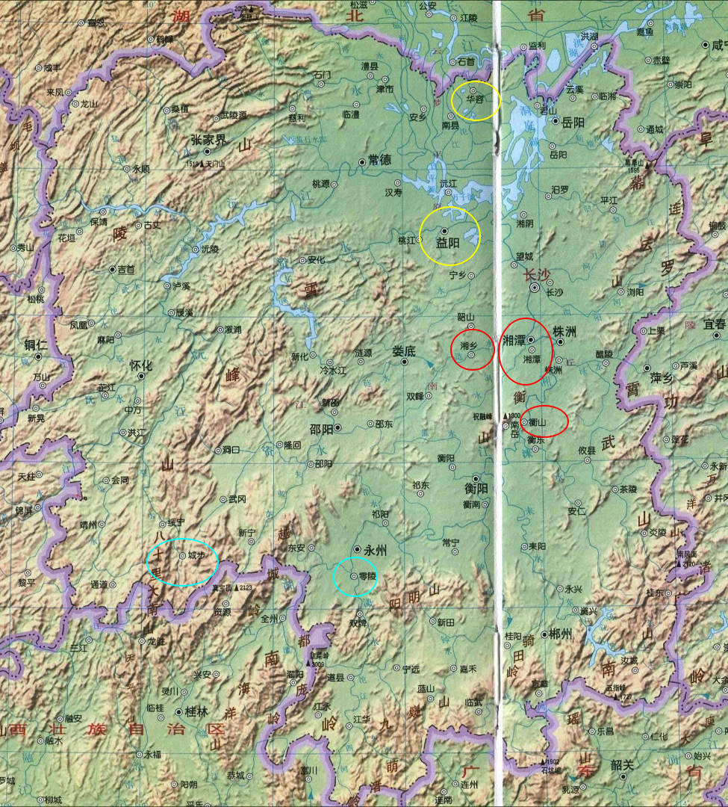
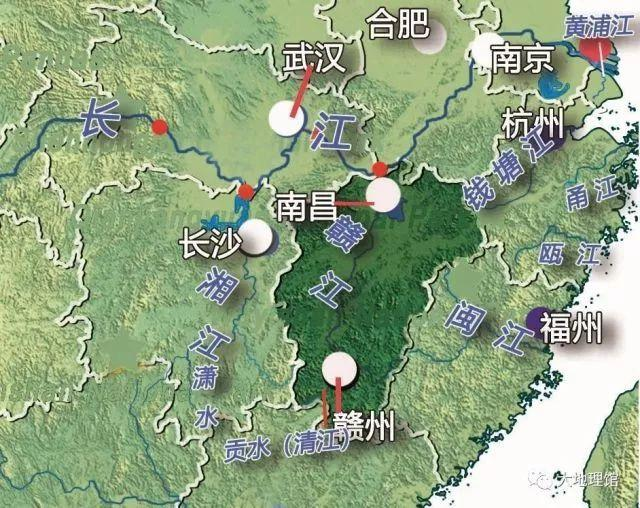

# 《实践论》 是反对 31 年-37 年把马克思理论教条化,这类缺乏调查研究的作风

人的理论思想要符合客观规律,如果不合那将失败.人们通过社会实践活动,逐渐认识客观规律.理论是建立在实践的基础之上的,因此实践是检验真理的唯一标准. --辩证唯物论

- 一切社会实践活动离不开**物质生产**.因为人们有着满足物质的需求,因此物质生产是最基本的社会实践活动.

  那么由此可以看出,其他社会实践活动,是围绕着物质生产活动而发展的,也就有了一切活动都是为了物质生产这一观点

- 人们通过物质生产活动逐渐认识自然的规律,人与人之间的生产关系;通过政治,科学艺术等活动认识人与人之间的其他关系

  政治,科学艺术活动具体有哪些呢?

- 人们的生产活动是从低级到高级的,随着生产力的提升,人们的认识也逐步提升,发展出了科学的认识方法(包含自然,社会),社会也发展出了阶级.在阶级社会中,人们的生产离不开阶级,因此各种思想也离不开阶级性.在很长的历史时期内人们充分地认识社会,对社会只有片面的了解,这是由于剥削阶级的偏见歪曲了社会的历史.而马克思哲学辩证唯物论是为无产阶级服务的.

  阶级社会是在哪个历史阶段产生的呢?

## 辩证唯物论的认识发展的过程理论

> 从低级(感性)到高级(理性)的认识过程

> 从掌握事物的外部联系(片面的)到掌握事物的内部联系,也叫内部矛盾(理性的)的认识过程

- 感性认识:人们从各种人听到的话,从各种环境中看到的现象,从这些片面的外部联系当中形成印象,感知,感觉.

  - 唯心论者认为理性认识无法从感性认识的基础上发展而来

- 理性认识:随着社会实践的继续,逐渐了解事物的客观内部规律,也发展出理性的认识(理论)

> 当掌握理论后,还远没有结束.马克思主义哲学,不仅仅是解释世界,还要**改造世界**

> 由于理论的不完全性,掌握理论后还要把理论继续投入到实践当中去检验,去纠正错误,进而发展出新理论,如此循环,实现理论与实际现实的统一(知行合一)

- 右侵机会主义:由于革命的变化是迅速的,如果人们的认识无法跟上新的,已经变化的客观情况,那么思想就会落后于现实

- 左翼空谈主义(冒险主义):思想超过了客观情况,在行动上表现为冒险主义

> 认识受限于历史阶段,每一个历史阶段相较于上一个阶段,人们的认识逐步深化,而随着社会实践的继续,以往新的认识也会逐步变为旧的认识,**因此真理具有相对性**.在绝对真理的长河中,无数的相对真理的总和,才是绝对真理,而这个过程是无穷无尽的.而马克思列宁主义为我们开辟出这条认识真理的道路

- 人们无法在封建主义社会上预先认识资本主义社会,因为资本主义还没有出现,也就无法实践.

  - 马克思主义是资本主义社会的产物,而无法认识帝国主义的具体规律,因为还没发展到帝国主义的阶段

# 《矛盾论》,发表原因同《实践论》一样

- 形而上学即玄学,把一切事物看成是静止的,孤立的,从一开始便是如此不会变化为其他事物,只会重复产生同一事物的宇宙观.即使是有变化,也仅仅是场景的变换,数量的增减这些外部联系

- 普偏性(一般性):事物运动之间的共同点

- 特殊性:事物运动之间的区别,也是事物千差万别的原因,它构成了不同科学的研究对象

- 事物之间在某一的场合为特殊性,而在另一个场合为普偏性

- 矛盾也分为主要矛盾,非主要矛盾.主要矛盾的存在和发展影响着其他矛盾的存在和发展

  - 当帝国主义使用非战争形式的压迫时(如政治,文化,经济),半殖民国家的统治阶级会向帝国主义投降,共同压迫大众

  - 生产力和生产关系:机械唯物论把主要矛盾看成是静止的.而辩证唯物论所看待的主要矛盾是会变化的,在一定条件下生产力不起作用,生产关系就会转变为主要的决定作用(主要矛盾).

# 革命首要问题,中国社会各阶级分析

> 分辨真正的敌友,团结一切朋友

> 不断革命论者(托洛茨基主义):主张不联合资产阶级,我们是不能同意的

> 革命转变论者:主张民主革命转变为社会主义.需要联合资产阶级,依靠无产阶级群众的力量克服资产阶级的妥协性,否则资产阶级反过来克服无产阶级.不流血的转变是我们所希望的,要看无产阶级群众的力量而定

- 地主,买办阶级是帝国主义的附庸,阻碍生产力的发展.是我们的敌人

- 中产阶级对革命的态度时而怀疑,时而支持.我们对此要谨慎,不能让他们扰乱阵线

- 小资产阶级一部分人,经济上有剩余.与中产阶级的态度颇为接近

  - 另一部分(大概占比一半),经济上只能自给自足.在帝国主义,军阀的压迫下,觉得生活越来越难维持,对革命取中立态度

- 无产阶级

  - 现代工业无产阶级约 200 万人,是新生产力的代表者,为罢工,革命领导的力量

    - 他们最集中,又受着压迫,经济地位低下

  - 游民无产者

    - 他们在各地都有秘密组织,如闽粤的“三合会” ,湘鄂黔蜀的“哥老会”,皖豫鲁等省的“大刀会”,直隶及东三省的“在理会”,上海等处的“青帮” ,都曾经是他们的政治和经济斗争

- 半无产阶级

# 农会,农民大革命

> 1 月 4 日:毛泽东考察湖南农民活动

> 3 月 5 日:毛泽东发表《湖南农民运动考察报告》

- 湖南当时是农会的中心,一共 75 各县,赵恒惕是湖南军阀
  1923 年中共三大,毛泽东提出湖南工人数量很少,国民党员和共产党员更少,漫山遍野是农民

- 组织时期(1926 年 1 月至 9 月为第一时期):1 月至 6 月为(秘密活动时期),7 月至 9 月革命军驱逐军阀赵恒惕(公开活动时期)

  这里的秘密时期,应该是为了争取群众

  - 此时期内:农会会员为三四十万,没什么斗争

- 革命时期(1926 年 10 月至 1927 年 1 月为第二时期):

  - 农会会员 200 万,1 家只登记 1 人,以 1 家 5 口计算,能直接领导的群众为 1000 万,在湖南农民全数中,差不多组织了一半的农民

    

    - 其中以长沙为中心的各县几乎全部组织起来

    - 益阳,华容等组织了大部分,还有小部分未组织

    - 诚步,零陵等组织了小部分,还有大部分未组织

    - 湘西由于袁祖铭势力范围内,几乎未组织

- 在这四个月内出现农村大革命:农会在乡村独裁一切,顺之者存,违之者灭

- 主要攻击目标是土豪劣绅,不法地主各种宗法的思想和制度,城里的贪官污吏,乡村的恶劣习惯

- 一切权力归农会,两公婆吵架都要到农会解决

- 农村大革命是一个阶级对另一个阶级的暴动,必须挢枉过正:

  - 政治打压:杀猪出谷(抢走粮食),捉人戴高帽游乡,杀大绅士,滚上了土豪劣绅的小姐少奶奶

  - 经济打压:阻止谷米出境,降低粮价,减租,减息

  - 推翻都团(区乡),农民武装:县下一级机关,管理 1 万到 6 万人左右,有独立武装和财政

  - 推翻宗法制:

- 当革命传到了城里,中层以上的国民党右派,无一言以蔽之"糟的很";认为农民运动为"痞子运动,惰农运动"

- 农民分为三种,富农,中农,贫农,他们状况和对革命的态度各不相同

  - 富农(中间阶级)和地主占 10%

    - 地主:

      - 不需要劳动,靠剥削农民为生

    - 富农:

      - 其中部分有土地,部分租入
      - 也有全无土地,全部租入
      - 都有充裕的生产工具,活动资本
      - 自己参加一部分劳动
      - 主要剥削劳工,一部分靠地租债利剥削中年贫农,多半还管公堂

  - 中农(自耕农)占 20%

    - 土地占用和富农差不多
    - 生活来源大部分靠自己劳动
    - 一般不剥削别人

  - 贫农占 70%,分为赤农,次农

    >  为半无产阶级:有手工工人,店员,佃农,半自耕农

    >  农民问题主要是他们的问题

  注意,在《中国社会各阶级的分析》文章中,毛泽东还没有对贫农未作详细区分,半自耕农和贫农(佃农)是区分开来的,贫农(佃农)又分为两部分:一部分有充足农具和资金,所以对应次农,另一部分是无土地的,所以对应这里的赤农

  - 赤农占 20%:全无业,无土地,无资金

    - 部分佃农:无充足农具,肥料不足,土地歉收,更需要出卖劳动力

      - 因此革命性优于店员,半自耕农,和另一部分佃农

  - 次农占 50%:半无业,略有土地,略有资金

    - 半自耕农:每年粮食大约有一半不够,需要租别人田地,出卖劳动力,或经商弥补,革命性不如佃农

    - 另一部分佃农:有充足的农具,部分资金.苦于半自耕农,优于另一部分佃农

    - 店员:微薄的资金,面对年年增长的物价,苦不堪言,需要一个改变现状的革命.革命性和上面佃农差不多

  - 富农(中间阶级)始终是消极的

    - 富农(中间阶级)在革命高涨时表面投降,当革命低潮白色恐怖一来便反水,引导反动军队叛乱,烧屋,捉人

  - 中农是游移的,暂时不积极的

    - 因此农会要多做宣传解释,争取中农进农会

  - 贫农始终是积极的,从第一时期(秘密时期)到第二时期(公开时期),几乎都是他们领导

    - 赤农阶级 50%

    - 次农阶级 50%

# 红色政权的存在

- 在脆弱社会经济结构的中国,立足与之上的革命力量(红)和反革命力量(白),也都是脆弱的

- 而白色政权的矛盾不断扩大,相互之间不断分裂,战争.是帝国主义者之间的矛盾,在中国境内日益发展的必然结果,军阀混战也由此而来(从民国元年 1912 年以来便持续着)

  - 军阀混战的不断导致赋税不断加重.随着帝国主义商业资本的入侵,民族资产阶级便会拼命压榨工人,地主和高利贷的剥削会不断加重.那么和工人阶级的矛盾,地主和农民的矛盾必然会激化,造成灾荒,匪祸,士兵和群众经常处在困苦的环境之中.因此反帝反封建的革命也会不可避免的到来,工人罢工,学生罢课,士兵哗变,这些星星之火,便有了燎原之势.这也是红军长期存在和发展的必要因素

    - 五卅运动:1925年回韶山冲亲自领导农民运动, 注意到上海和广东的五卅运动形成鲜明对比

        - 上海工人阶级斗争: 没有得到农民支持而孤军奋战

        - 广东的省港澳: 得到农民支持而长期坚持下来

        - 毛泽东说:以前没有充分认识到农村里阶级斗争的程度, 在继之而起的政治运动中, 湖南农民变得非常有战斗性

    - 1926 和 27 年发生的资产阶级民主革命,在广东,湖北,湖南,江西等地开展,出现过工会,农会

  - 此时的红军正是受民主化革命的工农影响下分化出来的

  - 而未发生资产阶级民主革命的阎锡山,张作霖军队,也就未分化出红军的成分

    - 1927 年 8 月 1 日,南昌起义(由周恩来、贺龙、叶挺、朱德、刘伯承领导)

    - 南昌起义的失败是没有争取江西.广东,香港受帝国主义的影响较大,军事力量也大,而江西着两方面都较小,群众基础更好.福建是完全混乱的情况,和浙江一样,军力比江西更弱.

      - 因此我们要和蒋桂两派争取江西,同时兼及闽西(福建西部)、浙西.在三省扩大红军的数量,造成群众的割据

## 军事方面

- 若红色政权只有赤卫队,没有红军,则只能对付挨户团,不能对付白色政权,不能长期发展

  - 因此要想长期发展,便要有正式的武装和"工农武装割据"的思想与白色政权形成割据局面,以及经济建设,土地分配

    - 军队存在的意义是为了组织群众建立政权,而不是军队控制政权.革命战争就是群众的战争,只有动员群众,依靠群众才能进行战争

  - 赤卫队:不能脱离生产的群众武装

  - 挨户团:形容几乎每一户人家都要参加的意思.在 1927 年革命失败以后,变成了反革命的武装组织

### 红军以集中为原则,赤卫队以分散为原则

- 1927 年冬天实行以连,营为单位分散到农村各地单独行动,但红军不是赤卫队,应付不了恶劣环境,反而越难集中.当敌军集中大量军力攻击红军,红军如果分兵几乎没有一次不失败

- 1929 年 1 月新开辟的闽西(福建西部),赣南(江西南部)政权.是以兵力集中的优势才能消灭敌人,占领城镇

- 游击战术主要是敌进我退,敌驻我扰,敌疲我打,敌退我追.随时打开(近距离分兵,更能争取,发动群众,开展土地革命),随时收拢(对付敌人)

  毛泽东研究过第一次世界大战的平原阵地战,不适合山多地少的中国

### 不同时期应采取而不同战略.总任务在于争取群众,扩大红军,而不是进攻

- 白色军阀之间每日不停的战争.但有暂缓时期,在暂缓时期,白色军阀(一省的几个统治阶级或多个省的统治阶级)便会联合起来攻击红色政权

  - 白色暂缓期:

    - 避免分兵冒进

    - 避免人力分散(分配土地,建立政权,发展党,组织地方武装)

    - 建立中心区域

  - 非暂缓期:

    - 发展割据地区

    - 建立中心区域

- 1928 年 4 月以前,在广州,海陆丰(汕尾市),湘赣各地,受到白色政权的摧残

  - 4 月毛泽东与朱德在井冈山会师,合编成工农革命军第四军(6 月改称红军第四军)

  - 4 月以后,正值南方白色政权的暂缓期,党的政策采取发对逃跑主义,坚决斗争,采取波浪式推进(游击),建立罗霄山脉的中段政权(宁冈为中心),成功击退敌军
    

    这里应该是指 1928 年 5 月,在宁冈召开湘赣边界党的第一次代表大会,作出对"红旗要打多久"的疑问,以及红色政权今后的存在发展

    1928 年 6 月党第六次全国代表在莫斯科举行:再一次答复"红色政权的存在发展(星星之火,可以燎原)"问题,也就是总任务在于争取群众,扩大红军,而不是进攻

  - 罗霄山脉:湘赣地区的自然分界线,湘江和赣江的分水岭,海拔 1000 米以上
    

  - 北段没有中段(宁冈)可攻可守,南段没有中段群众基础

  - 只有在有群众基础的井冈山四周(宁冈、永新、酃县、遂川四县),利用湘赣两敌利害不一致,四面防守,无法集中,以此扩大红军

- 井冈山的五井山区是湘鄂赣的三省暴动的重要军事根据地,因此要修筑工事,储备粮食,建设医院

- 对敌军的宣传:不杀俘虏,医治俘虏,俘虏可以自愿去留,回去的则发放路费

## 经济问题

- 红色政权长期被白色政权包围封锁,以及 1928 年 3 月湖南特委对小资产阶级的政策改变,过度打击.导致生活必须品十分稀缺

毛泽东对此经济问题,描述不多,并没有提出很好的解决方法

- 1933 年春季,计划经济(计算原料的生产,计算到敌区和我区的销场(大概指市场))工作取得成绩

  - 国民经济有国营经济,合作社经济,私人经济组成

  - 合作社经济,1933 年 9 月江西福建两省共 1423 个,股金 30 万

    - 发展最好是消费和粮食合作社
    - 生产合作社次之
    - 信用合作社刚刚开始
    - 逐渐超过私人经济的优势,取得领导地位

  - 私人经济,只要不出法律范围内,不但不阻止,还要有所表扬
    - 3 种经济中,目前占用绝对优势
      这里的法律具体是什么?

- 1933 年 8 月报告:

  - 经济建设围绕着革命战争这个中心任务进行的
  - 宣传经济建设这个任务到广大群众中去
  - 推销经济公债,300 万公债,100 万作战,两百万借给合作社,粮食调剂局,对外贸易局
  - 发展合作社运动(如犁牛合作社),建设谷仓,荒仓
  - 每个县建立粮食调剂局,方便粮食有余流通到稀缺的地方,防止某些地区粮食价格过高
  - 从白区购买必需品,发展手工业(造纸,织布,制糖,盐).首先满足自给,然后再出口白区

- 1934 年 1 月报告:
  - 国营经济对私营经济的领导
  - 集中经济供给战争,

## 组织问题

- 革命依靠干部,干部决定一切(人才,干部是世界上所有宝贵的资本中,最宝贵最有决定意义的资本)

  - 因此需要民主制的实行(党内民主),才能锻炼干部,发挥干部积极性

> 特委 -> 县委 -> 区委 -> 支部

- 以一姓的单位家族组织,为一个党支部.因此支部会议也可以是家族会议.此类家族组织地方性很强,经济生产方式落后

  - 改造这类地方主义,更多还是要靠白色反革命的压迫

- 革命高涨期(6 月),许多投机分子混入党,白色恐怖一到,便反水

  - 9 月洗党后,党员数量虽少了,但战斗力更强了

  - 9 月后,建设秘密组织,并深入白区,但城市敌人势力过大,难以在城市建设组织

## 土地问题

- 江西土地 80%地主 20%农民
- 湖南土地 70%地主 30%农民

- 分配土地,调动了农民的积极性,开发了荒废的土地,提高了粮食生产

- 实际以人口平分进行土地划分,比中央以劳动力平分土地要多分一倍

  - 山多田少的地方,三四个乡为一个单位(占少数)
  - 普通地方每一个乡为一个单位(占多数)

# 反对本本主义(既反对教条主义)

通过调查社会各阶级的情况和关系,从而制定出正确的政策.调查以实际情况为准,而不是遵守着全国人民代表大会的本本.没有正确的调查,便会出现空洞,唯心的盲动主义,机会主义的政策,那么革命就会失败

- 要开调查讨论会,避免个人犯错

- 不能单靠书面报告,一定要亲自调查

# 战争的规律

- 一切带原则性的军事规律,军事理论,都是前人和后人的经验总结.应当学习它,还要考证它,吸收用的掉的东西,丢弃用不到的东西

- 不同的战争情况决定着不同的战争指导规律,有地域,时间,性质的区别.要按照情况活用原则,反对机械战争论:

  - 从时间上看,不同的历史阶段有着各自历史阶段的特点
  - 从性质上看,革命战争和反革命战争各有不同的特点
  - 从地域上看,不同国家,不同的民族有不同的特点

如果没有认识到这些差别,主观指导不符合客观情况,没有解决主观和客观的之间的矛盾,便会失败

- 军事家不能超过物质条件许可的范围内企图战争的胜利,战争的胜负取决于双方的政治,经济,自然等条件,以及双方军事家的战争指导

- 战略是研究全局规律,战术是研究局部的规律

  - 全局不能脱离局部而独立,全局由局部构成,而局部又隶属于全局
    - 一些局部决定着全局,一些则不决定.一些局部失败了不会决定全局的失败,另一些则会

- 军事家在局部战争发生前的认识的过程:侦察敌方的情况(政治,经济,地理,气候等),去粗取精,再将自己的情况加上去,对比双方后形成判断,作出计划.如果没有计划准备,那么战斗必然会处于被动

  - 建立军事计划后的实行过程中,要验证计划是否符合实际,不符合就要依照新的认识,作出新的判断对计划进行调整,读书是学习,使用是更重要的学习,要在战争中学习战争,马克思主义的最本质就在于具体地分析,具体地情况

## 革命的历史阶段

- 1927 年陈独秀右倾投降主义:主张联合,否认斗争,放弃农民,小资产,中产领导权,放弃武装领导权

- 1930 年李立三左倾冒险主义:城市中心论,企图迅速胜利.不懂中国内战的持久性,没有认识到当时红军还幼小,敌人很强大

- 1931-35 年王明左倾机会主义:混淆社会主义革命和民主革命,把本该联合的资产阶级当成敌人,对不同意他观点的人残酷打击.第五次反围剿不接受毛泽东建议,用阵地战代替游击战.1935 年 1 月长征遵义会议:毛泽东结束王明的错误

- 1935-36 年张国焘右倾机会主义:拒绝北上陕西,打算攻占四川,分裂红军,另立中央

## 围剿与反围剿

- 1928 年 7-11 月,江西湖南两省,一,二次边界围剿失败后,9 月发动第三次边界围剿,最后失败.最后红四军开辟赣南、闽西革命根据地,红五军留在井冈山

  注意:围剿的次数是以不同的根据地,单独计算的

- 1929 年 7 月:广东,江西,福建军队发起闽西根据地第一次围剿

- 1930 年 1 月:广东,江西,福建 14 个团兵分 7 路,继续发起对闽西根据地第二次围剿

  - 10 月赣西南、闽西两苏区统称中央苏区

- 1930 年 11 月 - 1931 年 1 月:10 万军队,对中央苏区发起第一次围剿

- 1930 年 12 月 - 1931 年 5 月:对鄂豫皖根据地(位于湖北、河南、安徽三省交界处,主要为大别山腹地,张国焘为书记)发起一,二次围剿

- 1931 年 4 月 - 5 月:18 个师共 20 万,对中央苏区发起第二次围剿

- 1931 年 7 月 - 9 月:30 万,对中央苏区发起第三次围剿

- 1931 年 9 月- 1932 年 6 月:对鄂豫皖根据地,发起第三次围剿

  9 月 18 日(918 事变):日本武力侵占东北

- 1932 年 6 月:30 万军队对鄂豫皖根据地,发起第四次围剿,最后反围剿失败

- 1932 年 12 月:40 万,对中央苏区发起第四次围剿

- 1933 年 9 月:100 万军队,采取堡垒主义,33 年 6 月江西共筑碉堡四千多座.对中央苏区发起第五次围剿,最后反围剿失败

- 10 年红军战争史,古今中外都是这样的战斗形式,但每一次战斗的内容是不一样的,一次比上一次复杂,激烈.江西中央区第五次反围剿,被敌人打破防御,导致局部的失败(只有全部丧失根据地和红军,才是全面的失败),丧失南方根据地后,长征战略退却到陕西(防御的继续).而围剿与反围剿的战斗形式还在持续着.

- 打破围剿之前是防守,是反围剿的第一阶段,打破之后是进攻,是反围剿的第二阶段.这两个阶段反反复复持续着

### 那何时结束进攻,再进入反围剿防守准备呢?

- 敌人的围剿是秘密进行的,如果防守准备过早,变成等待敌人进攻,等待久了,在重新组织进攻,便错失了对敌的进攻.甚至刚重新进攻便遇到敌人进攻,使自己处在困难的地位

- 这个时机,成为了一个重要的问题.这要从双方的情况入手,收集敌方政治,经济,军事情报,从而估计敌方力量

- 与其失之过迟,不如失之过早.因为后者的损失较之前者为小,而其利益,则是有备无患,根本上立于不败之地

- 反围剿防御准备阶段:

  - 红军的退却:具体指不要进攻的太远,不要使红军过于疲惫
  - 政治动员:宣传工作,告诉根据地老百姓,敌人进攻的危害性,号召百姓参与防御建设
  - 征集新兵:根据人口补充红军的消耗
  - 财政粮食:考虑战争中需要物资的最低限度

战略退却的目的是为了保存军力,准备反攻.退却之所以必要,是因为处在强敌的进攻面前,若不退让一步,则必危及军力的保存

准备反攻,须选择和造成有利于我不利于敌的若干条件,使敌我力量对比发生变化,然后进入反攻阶段.

分散红军诱敌深入,使敌军进入我方地理优势范围,在集中红军消灭敌军.先拣弱的打(敌军强弱分布需要侦察).如敌军力量远远超过我军,便需要极端的退却,使敌军疲弊,犯错,暴露弱点,我方集中兵力再发动进攻,我军便从被动转为主动,强迫敌军主动转为被动

## 抗日

1937 年:

2 月:国民党三中全会
7 月 7 日(77 事变):日本发动全面侵华战争
8 月:红军改编为"国民革命第八路军",朱德,彭德怀分别为正副总指挥
9 月 22 日:蒋介石承认共产党合法地位,抗日统一战线正式形成
