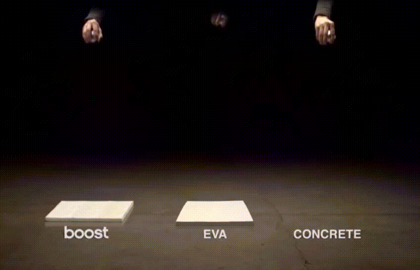

# 服装业

## 商业模式

- [姚蔚铭：你买的衣服，成本价到底有多少？](https://www.bilibili.com/video/BV11h411j75B)

    - 定倍率：零售价格与成本价的比值

        - 纺织品的正常倍率是4-6。低于4属于良心品牌，低于3是爆款通过大量的量压缩成本，徘徊在倒闭的边缘性中，压一次货就撑不住了

        - hm、zara、优衣库4-6，nike、阿迪6-8，普通商超市>10

            - 阿迪、nike多出来的2倍主要是营销成本

        

    - 衣服的生产周期很长，最大的成本是库存

        - 一般是3个月左右，以至于纺织厂都是冬天生产夏天的面料，夏天生产冬天的面料。

        - 如果压了一年库存，现金流无法及时收回，十几年的服装品牌会轰然倒塌

            - 例子：拉夏贝尔、美特斯邦威、凡客诚品，国外的真维斯

- [雪球：从财报看服装业的生意模式](https://baijiahao.baidu.com/s?id=1636500556847811566&wfr=spider&for=pc)

    - 三种商业模式：
        - 1.品牌运营商。也被称为 SPA（Speciality retailer of Private label Apparel，译为自有品牌专业零售商）
            - 多数A 股企业采用的模式，创建并管理一个服装品牌，开发设计产品，以自制或外委加工方式生产，并自建零售门店或寻找服装经销商代理销售等方式出售自己产品

        - 2.服装加工厂
        - 3.服装经销商或称为品牌代理商

- 品牌运营商（SPA）

    - 1.产品研发

        

        - 几乎是服装品牌唯一可以凸显竞争优势的环节

        - 除非是偏向高端定制或功能性产品，多数服装企业的研发投入仅仅只是服装设计费用

        - 18 家服装上市公司的 2018 年的平均值是 2.19%

        - 研发费用还能用来干什么呢？朗姿股份的年报表示：公司设计团队具备敏锐的时尚捕捉能力，经常参加国际流行前沿的时装发布会、知名时装走秀活动，并对国际流行元素保持紧密跟踪，深入营销最前沿，及时反馈顾客需求和市场信息，确保市场需求与公司产品保持紧密衔接。

            - 可见，对于服装企业而言，研发费用用来出出差、旅旅游，理论上是完全说得通的。

        - 步森，这家 2011 年上市，2019 年便濒临退市的企业在其招股说明书中说：
            - 设计研发系统拥有员工 78 人
            - 2008、2009 和 2010 年分别开发出各式新产品 3535 款、3697 款和 3816 款
            - 其募投项目之一便是耗资 1708 万元的“品牌设计研发中心技术改造项目”。但翻看其 2015 年至今的财报，其研发人员数量越来越少，2018 年仅剩 15 人。

            

        - 拉夏贝尔 2017 年的招股说明书也显示，其 2014 年至 2016 年分别推出了约 7300、11360、18720 款产品款式。按照 2016 年研发人员 441 人计算，其人均工作量也在 42 件左右。

    - 2.加工制造

        - 有三种方式：

            - 1.自制生产
                - 七匹狼这样的早期上市企业，均保留有自己的服装工厂

            - 2.包工包料的外委加工
                - 拉夏贝尔：主要采取包工包料的外委生产模式，即直接向供应商采购成衣，由供应商采购公司指定或符合公司要求的面辅料。

            - 3.包工不包料的外委加工
                - 童装品牌安奈儿：“自主采购与检验合格的面辅料、产品样衣与生产工艺图，根据生产计划交由合作加工厂进行缝制加工”。

        - 制造加工是 “微笑” 曲线中附加值最低的部分，多数品牌运营商会选择外包，至少是部分外包

            

        - 加工制造属于劳动密集型产业：材料费略多于加工费

            - 20% 的制造费用中，包括了燃料成本，厂房、设备维护及折旧成本，以及约 3-5% 管理费用、3.5% 左右的税费成本。

            - 从七匹狼的数据来看，近年来生产人工成本占比不断上涨，进一步侵蚀加工环节的利润。

            

        - 加工制造在产业链中处于极为弱势的地位

            - 森马股份 2011 年的招股说明书披露的信息显示：

                - 其与代工厂的付款方式是 2-4-4，生产订金 20%；收到衣服后 10 个工作日付 40%；另外 40% 则需要待货物清点完毕后 60 天内付清。其回款周期至少 3-4 个月。

            

            - 代工厂资金压力大，怎么办呢？拖欠工人工资或许是可行办法，比如往后压一个月工资，收缴入职保证金等，都是典型的 “血汗工厂” 玩法。

    - 3.销售渠道

        - 服装行业基本不存在中间商。相比于酒水饮料、食品日用品等领域内中间商的普遍存在，服装行业在商业效率革新方面更为领先。

        - 有三种方式：

            - 1.品牌运营商自营的专卖店：要支付租金但自主收银的独立门店

            - 2.品牌运营商与商场联营的专柜或专店：位于商场内部，由商场统一负责收银，无须支付租金但商场根据销售额扣除一定比例点数的店面。

                - 从财务的角度来看，自营专卖店的营业收入来源于消费者，而联营专柜的营业收入则源自商场
                - 根据财政部 2017 年修订的《企业会计准则第 14 号——收入》要求，企业应以控制权转移替代风险报酬转移作为收入确认时点的判断标准。

                    - 要求服装经销商把消费者支付的全部价款都纳入到营业收入中，而后再将商场扣点作为代理费用，列示在销售费用科目中。

                        - 对于上市公司而言，由此带来的税收支出增加影响几乎可以忽略，但在财务指标上，会导致联营模式下的营业收入和企业毛利率上升。

                    - 衣服的所有权属于服装经销商而不是商场。因此，尽管消费者支付的价款由商场代收，但企业仍是交易的主要责任人而不是代理人。

            - 3.经销商代理的加盟店

                - 与某一服装品牌签订协议，选定某一商场或商铺，按照品牌商的统一要求装修、布置店面并从其处批发产品进行零售。

            - 拉夏贝尔是一家定位中端、经营体量较大的品牌。其9269家门店中，有9233家门店是直营的，占比99.61%。2014-2017年其直营门店毛利率水平约在65%左右。

                

                - 是不是定倍率就是100/35=2.86倍呢？非也！

                    - 这并不是消费者支付的全部产品零售价，并未包括商场或电商的扣点费用，而这部分费用，其实也是需要消费者支付的。

                    - 2017、2018年原营业收入89.99亿元、87.98亿元，应该分别再加上商场/电商扣点费用14.47亿元、13.78亿元。由此造成营业收入增加约16%。成本价35元的衣服，实际上消费者支付的零售价不是100元，而是116元。也是说，定倍率是3.31。

                    - 商场/电商扣点实际上是浮动性的房租，房租类成本约占零售价的24%。116元购买一件衣服，其中约有24%或28元为门店的房租成本；而如果是商场门店，28元则是商场的扣点。这个数字正好是衣服成本价35元的80%。
                    - 商场之所以选择扣点而不是固定房租形式向入场商家收取租金，其原因还是想从门店的营收中获得超过房租的利益分成。被商场扣点的比例可能不止24%。而入场商家为了维护自己的利益，会提高零售价格，拉夏贝尔同样的衣服，其商场专柜平均售价较自营门店高出约13.8%左右。

                    

            - 其它品牌毛利率水平基本都在60-70%之间，定倍率也应该与拉夏贝尔相当。

                

        - 吊牌价：

            - 拉夏贝尔女装品牌的吊牌价成本倍数通常在6-7倍之间。而且披露的线上销售渠道中，母公司吊牌价成本倍数6.3，而其收购的电商品牌七格格则只有2.6。

                - 同样吊牌价的衣服，其线上折扣约4.3折，而实体专卖店是6折，商场专柜是7折。

            - 无论是线上还是线下，我们都习惯按照吊牌价打折购买衣服。而通过调节吊牌价和折扣，商家几乎可以操控零售价。

- 服装经销商或称为品牌代理商。海澜之家案例

    - 并不是所有的品牌都有高额折扣。全国统一价的销售价格策略，不以打折为营销手段

    - 海澜之家还有一套独特的加盟商管理模式。这一模式助其实现A股服装类上市公司市值、营收、净利润的三个第一

    - 2018年底海澜之家各品牌总计6673家门店中，有6382家是加盟及联营店，占比95.64%。

        - 更像是连锁店，而不是服装品牌运营商

    - 拉夏贝尔的门店房租类成本占比达24%，而从多家上市公司的销售费率平均水平达34%。而以自营为主的拉夏贝尔、维格拉丝、安奈儿的销售费率更是超过40%。零售环节至少需要24%+34%=58%的毛利才能保证不亏损。那么，海澜之家是怎么干的呢？

        

        - 2018年拉夏贝尔的销售费用数据显示，除房租类成本占比营收24%外，人工成本占比营收20.35%。摊销折旧约5.4%。其它比如燃料、易耗品、差旅、运输、咨询等合计占比9.83%。上述合计占营收近60%！再加上管理费用及税费成本等，刚好把母公司与门店合计65%左右的毛利花光光了。
            

        - 海澜之家直营渠道毛利率约61%，加盟店零售的毛利率水平约35%

        - 海澜之家采用35%零售毛利，其单店收入是拉夏贝尔的约5倍，单店毛利达到了160万元。即便是像拉夏贝尔一样单店花掉65万元，其净利润仍有100万左右。这对于加盟者而言，诱惑力是巨大的。
            

    - 2018年海澜之家的研发投入占比营收0.26%，跟同行差了一个数量级，而这还是其研发投入同比增长了96%的结果。
        - 设计流程：

            - 开发提案是重点：主要是对版型、面料、色彩的选择，开发提案的好坏直接决定了最终产品的成败
            - 因此，其主要工作重心是提高开发提案水平，而将打样等操作层面的工作外包给供应商的设计团队。超低的研发投入增大了利润空间。

            

        - 滞销产品可退货条款

            - 供应商按照自己的开发提案设计、制造商品，贴上海澜之家的牌子，放在海澜之家的门店来卖，卖得多则双方获利都多，卖的少则供应商负责把商品拿回去剪掉标签后，再处理尾货。

            - 与上文提到的“包工包料”、“包工不包料”等传统玩法，有了革命性变化。

        - 所有权与经营权分离的特许经营模式

            - 加盟商可以做“甩手掌柜”，只需要负责提供符合要求的门店和经费即可。经营陈设、招聘培训、铺货定价等均委托给海澜之家管理，销售收入按照比例分成。

                - 加盟商获得零售毛利，并支付相关成本开支。海澜之家获得批发货款收入，增强母公司业绩。

            |                | 公司创新的特许经营模式                                                 | 一般服装企业连锁经营模式
            |----------------|------------------------------------------------------------------------|--------------------------------------------------------------------------------------------|
            | 加盟店管理     | 加盟店由公司统一负责代为管理，加盟商不必介入门店管理                   | 公司管理加盟商， 加盟商管理门店经营，各门店管理水平差异较大，品牌形象难以统一              |
            | 加盟店扩张能力 | 加盟商不必有服装从业经验，加盟门檻低，门店扩张能力强                   | 加盟商必须熟悉服装行业。懂得服装力经营，加盟门槛高，门店扩张能力弱                         |
            | 加盟店铺货方式 | 公司根据历史销售数据和市场调研，统筹规划                               | 一般会有订货会根据加盟商的订单式铺货                                                       |
            | 滞销产品       | 可以在不同加盟店之间调配，剩余产品退回公司                             | 门店一般会打折处理.不同门店属于不同的加盟商，调货的可能性较小                              |
            | 风险承担       | 门店库存属于公司。加盟商仅承担房租等固定成本，不承担库存风险           | 门店库存属于加盟商。加盟商除承担房租等固定成本外，还承担库存风险                           |
            | 终端定价权     | 公司制定全国统一指导价，加盟商价格浮动区间较小，公司具有较强终端定价权 | 公司制定指导价。对于非本季新品加盟商有较大的处置权，商品打折情形普遍存在，终端定价难以统一 |

## 产业链

- 上游：

    - 棉：新疆棉区气候条件较为适宜，病虫害发生较轻，棉花长势较好

        

    - 纱：

        - 把棉花纺成纱，一般要经过清花、梳棉、并条、粗纱、细纱等主要工序。用于高档产品的纱和线还需要增加精梳工序。生产不同要求的棉纱，要采取不同的加工程序，如纺纯棉纱和涤棉混纺纱

        

### 广州

- 清远转移园将高效承接广州中大纺织服装商圈

- 广州总部+清远基地

    - 北部围绕广清纺织产业有序转移园打造柔性生产智造区，依托园区优越的区位和低成本生产配套，承担面辅料生产、开料、缝制、染色、贴牌、包装等专业化、精细化生产环节。

    - 中部依托广州空铁联合交通枢纽，打造空铁枢纽功能区，承担供应链组织管理功能，主要包括订单管理、远程品控、交期管理以及智能生产。

    - 南部围绕广州中心城区打造时尚设计消费区，依托丰富的文化资源和时尚产业基础，承担时尚发布、中高端设计、企业总部、消费场景、人才培训、金融服务等功能。

    

# 面料

## 常见的错误认识

- 把面料成分等同于最终的衣服性能：

    - 随着纺织技术的进步，面料成分与最终的衣服性能差距将会越来越少

- 起球，不表示质量差：

    - [姚蔚铭：衣服为什么会起毛起球？纺织品化学工程师专业解答](https://www.bilibili.com/video/BV1v44y1a7ks/)

        | 面料                              | 是否会起球 |
        |-----------------------------------|------------|
        | 纯棉                              | 不会       |
        | 聚酯纤维（涤纶）                  | 不会       |
        | 短丝（棉） + 长丝（聚酯纤维）混纺 | 会         |

        - 起球：只是由化纤长丝和短纤维混纺的纱线，引的性状。

            

        - 纯棉的T恤，摩擦易掉毛；与聚酯纤维混纺后，由于聚酯纤维结实摩不断，原本掉毛的棉花会缠绕在聚酯纤维上，如果摩擦就被搓成了球（先起毛，再起球）。

- 纱线粗细单位：旦尼尔

    - 20D粗细的氨纶比30D的，弹性更差、衰减的更快

- [姚蔚铭：柔软的衣服 不要盲目购买 | 纺织品化学工程师专业解答](https://www.bilibili.com/video/BV1Am4y197Ci)

    - 不要凭手感买衣服。柔软的本质是减少纤维之间的摩擦，可以通过添加硅油实现衣服柔软；但硅油会残留有害物质，健康的硅油成本会很高。洗几次后，衣服变硬，是因为硅油别洗掉了。

- 支数宣传与实际不符：

    - [天丝™家纺的三个骗局你知道吗？](https://www.bilibili.com/video/BV1uX4y187wo)-

    - 家纺行业常见的套路，宣传100支，实际60支
    - 支数：描述纱线细度的单位量词。
        - 类似于拉面一样拉的次数越多，面越长越细。支数越大，纱线越细。

    - 识别方法：
        - 1.看检测报告的纱线线密度指标
            
        - 2.如果是兰精公司的天丝莱赛尔面料：可以向商家拿“兰精的授权书”
            

## 天然纤维

- [姚蔚铭：各类服装面料成分专业详解~通俗易懂](https://www.bilibili.com/video/BV1dL4y1F7Ga)

| 天然纤维 |
|----------|
| 棉       |
| 麻       |
| 蚕丝     |
| 羊毛     |
| 羊绒     |

- 棉花

    - 新疆90%的棉花都是细绒棉，10%才是长绒棉

    | 棉的种类         | 区别                                                    |
    |------------------|-----------------------------------------------------|
    | 细绒棉（最常见） | 长度28mm（实际长短不一）                            |
    | 长绒棉           | 长度36mm（实际长短不一）                            |
    | 精梳棉 (更贵)    | 棉常常长度长短不一，把短的梳走                      |
    | 丝光棉           | 泡在烧碱，棉吸水膨胀，从C型变为圆形，获得更好的反光 |

    

    - 纯棉 = 全棉 = 100%棉

    - 新疆长绒棉产量很低不到10%，市面上很可能是假货，因为成品面料无法检测是长绒还是细绒

        - [姚蔚铭：新疆长绒棉被子就是一个彻头彻尾的骗局](https://www.bilibili.com/video/BV1mj411Z7HP)

        - 衣服和家纺时棉花纤维越长越好，但被子需要的是蓬松度应该使用细绒棉

    - 棉如何获取弹力？

        - 普通棉结构：是肾状并且中间有空隙，有吸湿性强，放湿性差的特点

            

        - 用烧碱浸泡，棉细胞会吸水膨胀，棉纱线之间可以更加紧密，从而获取弹性势能。

            - 比方说老汉背心：在洗涤多次后会变得松松垮垮。因此还是有氨纶的衣服，更好一点

            

        - 丝光棉：在比上面的浸泡多了一个步骤，拉住布的两边，从而更光洁平整

            - 更透气、吸湿；染色饱和度更高、更牢固

            
            

        - 液氨丝光：把烧碱替换成液态氨，棉纤维溶胀的更加均匀，更高的质感。普通丝光机百万一台，液氨丝光机器需要两千万，全中国12台

            

    - [姚蔚铭：“纯棉衣服”既不天然也不环保，请耐心看完！](https://www.bilibili.com/video/BV1wf4y1V7sm)

        - 纯棉所用的化学试剂比化学纤维要多：棉花作为天然纤维，还附着果胶、蜡质等等，因此需要精炼漂白，需要用到渗透剂、烧碱等等。

        - 染色

            - 活性染料（目前最常用）：会有30%的染料会水解形成浮色（掉色）；一些人过了青春期后背还是会长痘和闭口，大部分都是被这种浮色形成的色淀，堵住毛孔引起的。因此会用活性剂进行皂洗，这需要大量的清水，也是高污染的核心；成本也高，因此小作坊可能会随便洗一洗。

            - 还原染料：染色品质非常好，可以持久不褪色。一般用在军装。但染色过程中会产生有毒污染气体。

            - 荧光增白剂：染成白色，可以使用紫外灯，对比餐巾纸会更鲜亮

            - 固色剂：为了提高品质或掩盖使用劣质染料，但劣质的固色剂，会有刺鼻气味

        - 柔软剂：用双指夹住衣服，使劲揉搓5秒钟后，手指会有黏腻感，就一定加了柔软剂。但劣质柔软剂有肝毒素、生殖毒素。

        - 粘合剂：加柔软剂洗几次后就没效果了，加粘合剂后可以提高耐洗性。可能会有甲醛。

- 蚕丝

    - 江浙已经不养蚕，现在在西南地方养，品质最好的是四川

    | 种类                        | 区别                                                                     |
    |-----------------------------|--------------------------------------------------------------------------|
    | 柞蚕丝                      | 比普通蚕丝蓬松度高，价格便宜；柞蚕在辽宁吃柞树长大，黄色丝，一般用作被子 |
    | 双宫茧 （两个蚕共有一个茧） | 比普通的蚕丝差；没办法抽出一根完整丝，做不了衣服，一般用作被子           |
    | 绢丝                        | 蚕丝的边角料（断了的蚕丝）                                               |

- 麻
    - 质感粗糙，扎人，已经很少见了

- 羊毛，羊绒

    | 种类          | 区别     | 供应                        |
    |---------------|----------|-----------------------------|
    | 羊毛          | 取至绵羊 | 澳大利亚供应全球40%         |
    | 羊绒 （很贵） | 取至山羊 | 中国的内蒙和新疆供应全球80% |

    - 为什么缩水？

        - 羊毛和人的头发一样有鳞片层，像鱼鳞一样。摩擦效应：正着摸很顺滑，逆着摸很粗糙

        - 毡缩现象（缩水）：羊毛的鳞片比人的头发更多，在洗涤揉搓的时候会相互摩擦纠缠在一起。无法复原。因此不能用洗衣机洗，手洗也需要轻柔

        

        - 巴素兰工艺：把羊毛的鳞片去除，可以洗衣机洗

            

## 化学纤维

- [姚蔚铭：COOLMAX、Lycra、T400、Cordura是什么面料成分？](https://www.bilibili.com/video/BV14T411E7U8)

- 再生纤维

    > 把棉花，木头，竹子用化学试剂溶解后，纺丝织成布

| 再生纤维种类         | 吸湿性                                                      | 舒适性   | 纤维强度（易破） | 回潮率（越高越冰凉） | 用途                                                                  | 环保             |
|----------------------|-------------------------------------------------------------|----------|------------------|----------------------|-----------------------------------------------------------------------|------------------|
| 粘纤                 | 比棉高50%                                                   |          |                  | 易破                 | 13%                                                                   | 二硫化碳污染很大 |
| 莫代尔               | 比棉高50%                                                   |          | 不易破           | 13%                  | 内衣                                                                  |                  |
| 莱赛尔               | 比棉高50%                                                   | 比棉要好 | 不易破           | 13%                  | 最环保的纤维，回收率99.7%                                             |
| 醋酯纤维（醋酸纤维） | 不那么吸水   有塑料感、光泽像蚕丝、抗皱、有不错的吸湿透气性 |          |                  | 7%                   | 香烟的烟嘴、X光片、一醋酸：肠溶片、二醋酸：贴身衣服、三醋酸：高端衣服 |                  |

| 再生纤维       | 制造过程                                                                                         |
|----------------|--------------------------------------------------------------------------------------------------|
| 粘胶（棉）     | 把精梳棉梳下来的短棉花，用二硫化碳进行溶解成胶，在用机器把胶压成丝                               |
| 粘胶（竹纤维） | 把竹子用二硫化碳进行溶解，再经强酸强碱洗涤后纺丝。这时竹子中的天然抑菌竹醌已经没有了             |
| 莫代尔         | 一种加工工艺不局限于一种原料，一般是山毛榉木，在压丝这一步骤中，压到锌离子很浓的液体里           |
| 莱赛尔         | 一种加工工艺不局限于一种原料，一般是桉树，用NMMO溶解                                             |
| 醋酯纤维       | 把溶解后的木头和棉花，再加入醋酸酐发生化学反应。有一醋酸，二醋酸，三醋酸，酯化越多光泽、品质更好 |

- 莱赛尔纤维：

    - 是一种原纤化材料，洗多了会起球

    - 天丝（Tencel）：一个商标，它们的莫代尔和莱赛尔更好

    - 天丝莱赛尔的不同等级：

        | 等级 | 说明                         |
        |------|------------------------------|
        | G100 | 便宜；易起球                 |
        | LF   | 不容易起球                   |
        | LFH  | 不容易起球；还更加强韧、耐用 |
        | A100 | 几乎不会起球；但手感差       |

- 贴身衣物优先选项：莱赛尔（最好是天丝） > 莫代尔 > 棉花 > 粘胶

- 合成纤维

    > 全部由化工原料合成的

    | 合成纤维               | 吸湿性                                                               | 生活例子                                                   | 价格            |
    |------------------------|----------------------------------------------------------------------|------------------------------------------------------------|-----------------|
    | 聚酯纤维（涤纶）       | 差。涤纶是聚酯纤维的一种。可塑性强、防皱                             | 夏凉被、羊羔绒、法兰绒；可以把纱线做成各种形状，形成速干衣 |                 |
    | 锦纶（尼龙、聚酰胺）   |                                                                      | 耐磨好，适合做中锋衣、羽绒服、防嗮服、渔网                 | 比涤纶贵3倍     |
    | 腈纶（人造羊毛）       | 差。电阻大易起静电（因此会有牛奶面料，但市面上大都是假的），保暖性好 |                                                            | 比涤纶贵2/3倍   |
    | 氨纶                   | 弹力好，混合到其他面料增加弹力，一般百分之几就够了                   |                                                            | 比棉花贵2倍以上 |
    | 二烯类弹性纤维（橡筋） |                                                                      | 用在高端运动袜的袜口，有立体包裹感                         |                 |
    | 莫代尔                 | 比棉花高50%。软弹                                                    |
    | 莱赛尔                 | 比棉花高50%                                                          |                                                            |                 |
    | 醋酯纤维               | 是涤纶的15倍                                                         | 质感好，用在高端时装                                       | 烟嘴            |  |

    - 腈纶：吸湿性差易起静电，需要混纺其它吸湿纤维，市面上一般为“粘胶纤维”（再生纤维的一种），价格不到棉花三分之一，甚至易变形。

        - 吸湿性特别好会吸湿发热，洗完澡没擦干身体，立刻穿衣服会感到有一股暖流

            - 好的保暖衣服，腈纶要大于40%，混纺的吸湿纤维大于20%，氨纶大于5%。

        - 牛奶丝：把牛奶蛋白中的酪蛋白混入纺丝液，技术高、成本高。

            - 市面上的牛奶丝，只是腈纶+氨纶+大量的硅油柔软剂。硅油会残留对人体有害的物质。

        - 大豆丝：把大豆蛋白加入纺丝液，成本还行，不会有假。吸湿效果更好，但比不上天然纤维。一般用作被子

        - 德绒（dralon）：不是面料。只是一个商标，指德国的拜耳公司生产的腈纶。用干法纺丝出细的纱线，普通的是用湿法纺织。保暖性、透气性比普通腈纶更好。但产品溢价也高，假货也不少（要看吊牌有没有授权）。

        - 美雅碧：日本三菱的腈纶商标

        - 色拉姆：日本东洋的腈纶商标

    - 氨纶：

        - 莱卡（Lycra）：高品质氨纶，由德国拜耳公司（也是发明阿司匹林的公司）研究、杜邦公司注册成商标

            - 低品质的氨纶，使用一段时间后，会发生弹性下降、衣服也变得松松垮垮

    - 锦纶
        - Cordura：锦纶（尼龙、聚酰胺）的一种，但更柔软、耐磨、韧性。一般用在帆布背包，战术背心

        - 也有莱卡（Lycra）锦纶，莱卡异形截面锦纶（类似于coolmax版锦纶）
        - 锦纶66：更耐磨。2022年以前无法实现国产化，之后国内的永荣股份实现国产化。

- 丙纶

    - [姚蔚铭：什么速干衣出汗不会粘身子？](https://www.bilibili.com/video/BV148411R719)

    - 排斥汗水：不会被水润湿，因此不会粘身。水滴在丙纶上，像滴在荷叶上。

- GORE-TEX品牌面料（膨体聚四氟乙烯）

    - [姚蔚铭：纺织科普 | GORE-TEX面料是什么？如何专业选购？](https://www.bilibili.com/video/BV1yP4y1g7U7)
    - 复合面料：

        

        - 面料彼此间，以及拼接的航线使用热熔胶，如果使用胶粘会不牢固的问题

    - 聚四氟乙烯有荷叶效应，一般用作不粘锅涂层，水管生料带

    - 膨体聚四氟乙烯，蜂窝结构：气态水 < 孔隙大小 < 液态水，因此可以防水、透气；但不耐磨、孔隙易被堵塞，因此GORE-TEX品牌一般用作三层面料

    - 但GORE-TEX很贵，不建议购买。防水透气可以买tpu，tpe面料；防水效果差点，但透气更好

- 鹅绒

    - [姚蔚铭：你买的鹅绒服里竟然掺鸭绒](https://www.bilibili.com/video/BV1XM411U7fx)

    - 国家标准允许鹅绒掺杂15%鸭绒。标称95鹅绒，实际上鹅绒只占80%；羽绒被标称的95鹅绒，大概率80鹅绒加鸭绒。

    - 用“蓬松度”判断鹅绒：

        | 名称   | 蓬松度 |
        |--------|--------|
        | 95鹅绒 | > 800  |
        | 90鹅绒 | > 730  |
        | 85鹅绒 | > 680  |
        | 80鹅绒 | > 620  |

- 三明治空气层

    - [姚蔚铭：这种面料灵感来自 |三明治 汉堡包 肉夹馍](https://www.bilibili.com/video/BV1ae411F7Bn)

    - 像床垫那样，中间尽可能保持着镂空

### 聚酯纤维（涤纶）

- 聚酯纤维与涤纶的关系：涤纶（PET）只是聚酯纤维的一种；还有PTT、PBT。它们化学结构相近但不完全一样。

- 再生聚酯纤维：用塑料瓶的聚酯纤维

- 混纺：通过根据材料的热缩率不同，加热形成类似弹簧的结构。可以变得更有弹力，比不过氨纶，但寿命更长。

    - 索罗娜：PET+PTT混纺

    - T400：有不错弹力，虽然比不过氨纶，但弹性寿命长。一般用在领口、牛仔裤的裤裆。

    - T800：

- coolmax:纱线形状不是普通的圆形，有岛湿的沟槽，产生的毛细效应，有利于吸湿和速干（比棉花强）
    - 要交很多溢价给那个吊牌

    
    
    

- 阳离子面料：涤纶的染色需要在130度的水中，需要高压锅，成本较高。因此使用阳离子的染料配合阴离子的涤纶，通过磁吸染色，成本便宜，但效果更差。一般用在低端的保暖内衣上。

- 聚酯纤维制作的不同面料风格：

    - [姚蔚铭：珊瑚绒、羊羔绒、摇粒绒、法兰绒是什么？各有什么区别？](https://www.bilibili.com/video/BV14M4y1A7Au)

    - 这些面料都易起静电，需要在洗完衣服后，加入柔顺剂泡，不用清水冲洗，直接脱水晾干

    | 面料   | 内容                                                         |
    |--------|--------------------------------------------------------------|
    | 珊瑚绒 | 绒长像海里珊瑚                                               |
    | 法兰绒 | 原本是英国的粗疏羊毛面料，现在移花接木到了绒比较短的聚酯纤维 |
    | 摇粒绒 | 比珊瑚绒多一道工序：让绒毛缠绕在一起                         |
    | 羊羔绒 | 摇粒绒的一种，只不过绒毛缠绕的像羊羔                         |

# 编织

- 针织

    - 有更好的透气性，更有弹性

    - 应用：T恤、毛衣、运动服、

    - 经编针织：

- 梭织

    - 牢固不容易变形缺少弹性，

    - 应用：床上四件套、连衣裙、牛仔裤、西装

- 支数

    - 纱线越细，支数越多。40支面料的纱线比20支更细

    - 支数越多，面料的密度更高、更薄。但并不意味着支数越多，衣服越好

    - 一般很少有衣服超过80支

# 染料

| 染料       | 安全性                                                           |                                          |
|------------|------------------------------------------------------------------|------------------------------------------|
| 植物染料   | 属于媒染染料，易掉色，因此需要加固色剂（硫酸铝钾等），有毒不安全 |                                          |
| 荧光增白剂 | 安全                                                             | 水洗脱落；漂白会生成黄色物质导致衣服变黄 |

- [姚蔚铭：最好染和最难染的衣服颜色分别是什么？](https://www.bilibili.com/video/BV1RT411Y7we)

    - 黑色最好染，也最容易发生质量问题：本来打算染红色，却不小心染成了紫色，就刚脆一不做二不休染成黑色
        - 染色失误的回修布：黑色衣服洗涤时，可能会发现脱落的颜色根本不是黑色，而是红色。因为黑色是由红黄蓝三种颜色印染的。

    - 84消毒液和漂白剂洗黑色衣服时，最先破坏蓝色，所以最后衣服变成淡红色。而且这是不可逆的。

    - 黑色也是最难染的：因为有深度。最高级的黑是“阿拉伯黑”

- 活性印染：

    - [姚蔚铭：为什么纯棉的衣服更容易掉色？](https://www.bilibili.com/video/BV1os421P7ct)

    - 棉花的化学结构都含有羟基-OH，染色相当于抓住这个羟基-OH。但水也会有羟基-OH，因此会出现掉色，以至于印染厂会水洗1-2次，这也是印染厂高污染的原因，但水费和污水处理费太贵，印染厂也就洗掉个90%左右，剩下的回家洗1-2次就不会掉色了。

- 涂料印染：直接把颜料用粘合胶粘到衣服上。价格便宜，操作简单

    - 危害：有甲醛
        - 甲醛：没有气味，但有刺激性
    - 有商家用涂料印染冒充活性印染。鉴别方法：用白布反复摩擦
    

- 免烫衬衫，用DMDHU把面料间的纤维粘住，达到不皱的效果。但会释放很多甲醛

# 速干衣

- [姚蔚铭：奥运乒乓球决赛，为什么莫雷加德的衣服干爽而樊振东却大汗满身？](https://www.bilibili.com/read/cv36801424)

# 不同纺织品的主要产地和代工厂

- [特要挑：小心踩雷！揭秘所谓1688大牌代工厂同源店铺](https://www.bilibili.com/video/BV1Go4y147JA)

- [姚蔚铭：如何正确的网购衣服，纺织品化学工程师专业解答](https://www.bilibili.com/video/BV1fU4y1M78m)

| 品种       | 主要产地           |
|------------|--------------------|
| 皮革皮草   | 河北辛集、嘉兴海宁 |
| 卫衣       | 山东青岛即墨       |
| 袜子       | 浙江绍兴诸暨       |
| 童装       | 浙江湖州织里       |
| 牛仔系列   | 广东广州新塘       |
| 运动服系列 | 福建泉州石狮       |
| 毛巾       | 河北保定高阳       |
| 羊毛衫     | 浙江嘉兴濮院       |
| 泳装       | 辽宁葫芦岛兴城     |
| 汉服       | 山东菏泽曹县       |

| 代工厂   | 地区       | 自主品牌                      | 介绍和自主技术                                                                                 | 代工面料           | 代工过的品牌                                                                                                             |
|----------|------------|-------------------------------|------------------------------------------------------------------------------------------------|--------------------|--------------------------------------------------------------------------------------------------------------------------|
| 嘉麟杰   |            | kroceus地球科学家             | 与p棉发明者（美国primaloft）推出百分百可回收的人造纤维、起绒类面料、韦编羊毛面料、运动功能面料 | 户外的抓绒polarect | 始祖鸟、猛犸象、Rab、迪桑特、耐克、阿迪达斯、亚瑟士、icebreaker（著名的户外羊毛品牌）                                    |
| 晨风     |            | 柏明blooming（女装）          |                                                                                                |                    | 优衣库、patagonia、stella mccartney、陈序之（XU ZHI）、陈鹏（CHENPENG）                                                  |
| 唐古拉   |            | 唐古拉（目前只有线下店）      |                                                                                                | 耗牛绒             | 无印良品、loro piana、brunello cucincelli、杰尼亚                                                                        |
| 南益集团 |            |                               |                                                                                                | 针织羊毛           | 杰尼亚、burerry、prada、阿玛尼、拉夫劳伦、tommy hifiger、fred perry、brooks brothers、阿迪达斯、耐克、gap、优衣库        |
| 万家美   |            | SAIDAN 赛丹（目前只有线下店） |                                                                                                | 针织毛衫           | MaxMara、BURBERRY、HUGO BOSS、DIESEL、POLO Ralph Lauren、LACOSTE、COS、鄂尔多斯1436、宝姿、珂莱蒂尔、雅戈尔、播、朗姿等 |
| 溢达     |            | 十如仕                        | 全球最细的棉纱线（700英支）、有全产业链：棉花育种、纺纱、织布、染整、成衣                      | polo杉             | 拉夫劳伦、LACOSTE法鳄、汤米、布克兄弟、雨果博斯                                                                          |
| 盛泰     |            | 水柔棉                        |                                                                                                |                    | 拇指白小T、雅戈尔、京东京造、armani、burerry、hugo boss、Ralph Lauren、ck、FILA                                          |
| 尚飞     | 福建省福州 | 33000ft（三万三英尺）         | GEO TECH户外面料                                                                               | 户外冲锋衣         | 山姆、京东京造                                                                                                           |
| 晶苑     |            |                               |                                                                                                |                    | 优衣库、h&m、gap、a&f、李维斯、marks&spencer、lee、北面、puma、安德玛、维多利亚的秘密                                    |
| 元首     | 山东济南   |                               |                                                                                                | 保暖内衣           | 蕉内、舒雅、jockey、polo、fila、冠军、郡是、nissen                                                                       |
| 天山     |   |    GTS、天山                           |                                                                                                | 羊绒衫           ||
| 鹿王     |   |    鹿王                           |                                                                                                | 羊绒衫           ||

## 丝绸

| 代工厂   | 自主品牌                           | 介绍和自主技术                                                                             | 代工过的品牌                                           |
|----------|------------------------------------|--------------------------------------------------------------------------------------------|--------------------------------------------------------|
| 凯喜雅   | 凯喜雅（女装），Seeler茜纳（女装） | 中国最大丝绸企业，是国际丝绸联盟的主席；意大利丝绸协会和爱马仕只是副主席。蚕丝蛋白生物科技 | LV、香奈儿、la perla                                   |
| 万事利   | 万事利                             | 丝绸一般作为国礼送给外宾，北京冬奥会、杭州亚运会的官方特许生产零售商。双面印花技术         | LV                                                     |
| 嘉欣丝绸 | 金三塔、妮塔Nita                   |                                                                                            | armani、patrizia pepo、michael kors、massimo dutti、ck |
| 华佳     | 桑罗                               | 生丝可以达到10万米无疵点、第一起草人身份制定《精品生丝》行业标准                           | 爱马仕                                                 |
| 达利     | 丝绸故事                           |                                                                                            | ck、zara、优衣库、marks&spencer、dvf                   |
| 南方丝巣 | 南方丝巣                           | 以上都是江浙的代工厂，这家是唯一广西的代工厂                                               | 山姆会员店                                             |

## 内衣

- [特要挑：保暖内衣品牌推荐，看完妈妈再也不用担心我的秋裤了](https://www.bilibili.com/video/BV1w24y1C7LY)

| 国内品牌                   | 介绍和代工                                                                                |
|----------------------------|-------------------------------------------------------------------------------------------|
| 三枪（上海老国企）         | 发展还行                                                                                  |
| 宜而爽（台湾中兴纺织）     | 有点掉队，款式有点老气，三五十的价位的内衣不推荐                                          |
| 杭州三针（首推）           |                                                                                           |
| 武汉爱帝（有活动性价比高） |                                                                                           |
| 青岛红妮                   |                                                                                           |
| 大连仕乐                   |                                                                                           |
| 爱慕                       | 综合来看国内数一数二，除了贵点没毛病。子品牌：爱美丽，乎兮，和日本郡是合资运营的BODY WILD |
| 全棉时代                   | 母公司稳健医疗，价位偏高                                                                  |  |
| 歌帝（无锡的恒田）         |                                                                                           |
| 松山棉店（品控不错）       |                                                                                           |
|元首|舒雅、JOCKEY，还有蕉内、POLO、FILA、冠军、日本的郡是、nissen等很多大牌代工 |

| 国外品牌                                                         |
|------------------------------------------------------------------|
| 德国舒雅（最早1875年，东西可以，口碑好，价位偏高平均一套2、300） |
| 美国JOCKEY居可衣                                                 |
| 美国Hanes恒适（退出中国市场）                                    |
| 优衣库HEATTECH系列（保暖效果没那么神，喜欢用涤纶腈纶混纺面料）   |

| 互联网新锐品牌                                                     |
|--------------------------------------------------------------------|
| 蕉内（符合新一代年轻人口味，东西还可以，价格摆在那里）             |
| 螃蟹秘密（蕉内的幕后团队之前做螃蟹秘密的，这两年跟着蕉内涨价不少） |
| 内外（极简有设计感，注重材质和穿着舒适性，也走向了线下）           |
| Ubras（创始人担任过爱慕市场总监）                                  |
| 也可以看看京东京造和网易严选的，品质可以价格不贵。                 |

## 羊绒纱线

- [特要挑：羊绒纱线哪家强，国产羊绒纱线品牌盘点](https://www.bilibili.com/video/BV1Nv4y197SV)

| 品牌                       | 介绍                                                                                                                         |
|----------------------------|------------------------------------------------------------------------------------------------------------------------------|
| 浙江宁波康赛妮（CONSINEE） | 无可争议的行业巨头，国内最大羊绒纱线出口商，主打中高端。他家还有做花式纱的康宝莱（TopLine）。1688上有店铺，一公斤起售。     |
| 鄂尔多斯（ERDOS）          | 国产羊绒一哥，做成衣也做纱线（纱线品牌KVSS），纱线卖得少。                                                                   |
| UPW                        | 综合实力比康赛妮弱，工厂在东莞有官方商城，50公斤以下加收20%费用（可能）。                                                    |
| 中银绒业                   | 只做B端客户，找不到零卖的羊绒纱线。                                                                                          |
| 中鼎                       | 和新奥一样是浙江嘉兴桐乡的（有名的毛衣产业聚集地，国内最大的毛衫批发市场在桐乡濮院），产品偏中档，羊毛羊绒都做，混纺产品多。 |
| M.ORO                      | 发展迅猛，据说设备厂区环境堪称一流，直追康赛妮之势。                                                                         |
| 浙江桐乡华家那             | 纱线在1688有官方店铺                                                                                                       |
| 浙江湖州洪叶云台           |                                                                                                                              |
| 河北澜点                   |                                                                                                                              |

## 雨伞

| 品牌     | 介绍                                    |
|----------|-----------------------------------------|
| 友谊菲诺 | 北京奥运会、冬奥会唯一特许伞类生产商    |
| 天玮     | 蕉下小黑伞的代工厂、美国品牌totes代工厂 |
| 太阳城   | 中国制伞专业委员会会长                  |

## 衬衫

| 品牌     | 介绍                 |
|----------|----------------------|
| 鲁泰     | 国内老牌纺织服装巨头 |
| 京东京造 | 鲁泰代工             |

## 袜子

- 产业分布：

    - 绍兴诸暨大唐镇、草塔镇
    - 吉林辽源：棉袜

- [特要挑：真宝藏国产运动袜品牌，出自TOP级国际一线大牌代工厂](https://www.bilibili.com/video/BV1Ua4y1273i)

- 运动袜

| 品牌     | 介绍                 |
|----------|----------------------|
| 悍将     | 东方百富自主品牌     |
| SOLAX    | 东方百富海外自主品牌 |
| 运动之家 | 诸暨锦缘针纺自主品牌         |

- 抗菌防臭袜

| 品牌     | 介绍                                     |
|----------|------------------------------------------|
| 足步天下 | 金百利自主品牌。军转民用，才创立自主品牌 |

- 棉袜

| 品牌      | 介绍                   |
|-----------|------------------------|
| 耐尔      | 耐尔自主品牌           |
| 铁洛尼    | 耐尔自主品牌，高端商务 |
| 乔安贝    | 耐尔自主品牌，儿童袜   |
| OHNO      | 耐尔自主品牌，潮流袜   |
| 欧蒂爱    |                        |
| PULPOL    | 鹏飞自主品牌           |
| vone vene | 合兴达自主品牌         |

## 泳装

| 品牌           | 介绍         |
|----------------|--------------|
| 号手           | 号手自主品牌 |
| 范德安         | 英华自主品牌 |
| jinxueer金雪儿 | 益丰自主品牌 |
| 凯迪龙         | 益丰自主品牌 |

## 美利奴羊毛

- [特要挑：三百以内羊毛衫哪家强，一百多的某音爆款、两百多的京东京造和三百左右的柏品对比](https://www.bilibili.com/video/BV1TS411A7yU)

| 品牌              | 介绍           |
|-------------------|----------------|
| icebreaker        |                |
| 赛乐              |                |
| 大牧场            |                |
| KROCEUS地球科学家 | 嘉麟杰自主品牌 |

## 枕头

- [特要挑：真大牌源头代工厂，盘点国内头部顶尖记忆绵制造商](https://www.bilibili.com/video/BV1ym411d78p)

| 记忆枕头品牌    | 介绍           |
|-----------------|----------------|
| 梦百合          | 记忆枕头       |
| 赛诺（SINOMAX） | 盛诺的自主品牌 |
| 百思佳          | 高裕自主品牌   |

- [特要挑：丝涟宜家代工厂，国内顶级乳胶枕头、乳胶床垫制造商](https://www.bilibili.com/video/BV1Hy421q7Px)

| 乳胶枕头品牌 | 介绍                         |
|--------------|------------------------------|
| 宝珀         | 爱德福自主品牌。海南乳胶     |
| 金橡树       | 金世缘自主品牌。泰国乳胶     |
| JSY          | 金世缘海外自主品牌。泰国乳胶 |

## 外套

| 品牌 | 介绍                      |
| ------ | --------------------------- |
| NNID   | 金子服饰自主品牌。 |

## 户外露营

- [特要挑：超高性价比！迪卡侬代工厂，国内最大的户外露营用品制造商](https://www.bilibili.com/video/BV161421D7XY)

| 品牌          | 介绍                               |
|---------------|------------------------------------|
| westfield我飞 | 泰普森旗自主品牌。迪卡侬代工厂     |
| Timber Ridge  | 泰普森旗海外自主品牌。迪卡侬代工厂 |

## 家纺四件套

- [特要挑：盘点国内鼎级家纺床品制造商，奢侈大牌四件套也是出自这些代工厂](https://www.bilibili.com/video/BV1We411E79T)

- 产业分布：

    - 南通市是中国、世界家纺之都。电商一半的家纺都来自南通

    - 山东市卧虎藏龙，一些头部家纺就来自山东

| 品牌     | 介绍         |
|----------|--------------|
| 依诗家   | 金号自主品牌 |
| 愉悦之家 | 愉悦自主品牌 |
| 绘睡     | 愉悦自主品牌 |
| 蓝铂     | 华纺自主品牌 |
| 那木     | 北方自主品牌 |

## 拉杆箱

| 品牌       | 介绍                   |
|------------|------------------------|
| 悠客NEWCOM | 新秀自主品牌           |
| 银座       | 银座自主品牌，平价路线 |
| 旅漫       | 银座自主品牌，高端路线 |
| 地平线     | 斯巴特自主品牌         |
| 宾豪       | 宾豪自主品牌           |

# 如何购买衣服

- [姚蔚铭：纺织品化学工程师如何专业的选购衣服？](https://www.bilibili.com/video/BV1By4y157F9)

    - 网购：

        - 看运费险：运费险越高表示退货率越高。

        - 模特的姿势可以掩盖版型的缺陷，因此要看衣服的正身照

        - 有没有细节图：有没有领口、走线拉链等等

    - 实体店：

        - 不能用手感判断衣服好坏

        - 看吊牌：有没有安全技术类别、国标（比如GB 18401）

            | 安全技术类别 | 标准                       |
            |--------------|----------------------------|
            | A类          | 婴儿                       |
            | B类          | 贴身。T恤、内衣、家纺      |
            | C类          | 不能贴身穿。风衣、羽绒服   |
            | GB 31701     | 专门为婴儿设计、标准更严格 |

        - 看水洗标签：一般在衣服左下侧衣角、裤子左侧口袋

            - 纤维成分由大到小的顺序排列

            - 洗涤标识：需要大于5个。顺序是水洗、漂白、晾干、熨烫、干洗；而且除了水洗的标识，其他一下子能看懂，反而是假。如果衣服上出现没见过的标识，就是假的。

                

## 国标

| 产品               | 国标                                                                  |
|--------------------|-----------------------------------------------------------------------|
| 冲锋衣             | [GB/T 32614](https://openstd.samr.gov.cn/bzgk/gb/std_list?p.p2=32614) |
| 速干衣             | [GB/T 21655](https://openstd.samr.gov.cn/bzgk/gb/std_list?p.p2=21655) |
| 针织运动服         | [GB/T 22853](https://openstd.samr.gov.cn/bzgk/gb/std_list?p.p2=22853) |
| 蚕丝被             | [GB/T 24252](https://openstd.samr.gov.cn/bzgk/gb/std_list?p.p2=24252) |
| 接触凉感（冰丝感） | [GB/T 35263](https://openstd.samr.gov.cn/bzgk/gb/std_list?p.p2=35263) |

- 安全类别GB/T 18401：A、B、C类

    - [姚蔚铭：A类纺织品真的安全放心吗？](https://www.bilibili.com/video/BV1wV411u7W6)

    - A类并不难制作

    - 但即使是婴儿类的A类，也可能会有许多安全问题。因为这个国标是颁布2010年，即便是A类也多多少少与时代脱节了
        - A类并不查双酚A——会让女童性早熟、男童雌化，之前曾有个毒奶瓶事件，使用的就是双酚A

    

## 内裤

- [老爸评测：内裤到底有多脏？9人耗时3个月，用百组数据告诉你！](https://www.bilibili.com/video/BV1ZJ411v7Pf)

    - 内裤要单独手洗

    - 内裤要勤换

## 袜子

- [姚蔚铭：为什么穿了抗菌袜，脚还是会臭？](https://www.bilibili.com/video/BV1tW4y1k7Dp)

    - 即使袜子抑菌，鞋子也会有细菌导致变臭

    - 竹纤维骗局：竹纤维在加工过程中，天然抑菌的竹醌已经没有了。
    - 远红外骗局：很可能是加了银离子和其他抑菌剂实现

        

    - 抑菌的工艺：

        - 1.加入化学抑菌剂：耐洗性差。**不推荐**

            - 银抑菌剂：银粒子抑菌袜。有重金属沉积的风险，目前无法证明是有害和无害，美国禁止使用。

            

        - 2.原料抑菌：把抑菌剂添加到纤维当中，与其他纤维混纺成纱线，再做成纺织品。

            - 比方说禾素时代品牌的袜子，禾素时代的主业是生产环保抑菌剂PHBV

## 速干衣

- [我们鉴定了10款畅销速干衣，迪卡侬等6款样品不达标](http://static.nfapp.southcn.com/content/201804/20/c1114763.html)

    - 吸水率（吸水能力）：放入水中，5分钟后捞起，垂直晾着，在30秒不滴水，进行前后称重

    - 芯吸高度（毛细管效应）：剪成长条在底部的水悬挂30分钟

    - 滴水扩散时间（吸水速度）：滴一滴水，水滴完全消散的时间

    - 水分蒸发速率（干得快不快）：每隔5分钟称一次重

- [姚蔚铭：速干衣是什么原理？如何专业的选购？](https://www.bilibili.com/video/BV1dU4y177mz)

    - 速干衣的工艺：

        - 1.改变衣服编织结构：把内层网眼织的比外层大，产生差动毛细效应

            

        - 2.双层结构面料：内层用涤纶，外层用棉花/粘胶

            

        - 3.异形截面丝：涤纶或锦纶纺丝过程中加工成异性，比方说coolmax

            
            
            
            

        - 4.使用亲水性好的聚酯聚醚化学物质：由于结构像涤纶，可以像染料一样染进去，比普通的涤纶要强很多

        - 5.单向导湿面料：真正意义上的速干衣，加工难度大，前面几种吸湿不错但速干一般，专业运动员会穿这种

            
            

    - 如何选择速干衣？

        - 1.选择以上的吸湿速干工艺，越多越好

        - 2.选择锦纶含量高的，锦纶许多性能比涤纶好，成本贵三倍

        - 3.实体店买衣服，用矿泉水滴一滴测试

## 羽绒服

- [姚蔚铭：羽绒服没破洞，为什么还会钻绒？](https://www.bilibili.com/video/BV1zP4y1U7rT)

    > 有缝线就会有钻绒问题

    - 无缝羽绒：用压胶代替绗线（缝线）。由于这是新工艺，部分品牌加工不成熟，有洗几次会开胶的问题

- 买腈纶而不是涤纶（聚酯纤维）

## 凉席

- [夏天睡天丝™莱赛尔凉席“凉而不冰”](https://www.bilibili.com/video/BV1WC411a7rF)

- 凉席不是越凉越好
    - 竹凉席过于冰凉，而且无法机洗。
    - 合成纤维凉席，闷汗不透气。
    - 凉席最好选择是：LFH等级的天丝莱赛尔

- 问商家客服提供Q-max值（瞬间接触凉感系数）检测报告。数值在0.2-0.3之间就是凉而不冰的感觉。

# 如何洗涤

- [做视频的洛唐：衣服为什么会变皱？熨斗和挂烫机的工作原理](https://www.bilibili.com/video/BV1HG4y177SD)
    - 化学键在水和外力的作用下断开，发生移动，在另一个地方形成新的化学键

    - 烫斗的湿烫模式：喷出水蒸气，让热量更均匀

- 氨纶不能用84消毒液，不然会出现弹力下降，衣服会变得松松垮垮

- [姚蔚铭：夏天衣服发臭了怎么办？](https://www.bilibili.com/video/BV1as4y1r7tX)

- [央视频：内衣和袜子可以一起洗吗？](https://www.bilibili.com/video/BV1Ua411d7xb/)

# 机器

## 洗衣机

- [中国疾病预防控制中心环境与卫生相关产品安全所：普通民用洗衣机微生物污染状况(https://www.docin.com/p-1752204544.html)

    - 结论：民用洗衣机污染严重

- [姚蔚铭：美国的洗衣机里有个“大钻头”](https://www.bilibili.com/video/BV1xq4y1h7Si_source=5de14ac47d024a404772edfe5d5eb20c)

    |              | 波轮                 | 滚筒               | 独龙转（美国）   |
    |--------------|----------------------|--------------------|------------------|
    | 洗涤方式     | 摩擦方式，洗的最干净 | 摔打方式           | 洗大件和一堆衣服 |
    | 是否损伤衣服 | 没有护理，过于暴力   | 最大保护原本的手感 |                  |

- [姚蔚铭：洗衣机“绿标认证”，是智商税吗？](https://www.bilibili.com/video/BV1Pb4y1e72p)

    - 羊毛绿标：只适合澳大利亚的美利奴羊毛。营销卖标签，比没标签要多花2000元。

- [姚蔚铭：在未来，超市里的洗衣液为什么会越来越少见？](https://www.bilibili.com/video/BV1fL4y147R6)

    - 传统洗衣液的复配3种成分：

        - 1.表面活性剂：洗涤作用可以润湿灰尘、乳化油脂

        - 2.生物酶：

            | 生物酶   | 作用 |
            |----------|------|
            | 蛋白酶   | 血迹 |
            | 脂肪酶   | 油渍 |
            | 纤维素酶 | 柔软 |

        - 3.提高穿著体验：荧光增白剂、柔顺剂、芳香剂等等

    - 传统洗衣液难以解决复配问题：表面活性剂 + 生物酶。洗衣液需要在碱性条件下才能洗干净，而生物酶惧怕碱性环境。也是为什么放久了的洗衣液，效果没有那么好，因为生物酶放久失去了活性。

        - 传统洗衣液一大瓶：只有10%是有效成分，90%都是粘度调节剂（增稠剂），方便消费者倒取

            - 加入生物酶后，需要稀释；但稀释后像水一样，倒取时不方便。

        - 如何把各种有用的洗涤成分科学混合，并维持性能，而不相互抵消：为了解决这个问题发明了洗衣凝珠，把洗涤剂和助洗剂分装；但用量是固定的，一次大概要洗7件的量。

            

    - 胶囊洗衣机：洗衣凝珠的洗衣机智能投放版。如果未来普及，超市上的瓶装洗衣液将消声灭迹

        
        

## 烘干机

- [姚蔚铭：纺织品化学工程师 | 烘干机选购指南](https://www.bilibili.com/video/BV1FS4y18773)

    - 优点：烘干机有护理效果，也可以避免羊毛、蚕丝被太阳直射的褪色；T恤、内衣晾干时的伸长和褶皱

    - 缺点：体积大、需要额外连接排水管

    - 选择热泵式|双擎|4层过滤网

        - 烘干方式：

            - 选购优先度：热泵>冷凝>直排

            | 对比项目     | 热风式                 | 冷凝式                                       | 热泵式                           | 真空负压                             |
            |--------------|------------------------|----------------------------------------------|----------------------------------|--------------------------------------|
            | 原理         | 像吹风机一样直吹热风   | 在吹风机的基础上加了冷凝器干燥烘桶内潮湿空气 | 像空调一样，用温和的热量烘干衣服 | 不断降低桶内的压强，使水分蒸发的更快 |
            | 价格         | 1000左右               | 3000左右                                     | 5000左右                         | 2500左右                             |
            | 能耗         | 2230W                  | 2190W                                        | 170W                             | 较低                                 |
            | 烘干温度     | 90°以上                | 70°-                                         | 90°                              | 60°以下                              | 室温- | 65° |
            | 安装方式     | 排气管道               | 排水管道                                     | 洗衣机叠放                       | 免安装                               |
            | 绒毛过滤     | 无                     | 无                                           | 有                               | 有                                   |
            | 排气方式     | 直接排放               | 除水后排放                                   | 除水后排放                       | 除水后排放                           |
            | 衣干即停     | 否                     | 是                                           | 是                               | 是                                   |
            | 是否损伤衣服 | 烘干的衣服还会干枯毛糙 | 依然有损伤衣服风险                           | 不会                             | 不会                                 |

        - 真空负压：体积小、噪音不低61dba

        - 双擎：给风扇单独配一个电机，避免风扇反转时没有风，内部积累热量损伤衣服

            

        - 4层过滤网：避免堵住风机和蒸发器，轻则烘干时间变长、更费电；重则烘干机报废

- 电阻接触式烘干机，不适合冲锋衣、羽绒服、棉服、毛毯等厚重纺织品

    - 只能判断衣服表面的含水量，内部的羽绒还含有水分

    - 选择透视3d烘干技术的烘干机

# 鞋

## 中底

### 材料缓震

- [弱水投研：【弱水投研】一文读懂运动鞋中底材料（上）：运动鞋中底材料进化史](https://mp.weixin.qq.com/s/vO7am8r2sUZOawomLSa2ew)

- [弱水投研：一文读懂运动鞋中底材料（下）：各大运动品牌发泡材料中底技术矩阵](https://mp.weixin.qq.com/s/V1E9WHgB4RjUEBlvpYI9EQ)

- [（视频）有缘zj：【材料缓震①】谁才是缓震材料之王？zoom x | react | boost | bounce | 䨻 | 云？](https://www.bilibili.com/video/BV1Af4y1R7Dy)

- [（视频）有缘zj：【材料缓震②】坚持创新虽存遗憾，但终会看见曙光！gel | 态极 | 轻弹 | 魔弹 | 澎湃 | 奇弹 | EVA | 非牛顿流体 | 尼龙弹性体](https://www.bilibili.com/video/BV1xA411v7PL/?vd_source=5de14ac47d024a404772edfe5d5eb20c)

- 聚合物根据分子作用力分为3种：橡胶 < 塑料 < 纤维

    - 鞋子的材料需要有弹力的橡胶

- 人工合成橡胶（热塑性弹性体/TPE）密度很大，因此需要进行发泡处理：

#### 发泡材料

- 发泡材料的出现完全改变了运动鞋产业。
    - 1975年，美国跑鞋品牌Brooks在其产品上应用了EVA发泡材料，开启了发泡材料主宰运动鞋中底的新时代。发泡材料又称为“泡棉（Foam）”，实质是泡沫塑料，相比传统的橡胶等材料具有轻质、美观、耐用、可塑性强、成本低等诸多优势。至今，绝大多数运动鞋都以发泡材料制作中底，甚至皮鞋、皮靴、拖鞋等也开始以发泡材料替代或混改原来的皮质、橡胶中底，以减轻鞋体重量、提高穿着舒适度。

| 发泡材料                                     | 特点                                                                                      | 轻质化 | 回弹性能 | 耐久性 | 价格 |
|----------------------------------------------|-------------------------------------------------------------------------------------------|--------|----------|--------|------|
| eva（e乙烯 + va乙酸乙烯酯）                  | va的含量增大时：回弹、韧性等等都会提高                                                    | **     | *        | *      | *    |
| etpu（膨胀热塑性聚氨酯）= 发泡后的tpu        | tpu（热塑性聚氨酯弹性体橡胶）， 分为聚醚型、聚酯型：前者强度、弹性>后者；后者拉伸>前者。 | *      | ***      | ****   | **   |
| tpee（热塑性聚酯）                           |                                                                                           | **     | ***      | ****   | ***  |  |  |  |
| peba（聚酰胺系热塑性弹性体）也就是尼龙弹性体 | 因其高强度、耐磨、轻质化的优点被广泛应用于绳索、降落伞、轮胎等。                          | ****   | ****     | ***    | **** |
| pu（聚氨酯）                                 | 发泡能减震、做硬能支撑、篮球的表面的人造革、拉丝后可以做衣服

- eva发泡

    - 是应用最早、最成熟、最广泛的发泡鞋材。EVA材料的各项性能都较为普通，耐久度指标较为落后，长时间穿着后容易使其发泡结构被“踩扁”，从而降低回弹、缓震性能。

    - 由于其技术成熟、造价较低，其在各大品牌运动鞋的产品矩阵中一般都为中低端定位。如果某运动鞋产品并未宣传其中底技术，一般可以默认为EVA材料。此外，运动鞋鞋垫大部分也由EVA材料制作。

    | 企业     | eva发泡科技名称         | 特点                                 |
    |----------|-------------------------|--------------------------------------|
    | 李宁     | cushion                 | eva （已退出市场）                   |
    | 李宁     | bounse                  | eva （已退出市场）                   |
    | 李宁     | bounse+                 | eva （已退出市场）                   |
    | 李宁     | 李宁云                  | eva                                  |
    | 李宁     | lightfoam               | eva                                  |
    | 李宁     | activefoam              | eva                                  |
    | 安踏     | A-FLASHILITE 氢         | eva                                  |
    | 安踏     | A-FLASHFOAM 虫洞        | eva                                  |
    | 安踏     | A-Flashbubble 细胞元    | eva                                  |
    | 安踏     | A-Shock 菱极            | eva                                  |
    | 安踏     | A-CORE                  | eva                                  |
    | 安踏     | C37                     | eva                                  |
    | 安踏     | A-FLASHEDGE 舒弹        | eva + tpe + 环保乳胶                 |
    | 匹克     | P-MOTIVE 魔弹           | eva                                  |
    | 匹克     | SUPER P-MOTIVE 超级魔弹 | eva                                  |
    | 361      | NFO                     | eva                                  |
    | 361      | NFO2.0                  | eva                                  |
    | 361      | 邦弹                    | eva                                  |
    | 361      | QU!KFOAM/Q弹            | eva                                  |
    | 361      | QU!KFOAM Lite           | eva                                  |
    | 361      | QU!KFOAM eco            | eva                                  |
    | 361      | QU!KFOAM/Q立方          | eva                                  |
    | 361      | ENRG-X/E韧              | eva                                  |
    | 特步     | 柔立方                  | eva                                  |
    | 特步     | energetex 聚能弹        | eva                                  |
    | 鸿星尔克 | 弜弹                    | eva                                  |
    | 乔丹     | Q-LITESPEED 轻速        | eva                                  |
    | 乔丹     | Q-KUNGFU 巭             | eva + tps（热塑性苯乙烯） 化学发泡   |
    | 乔丹     | Q-KUNGFU pro 巭pro      | eva + tps（热塑性苯乙烯） 超临界发泡 |
    | 阿迪     | bounce                  | eva （已退出市场）                   |
    | 阿迪     | Cloundfoam              | eva                                  |
    | 阿迪     | adiPRENE                | eva + 橡胶                           |
    | 阿迪     | adiPRENE+               | eva + 橡胶                           |
    | 阿迪     | REPETITOR               | eva                                  |
    | 阿迪     | REPETITOR+              | eva                                  |
    | nike     | cushion                 | eva （已退出市场）                   |
    | nike     | phylon                  | eva （已退出市场）                   |
    | nike     | cushlon                 | cushion + phylon                     |
    | nike     | lunar                   | eva + 丁腈橡胶                       |
    | nike     | lunalon                 | lunar + phylon  （已退出市场）       |
    | nike     | react                   | eva + 其他tpe                        |
    | nike     | renew                   | eva                                  |
    | 索康尼   | GRID                    | eva                                  |
    | 索康尼   | PROGRID                 | eva                                  |
    | 索康尼   | POWERGRID               | eva                                  |
    | 索康尼   | PWRGRID+                | eva                                  |
    | 索康尼   | SSL EVA                 | eva                                  |
    | 新百伦   | ACTEVA                  | poe（聚烯烃弹性体）                  |
    | 新百伦   | ACTEVA lite             | eva + poe                            |
    | 新百伦   | ACTEVA ULTRALITE        | eva                                  |
    | 新百伦   | ABZORB                  | eva + poe                            |
    | 新百伦   | ABZORB SBS              | eva + sbc（苯乙烯类共聚物）          |
    | 新百伦   | REVlite                 | eva                                  |
    | 新百伦   | FreshFoam               | eva                                  |
    | 新百伦   | N-ERGY                  | eva + 橡胶                           |
    | 亚瑟士   | duomax                  | eva                                  |
    | 亚瑟士   | solyte                  | eva                                  |
    | 亚瑟士   | speva                   | eva                                  |
    | 亚瑟士   | fluidride               | eva                                  |
    | 亚瑟士   | flytefoam lyte          | eva + tps                            |
    | 亚瑟士   | flytefoam propel        | eva + tps                            |
    | 亚瑟士   | flytefoam blast         | eva + obc（烯烃嵌段共聚物）          |
    | 亚瑟士   | flytefoam blast+        | eva + obc                            |
    | 美津浓   | FoamWave                | eva                                  |
    | 美津浓   | ap                      | eva                                  |
    | 美津浓   | ap+                     | eva                                  |
    | 美津浓   | PoWnCe                  | eva                                  |
    | 美津浓   | U4ic                    | eva                                  |
    | 美津浓   | U4icX                   | eva                                  |
    | 美津浓   | ENERZY                  | eva                                  |
    | 美津浓   | ENERZY Core             | 橡胶                                 |
    | 锐步     | DMX Foam                | eva                                  |
    | 锐步     | Fuel Foam               | eva                                  |
    | 锐步     | Floatride Fuel          | eva                                  |
    | 彪马     | IGNITE                  | eva                                  |
    | 彪马     | FusionFoam              | eva                                  |
    | 彪马     | RiderFoam               | eva                                  |
    | 彪马     | ProFoam Lite            | eva                                  |
    | 彪马     | HYBRID                  | IGNITE+NRGY                          |
    | 斯凯奇   | Resalyte                | eva （已退出市场）                   |
    | 斯凯奇   | Ultra Light             | eva                                  |
    | 斯凯奇   | Ultra Go/5GEN           | eva                                  |
    | 斯凯奇   | Ultra Flight/Flight GEN | eva                                  |
    | 斯凯奇   | Hyper Burst/轻弹        | eva                                  |
    | 安德玛   | Micro G                 | eva                                  |
    | 安德玛   | CHARGED                 | eva                                  |
    | 安德玛   | HOVR                    | obc                                  |
    | 安德玛   | FLOW                    | obc                                  |

    - 安踏由于历史上推出了数量繁多的、主要基于EVA的发泡中底科技，被冠以“EVA雕花大师”的称号。

- tpu

    > 部分品牌的宣传材料中会在TPU（或TPE等）前加一个E，代表Expanded发泡，实际概念没有差别。

    - 芳香族最大的缺点在于经过紫外线照射后会发生黄变，阿迪Boost即为芳香族TPU，穿着一段时间后材料变黄明显，影响观感；而脂肪族则几乎完全攻克了这一问题。

    - 脂肪族则几乎完全攻克了这一问题。除了没有黄变的缺点外，总体而言，脂肪族性能上还优于芳香族；调校良好的脂肪族TPU在除轻质化外的性能上几乎与TPEE不相上下，而生产成本却更低。
        - 脂肪族TPU自2021年下半年开始大放异彩

    - boost：2013年，阿迪推出源自德国巴斯夫Infinergy系列TPU（Thermoplastic Polyurethane）材料并买断专用权的Boost科技，使TPU名声大噪，也使Boost几乎成为了TPU的代名词。

        

        - Boost材料具有颗粒状的显著特征，源于其颗粒状的基材造型，发泡过程中每颗TPU粒子像爆米花一样膨胀起来，因此也得名“爆米花”。需要强调的是，这是由于Boost材料采用了珠粒发泡工艺，而珠粒发泡只是发泡工艺中的其中一种（甚至是最基础的一种，常见的泡沫塑料大多为珠粒发泡，也呈现“爆米花”结构），所有TPE材料都有可能采用珠粒发泡工艺，都会呈现“爆米花”状的颗粒纹路；而采用板材、胚模、注塑、挤出、3D打印等制备工艺的材料则不会呈“爆米花”状。因此，不能简单地将TPU和“爆米花”划等号。

    - 优点：比eva更软、弹、耐寒、耐久。发泡成球形还可以有材料缓震、结构缓震。
    - 缺点：太重，且在长时间受压力形变之后会发热
        - 因此在顶级竞速跑鞋领域目前已经几乎看不到阿迪Boost的身影。
    - 优缺点悖论：越重耐久性越好，越轻就需要不断发泡，冲入更多气体，耐久性越差。因此可以混入其它材料
    - 芳香族（聚醚型）TPU：有苯环结构，在紫外线的环境下很容易被氧化，导致不可逆转的发黄
    - 脂肪族（聚酯型）TPU：有苯环结构，耐黄性大幅度提高

    
    
    
    

    | 企业     | tpu发泡科技名称               | 特点                            |
    |----------|-------------------------------|---------------------------------|
    | 李宁     | drivefoam                     | tpu                             |
    | 李宁     | 䨻（中配版）                  | tpu                             |
    | 安踏     | NIROSPEEDGE                   | 脂肪族tpu                       |
    | 安踏     | MarsFoam 火星泡棉             | tpu                             |
    | 匹克     | P-soon 轻速                   | tpu                             |
    | 361      | QU!KFOAM♾/Q弹超               | eva + tpu                       |
    | 361度    | Boundair                      | 珠粒发泡，和bosst一样呈爆米花状 |
    | 特步     | Dynamic foam 动力巢           | 珠粒发泡，和bosst一样呈爆米花状 |
    | 特步     | Dynamic foam 2.0 动力巢2.0    | 珠粒发泡，和bosst一样呈爆米花状 |
    | 特步     | X-Dynamic foam 动力巢X        | 珠粒发泡，和bosst一样呈爆米花状 |
    | 特步     | X-Dynamic foam2.0T 动力巢X2.0 | 珠粒发泡，和bosst一样呈爆米花状 |
    | 鸿星尔克 | 炁(qi)                        | tpu                             |
    | 阿迪     | boost                         | 芳香族tpu，珠粒发泡             |
    | 阿迪     | lightstrike                   | 非珠粒发泡                      |
    | 索康尼   | EVERUN                        | tpu                             |
    | 索康尼   | PWRRUN                        | eva + tpu                       |
    | 索康尼   | PWRRUN+                       | tpu                             |
    | 新百伦   | ENCAP                         | eva + tpu                       |
    | 新百伦   | N2                            | tpu                             |
    | 新百伦   | Fuelcell                      | eva + tpu                       |
    | 新百伦   | FreshFoamX                    | tpu                             |
    | 亚瑟士   | Microflux                     | tpu                             |
    | 亚瑟士   | Hypergel                      | tpu + 硅胶                      |
    | 美津浓   | XPOP                          | tpu                             |
    | 彪马     | NRGY/能量球                   | tpu                             |
    | 彪马     | NRGY（FOAM）                  | eva+tpu                             |

    | tpu发泡鞋垫企业     |
    |---------------------|
    | 欧索莱（Ortholite） |
    | 海波丽（Hi-Poly）   |

- tpee发泡

    - 可以视作TPU的升级版本，总体而言在回弹、耐久等指标上与TPU差异不大，在轻质化指标上则有明显提升。

    | 企业 | tpee发泡科技名称  | 特点                                                                                                        |
    |------|-------------------|-------------------------------------------------------------------------------------------------------------|
    | 特步 | feather foam 騛羽 | eva + tpee + 其他tpe                                                                                        |
    | 乔丹 | 巭PRO             |                                                                                                             |
    | 阿迪 | lightstrike pro   | 性能大幅超越Lightstrike，但在营销策略方面显然有所失误，容易令消费者误以为该材料仅为Lightstrike的升级版本。 |
    | 李宁 | 䨻（低配版）      | 脂肪族tpu。成本下降一半以上，可谓是PEBA䨻的平价替代款。                                                     |
    | 锐步 | Floatride Energy  | tpee                                                                                                        |

- peba发泡

    - 其中pebax商标的peba最好
        - 高端运动鞋在宣传稿中常见的Pebax实际上是法国阿科玛公司为其PEBA产品确定的注册商标

    - 根据聚酰胺种类的不同，PEBA又可以进一步可以分为PA-6、PA-11、PA-12等，其中以PA-12应用于鞋材中底最为常见，因此在鞋材领域常常可见以“尼龙12”代指PEBA材料的情况。此外，一些商家还会以TPA、E-TPA等代指PEBA。

    - 发泡对比：板材发泡在性能上高于珠粒发泡，但由于板材发泡需要对板材进行切削成型，材料利用率远低于珠粒发泡，造成其成本居高不下，以至于耐克甚至可以利用Pebax废料生产一款新的跑鞋。

    - 缺点：抗撕裂性较差、易产生褶皱裂纹

    | 企业   | peba发泡科技名称         | 特点                                          |
    |--------|--------------------------|-----------------------------------------------|
    | 李宁   | lightfoam plus           | eva + peba                                    |
    | 安踏   | NITROSPEED氮             | peba                                          |
    | 安踏   | NITROSPEED NUC氮素       | eva + peba                                    |
    | 匹克   | 轻弹                     | eva + peba（解决不断发泡的eva很轻，但不耐久） |
    | 匹克   | P-popup澎湃              | peba                                          |
    | 匹克   | 爆湃                     | peba                                          |
    | 乔丹   | 巭（bū）pro              | EVA+PEBA                                      |
    | 361度  | QU!KFLAME/Q燃            | peba珠粒发泡                                  |
    | 特步   | 动力巢PB                 | 珠粒发泡                                      |
    | 阿迪   | boost light              |                                               |
    | 索康尼 | PWRVIZI                  | tpu + peba                                    |
    | 索康尼 | PWRRUN                   | peba                                          |
    | 亚瑟士 | FreshFoam Blast Turbo    | peba                                          |
    | 美津浓 | ENERZY Lite              | peba                                          |
    | 锐步   | Floatride/Floatride Foam | peba                                          |
    | 彪马   | NRGY ELITE（FOAM）       | eva+peba                                       |

    | 企业 | pebax发泡科技名称 | 发泡工艺         |
    |------|-------------------|------------------|
    | 李宁 | 䨻（高配版）      | 珠粒发泡工艺     |
    | nike | zoom x            | 板材模压发泡工艺 |

#### 发泡材料混入添加剂

- 非牛顿流体：STF（Shear Thickening Fluid）并不属于TPE范畴，而是一种TPE发泡过程中的的混合料或添加剂。STF材料一般不会单独制备成为中底主体材料。

    - 添加了STF添加剂的中底材料会产生“走路时软，跑步时韧”的动态脚感；软的橡皮泥，硬的可以保护鸡蛋。

    - 目前市面上最知名的STF材料为英国D3O公司生产的同名材料，也常被称为“防弹流体”、“防弹材料”等。

        | d3o应用        |
        |----------------|
        | 手机壳         |
        | 运动护具       |
        | 运动服装       |
        | 芭蕾舞鞋       |
        | 汽车的电池保护 |
        | 防弹衣         |

        
        

    - [李永乐老师官方：新材料P4U为啥能让柔软跑鞋瞬间强化？八隅体规则共价键是什么？](https://www.bilibili.com/video/BV1sx411Z7pG)

    - p4u（膨胀型流体 + pu）：中国人的d3o

        - 匹克的态极：

            - 优点：由于是膨胀型流体，走的时候软、跑的时候弹

            - 缺点：太重、太软——由于本身就软，还需加tpu保护导致更重。

        | 企业     | STF发泡科技名称           | 特点             |
        |----------|---------------------------|------------------|
        | 匹克     | taichi态极                | eva + stf        |
        | 匹克     | 轻量化态极                | eva + peba + stf |
        | 匹克     | 超轻量化态极              | eva + peba + stf |
        | 鸿星尔克 | α-flex/奇弹               | eva + stf        |
        | 鸿星尔克 | α-flex lite/奇弹lite      | eva + stf        |
        | 鸿星尔克 | α-flex pro/奇弹pro        | eva + stf        |
        | 鸿星尔克 | α-flex 2.0/奇弹2.0        | eva + stf        |
        | 鸿星尔克 | α-flex 3.0/奇弹3.0        | eva + stf        |
        | 鸿星尔克 | α-flex pro 3.0/奇弹3.0pro | eva + stf        |
        | 安踏     | Smart S.A.M               |                  |

- 除了以上述STF材料作为发泡添加剂外，各大运动品牌以及中底材料供应商还常常在制备TPE发泡材料时加入其他各种添加剂，以获得复合性能。
    - 如加入高导热性质的石墨烯、氮化铝等粉末，以提高TPE发泡材料的散热性能；加入非晶体金属粉末以提高发泡材料强度、韧性和耐久性等等。安踏甚至加入了废弃茶叶梗，使中底成为“具备环保理念的科技材料”，应用于近期推出的一款茶文化休闲鞋中。
        

#### 发泡工艺

- 基材和发泡工艺是影响其成品性能的两大最关键因素，普通基材+优秀工艺＞优秀基材+普通工艺的情况并不少见。

    | 发泡工艺 | 比喻                 |
    | -------- | -------------------- |
    | 化学发泡 | 酵母蒸馒头           |
    | 物理发泡 | 加入气体，如吹泡泡糖 |
    | 机械发泡 | 打蛋机               |

    | 发泡工艺           | 板材 | 胚模 | 注塑 | 珠粒 |
    |--------------------|------|------|------|------|
    | 物理（超临界发泡） | **** | ***  | ***  | ***  |
    | 化学               | *    | **   | **   |      |

- 化学发泡是最传统、最成熟的发泡工艺，将TPE原料、添加剂与化学发泡剂混合后加热，发泡剂受热分解并释放气体，使TPE充气膨胀并形成疏松多孔的结构

    - 比喻：酵母蒸馒头

    - 化学板材发泡EVA材料性能则十分普通，常用于制作中低端鞋内垫。

- 物理发泡（亦称超临界流体发泡、超临界发泡）则是近年来逐渐流行于制鞋产业的新兴工艺。

    - 超临界流体物理性质介于液体和气体之间，在一定温度和压力作用下兼具气体和液体的性质，可以像气体一样易于扩散，又可以像液体一样易于浸润。

        - 超临界发泡技术一般以二氧化碳或氮气（这也是安踏氮科技、彪马NitroFoam的命名来源）作为物理发泡剂，因为这两种气体环保、价格低廉且临界温度、压力较为容易实现。制备时，先将超临界流体和TPE原料、添加剂混合均匀，然后通过升温、降压使超临界流体变回气态，使气体充满混合物内，从而实现发泡效果。

        - 相比化学发泡，超临界发泡工艺制成的发泡材料泡孔更加细腻、均匀，回弹、韧性、轻质化和耐久度等指标更加优越，超临界发泡基本上全方位领先于化学发泡。但是相对应地，超临界发泡对设备和过程控制的要求远高于化学发泡，因此生产成本也远高于化学发泡。

    - 比喻：加入气体，如吹泡泡糖

- 板材发泡和胚模发泡
    

- 板材发泡，也称为片材发泡，是较为传统而成熟的发泡工艺。将TPE、添加剂、发泡剂等导入整齐、方正的板块状模具并充分混合，发泡后成品与木板材形状相似。

    - 板材发泡的优势在于发泡均匀，材料各处发泡密度较为统一，能够保证中底材料的前后掌性能一致，以及大规模投产时的标准化；缺点在于板材制作成中底时需要进行切削，从而导致材料利用率低、生产成本高。

    - 板材发泡成品质量两端分化严重，目前市面上最为高端的中底材料为超临界流体板材发泡的PEBA材料，以耐克Zoom X为代表

- 胚模发泡工艺：如果发泡模具直接是中底成品的形状，原材料配比好之后在模具内直接一次发泡成型
    - 优点：在于一次成型、工序简单
    - 缺点：在于发泡材料配比、称重的标准化程度不够高，难以精准保证每一胚模内发泡原材料的一致性；每一胚模的发泡过程独立，成品一致性程度较低且生产效率不佳；大规模生产需要预制大量模具，因而一定程度上提高了生产成本。

- 注塑发泡工艺：如果在材料混合熔融甚至发泡后再注入中底模具冷却成型
    - 相比胚模发泡，将材料混合熔融的过程单独前置
    - 优点：在于原材料混合均匀，成品一致性程度和良率大幅提高
    - 缺点：也与胚模发泡类似，模具质量与生产过程的控制精度影响成品质量，开模影响生产成本。

- 胚模发泡和注塑发泡是运动鞋中底最常用的发泡工艺，绝大多数EVA中底都采用这两种发泡工艺。为了提效降本，一些品牌会对其不同产品共用模具，因此产生了许多“套娃”运动鞋。以下图为阿迪Pro Bounce 2018和Court Vision 3共用中底、外底
    

- 珠粒发泡：与其他发泡工艺有较为明显的区别。
    - 其他发泡工艺一般遵循TPE颗粒—材料混合熔融—发泡成型的路线
    - 珠粒发泡一般先采用物理发泡方式，将TPE颗粒发泡成一颗颗“爆米花”，然后再用高温蒸汽将发泡粒子模压成型，因此珠粒发泡一般为物理发泡。
    - 珠粒发泡是最适合TPU和TPEE材料的发泡工艺，绝大多数TPU和TPEE中底都采用珠粒发泡工艺，但珠粒发泡工艺也存在重量较大、发泡不均匀等缺点。

- 除了上述发泡工艺以外，还有挤出、3D打印等发泡工艺，不一而足。

### 结构缓震

- nike的Air气垫
    - 按材料结构的不同分为AirSole（AirStrobel）、Air Max、Air Zoom等产品矩阵，产品定位和价格带也依次上升。
    

- nike的shox：太重

    

- 阿迪的bounce

    

- 抗扭片

    - 碳板的优缺点：抗扭片 > 碳板； 碳板易断裂

    - 碳板通过对腈纶加工制成

    - 阿迪的Springblade、4D、美津浓的Wave抗扭片
    

    - 亚瑟士的Gel缓震胶、李宁的弜（jiàng）、特步的减震旋Pro，以及高档跑鞋普遍加入的碳纤维板、篮球鞋普遍使用的TPU抗扭片等等
    

- 机械结构材料不易塌陷、变形，耐穿着，使用寿命较长，但由于材料密度大导致重量较高，且缓震性能上限有限。
    - 因此，除了利用机械结构进行减重以外，机械材料往往用于对轻质化要求不高的运动鞋中，如篮球鞋、休闲鞋等，而对于轻质化要求较高的跑鞋，则更多使用发泡材料。

- 机械结构材料和发泡材料结合使用以均衡获取两种材料的优势
    - 也是目前运动鞋中底技术发展的一个重要趋势。例如目前的顶级竞速跑鞋“奇形怪状”已经十分普遍，原因就是各大品牌普遍在发泡材料的基础上调整机械结构，通过造型设计、镂空等方式进行减重，以最大程度提高鞋体轻质化水平。

## 鞋面

- [有缘zj：【有缘】为你揭开“外底防滑”那层面纱！你的疑问都能在这条视频里找到答案](https://www.bilibili.com/video/BV1KB4y1W7Aq)

- 材料

    - 聚酯纤维（涤纶）：易上色。应用工程网布

    - 锦纶（尼龙）：耐磨、耐拉伸、光滑。
        - 应用：冲锋衣、羽绒服、防嗮衣。新冠核酸拭子、轮胎。

    - 氨纶（pu）：弹性纤维

- 编制方式：

    - mono纱：表示只用了一种面料

    - 贾卡：横线纵线交错编成花纹的一种工艺

    - 梭织

    - 针织

    - 一体织：把纤维丝放在一个三维空间里，互相交错编制
        - 不需要先纺成布，在裁

- [【有缘】为什么鞋面很薄却很捂脚？什么影响着鞋面透气性能？primeX | strung | 䨻丝 | 绞综 | mono纱 | 闪击10 | LeBron21](https://www.bilibili.com/list/watchlater?bvid=BV19w411179s)

- 鞋面不可能三角：透气、强韧、舒适

- 透气
    - 比表面积：做成更细的纱线
    - 孔隙率：透气孔面积占总面积的比。将纱线织成弯弯曲曲，就可以借助毛细管效应
    - 亲水性：塑料丝不吸水

| 企业 | 鞋面科技名称 | 材料           |
|------|--------------|----------------|
| 安踏 | Space Fiber  | mono纱         |
| 安踏 | A-WEB        | 弹性呼吸网材料 |
| 安踏 | Cloud Knit   | 针织鞋面       |

## 鞋底

dsp树脂

| 企业 | 鞋底科技名称   | 材料               |
|------|----------------|--------------------|
| 安踏 | 3D足型碳板     | 碳纤维             |
| 安踏 | CPU鞋底        | 浇注型聚氨酯弹性体 |
| 安踏 | A-GRIP PRO     | 耐磨橡胶           |
| 安踏 | A-HARDCOURT RB |                    |

## 染色

- [【有缘】颜色影响性能？为什么boost染色难？外底抓地力不一样？Adidas | 李宁 | 超轻 | 脂肪族 | powerrun | tpee | etpu](https://www.bilibili.com/video/BV1MP411v773)：

    - eva发泡的中底能看到各种颜色；而etpu、tpee、peba的中底大多数是白色和乳白色
        - eva发泡的工艺更简单，染料对发泡反应的影响很小
        - adidas的boost也只是表面染色，从鞋底上看还是白的
            - 就像鸡蛋炒饭要给每一粒饭染上鸡蛋；麻烦、并且会增加重量

    - 橡胶外底
        - 炭黑：除了染成黑色还有补强剂的作用
            - 例子：美津浓的碳素橡胶。
        - 白炭黑（二氧化硅，也就是沙子）：代替炭黑作为补强剂
            - 炭黑不能用在室内篮球鞋，室内地板会留下擦不掉的痕迹

    - 聚酯纤维：易染色

## 企业趣闻

- 2019年，李宁发布“䨻”科技，标志着李宁品牌的高端化，同时也带动了整个国产运动品牌的腾飞，自此国产品牌开始呈现多点开花、突飞猛进的局势。李宁在发布䨻系列产品时，宣称其原材料为法国阿科玛提供的Pebax材料，即与耐克ZOOM X同源，但在此后发布的产品中逐渐以超临界TPEE、TPU发泡材料替代，且未进行官方说明或在产品宣传方面予以解释，导致其陷入公关危机。

- 安踏于2021年发布的“氮”系列科技似乎吸收了李宁的教训，没有在发布伊始即绑定具体材料，避免了陷入“货不对板”、“虚假宣传”的困境。氮科技全部采用超临界流体发泡工艺。目前已上市的氮科技至少有三种，按回弹率由小到大，分别为用于中端跑鞋的EVA+PEBA氮（回弹率80%左右），用于中、高端篮球鞋的脂肪族TPU氮（回弹率83%左右），以及用于高端跑鞋的板材PEBA氮（回弹率87%左右）。

- 361度在跑鞋特别是其国际线跑鞋上的成就有目共睹，据悉其国际线由亚瑟士团队运营管理。

- 索康尼的中国业务由特步负责运营管理。
