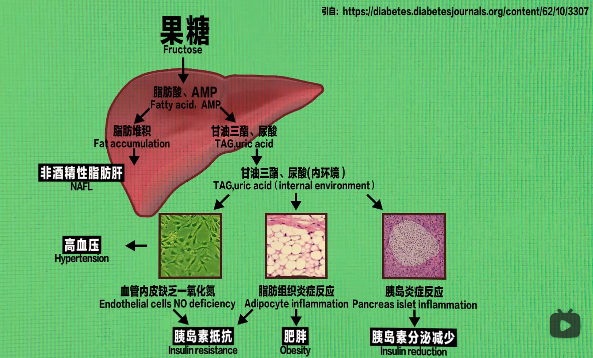

# 配料表

| 增鲜剂           |
|------------------|
| 谷氨酸钠（味精） |
| 5'-呈味核苷酸二钠 |
| 5'-肌苷酸二钠    |

| 防腐剂   |
|----------|
| 苯钾酸钠 |
| 山梨酸钾 |

| 色素   |
|--------|
| 栀子黄 |

## 糖

- [营养师赵赵：深扒21款糖和代糖，减脂抗体必修干货](https://www.bilibili.com/video/BV1H34y1E7MW)

- [冷却报告：一张图看懂：饮料中的19种甜味剂有哪些健康误区，买饮料买的明明白白](https://www.bilibili.com/video/BV1qR4y1J7Va)

- 以下糖吃进身体以后，会还原成葡萄糖和果糖

    - 过量葡萄糖：肥胖，胰岛素抵抗，痤疮，糖尿病

    - 过量果糖（代谢类似酒精）：肥胖，胰岛素抵抗，脂肪肝

    

    | 种类           | 成分                  |
    |----------------|-----------------------|
    | 蔗糖           | 葡萄糖 + 果糖         |
    | 麦芽糖         | 葡萄糖 + 葡萄糖       |
    | 蜂蜜，果葡萄糖 | 一堆葡萄糖 + 一堆果糖 |

| 糖的种类 | 甜度 | 热量 | 升糖指数（对血糖的波动） |          |          |          |      |      |
|----------|------|------|--------------------------|----------|----------|----------|------|------|
| 葡萄糖   | 0.74 | 16.7 | 100                      | 葡萄糖浆 | 果葡萄糖 |
| 蔗糖     | 1    | 16.7 | 68                       | 白砂糖   | 赤砂糖   | 冰糖     | 红糖 | 黑糖 |
| 麦芽糖   | 0.32 | 16.7 | 105                      | 麦芽糖浆 | 玉米糖浆 |
| 果糖     | 1.73 | 16.7 | 23                       | 蜂蜜     | 果汁     | 果葡萄糖 |
| 乳糖     | 0.15 | 16.7 | 46                       | 牛奶     | 乳清粉   |

### 代糖

> 人不需要任何代糖

- 吃了代糖后，可能会加大热量摄入

- 糖醇

> 热量小，对血糖的波动小

| 种类     | 甜度     | 热量 | 升糖指数 | 推荐程度   | 原料                       |
|----------|----------|------|----------|------------|----------------------------|
| 山梨糖醇 | 0.5-0.7  | 16.7 | 4        | 吃多会腹泻 | 苹果，梨，桃               |
| 麦芽糖醇 | 0.75-0.9 | 8.8  | 35       | 吃多会腹泻 | 淀粉                       |
| 木糖醇   | 1        | 11   | 12       | 吃多会腹泻 | 白桦树，橡树，玉米芯，甘蔗 |
| 乳糖醇   | 0.3-0.4  | 8.4  | 6        |            | 脱脂乳                     |
| 赤藓糖醇 | 0.6-0.8  | 0.8  | 1        | 推荐       | 自然界广泛存在             |

- 天然代糖

| 种类       | 甜度    | 热量 | 升糖指数 | 推荐程度 | 原料   |
|------------|---------|------|----------|----------|--------|
| 甘草甜素   | 200-300 | 0    | 0        |          | 甘草   |
| 甜菊糖苷   | 250-300 | 0    | 0        |          | 甜叶菊 |
| 罗汉果甜苷 | 266-344 | 0    | 0        |          | 罗汉果 |

- 人工代糖

| 种类     | 甜度       | 热量 | 升糖指数 | 推荐程度                                                                                              |
|----------|------------|------|----------|-------------------------------------------------------------------------------------------------------|
| 阿斯巴甜 | 150-250    | 0    | 0        | 不推荐                                                                                                |
| 安赛蜜   | 200        | 0    | 0        | 不推荐                                                                                                |
| 三氯蔗糖 | 600        | 0    | 0        | 能骗过舌头和大脑，但不能骗过肠道菌群，会影响肠道菌群，导致吸收葡萄糖的能力变强，最后诱发疾病；不推荐 |
| 糖精     | 240-500    | 0    | 0        | 不推荐                                                                                                |
| 阿力甜   |            |      |          | 不推荐                                                                                                |
| 纽甜     | 7000-13000 | 0    | 0        | 不推荐                                                                                                |
| 甜蜜素   | 30-40      | 0    | 0        | 被怀疑有致癌风险；不推荐                                                                              |

# 日常调味品

## 油

- [营养师赵赵：不会用油危害大，这份指南请收下！](https://www.bilibili.com/video/BV1aF411p7BR)

- 不要只吃一种油，应该轮换使用，不然会产生反式脂肪酸

- 油用错地方会产生反式脂肪酸

| 炒菜（热稳定，烟点高） |
|------------------------|
| 稻米油                 |
| 低芥酸菜籽油           |
| 精炼橄榄油（并不是特级初榨橄榄油）             |
| 花生油                 |

| 凉拌/做汤 |
|-----------|
| 橄榄油    |
| 亚麻籽油  |

| 油炸（需要饱和脂肪酸高的，产生的过氧化物较少） |
|------------------------------|
| 稻米油（只建议偶尔使用）     |
| 椰子油                       |
| 棕榈油                       |
| 动物油                       |

## 醋

- [营养师赵赵：食醋有鄙视链么？推荐2款做菜的~](https://www.bilibili.com/video/BV1JY4y1E7)

| 食品       | 国标   |
|------------|--------|
| 山西老陈醋 | T19777 |

- 配料表：

    | 成分   | 推荐程度 |
    |--------|----------|
    | 味精   | 不推荐   |
    | 增添剂 | 不推荐   |
    | 色素   | 不推荐   |

## 酱油

- [营养师赵赵：酱油分级测评，推荐1超高性价比，3健康YYDS！](https://www.bilibili.com/video/BV1DF411j7dL)

| 不推荐 |
|--------|
| 甜味剂 |
| 防腐剂 |
| 增鲜剂 |

- 推荐黄豆酿造，而不是脱脂大豆（榨油后的豆渣，进行发酵）

## 蚝油

- [营养师赵赵：蚝油有鄙视链吗？推荐4款，还有1款天花板](https://www.bilibili.com/video/BV1n34y1j7cg)

- 配料表：

    - 不推荐第一成分是水的，推荐第一成分是蚝油的

    - 推荐蚝汁>50%以上，鲜味全靠蚝汁而不是增鲜剂

    - 不推荐加防腐剂的，因此蚝油要放冰箱，不然会霉变

# 酒

| 注意事项                                                 |
|----------------------------------------------------------|
| 不要随便吃解救药物（并不是药物，而是食品）               |
| 吃药不能饮酒                                             |
| 不要和汽水，其它酒混着喝                                 |
| 不要平躺睡，最好侧着睡，避免呕吐物堵塞呼吸道，不然会窒息 |

# 饮料

## 果汁

- [营养师赵赵：果汁不要乱买，重点考虑这三类](https://www.bilibili.com/video/BV1Qi4y1D7ap)

> 不如直接吃水果

| 食品        | 成分                                       |
|-------------|--------------------------------------------|
| 果汁饮料    | 果汁>5%，>10%                              |
| 浓缩果汁    | 水和果汁（基本就是糖水）；营养有损失       |
| NFC果汁     | 有加热过程，因此营养会有损失；口感比较优秀 |
| 鲜榨果汁    | 制作过程没有杀菌，有卫生问题               |
| 冷压HPP果汁 | 最推荐；但太贵                             |

# 牛肉

## 牛排

- [营养师赵赵：牛排怎么挑？哪个部位适合你？不同国家牛排分级怎么分？看完又省99](https://www.bilibili.com/video/BV1SZ4y1z7rz)

| 种类                           | 推荐程度                                                 |
|--------------------------------|----------------------------------------------------------|
| 合成牛肉（只要没写整切，原切） | 一般会有卡拉胶，不推荐                                   |
| 整切（腌制牛排）               | 水分比较多，在腌制过程中可能会注入细菌，因此最好做成全熟 |
| 原切                           | 最推荐                                                   |

# 面

## 挂面

- [营养师赵赵：挂面有鄙视链吗？推荐四款，最后一类更健康](https://www.bilibili.com/video/BV1vS4y1v7nP)

- 配料表：

    | 成分                            | 推荐程度                                                |
    |---------------------------------|---------------------------------------------------------|
    | 栀子黄（色素）                  | 不推荐                                                  |
    | 大量盐，碱（钠含量大于900毫克） | 不推荐（钠的尽量含量小于600毫克，**最好是无钠的挂面**） |

## 意大利面

- [营养师赵赵：意面怎么挑？推荐2款高性价比，1款低热，3款健康YYDS](https://www.bilibili.com/video/BV1dL4y1F7Za)

- 营养价值比挂面高一点点

- 面配料表：

    | 成分                           | 推荐程度             |
    |--------------------------------|----------------------|
    | 栀子黄（色素）                 | 不推荐               |
    | 硬质杜兰小麦粉（一般都是进口） | 蛋白质含量更高，推荐 |

- 配料包配料表：

    | 成分               | 推荐程度           |
    |--------------------|--------------------|
    | 牛肉提取物         | 营养有损失         |
    | 食用香精           | 人体不需要，不推荐 |
    | 辣椒红             | 人体不需要，不推荐 |
    | 山梨酸钾（防腐剂） | 不推荐             |

# 冰激凌，雪糕，棒冰

- [营养师赵赵：冰淇淋有鄙视链？注意避坑，再推荐4款超级nice~](https://www.bilibili.com/video/BV1Y3411G7b1)

| 食品   | 国标  |
|--------|-------|
| 冰激凌 | 31114 |
| 雪糕   | 31119 |
| 棒冰   | 10016 |

- 配料表：

    | 工业氢化植物油（不是优质脂肪，不推荐） |
    |----------------------------------------|
    | 植脂末                                 |
    | 植物奶油                               |
    | 代可可脂                               |

    - 植脂型冰淇淋（推荐指数：还行）

    用植物油代替部分奶油

    - 以牛奶为主，配料表越短香精色素最少（最推荐）
