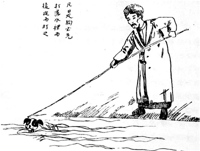

# 香港海员罢工

- 目标: 改善香港海员待遇, 而举行的罢工

- 罢工持续了56天，最终取得胜利

- 背景: 香港海员长期受英帝国的压迫剥削, 比同样是海员的白人, 待遇不平等

- 苏兆征、林伟民等工人代表开始宣传, 组织

- 在1921年3月6日的香港组建**中华海员工会联合总会**, 开始准备工作

- 9月开始第一次提出要求

    - 1.增加工资

    - 2.工会有权介绍职业等

    - 遭拒绝

- 11月开始第二次提上述要求

    - 遭拒绝

- 1922年1月12日开始第三次提提上述要求, 并限令24小时回复, 不然就罢工

    - 遭拒绝后, 开始罢工

    - 为了扩大罢工, 争取香港运输工会举行同情罢工

    - 罢工使5条太平洋航线, 9条近海航线瘫痪

    - 党领导工人运动的中国劳动组合书记部号召全国工人支援香港海员大罢工

        - 上海、湖北、河南等地以及京奉、京汉、陇海、京绥等铁路工人，纷纷成立香港海员罢工后援会

        - 中共广东支部和社会主义青年团广东区委组织全体党、团员参加接待和其他各项工作，发表《敬告罢工海员》书

- 2月底举行总同盟罢工, 3月初罢工工人达10万人以上

    - 香港出现交通运输中断, 生产停顿, 商店关门, 物价暴涨, 群众抢购大量生活用品

    - 港英当局采取离间、恫吓、威胁手段对待罢工海员，宣布海员工会为“非法团体”，派出武装军警实行戒严，封闭海员工会会所，逮捕罢工领导人，从而更加激起了海员和广大工人群众的义愤

- 3月4日沙田惨案: 港英武装军警在香港沙田地区, 向返回广州数千名罢工工人开枪扫射，当即打死6人，打伤几百人, 激起广大工人和各阶层群众的强烈义愤，纷纷提出强烈抗议

- 3月8日罢工胜利: 港英当局和轮船资本家迫于形势，遂不得不向工人屈服，答应了海员工人的基本要求

    - 广州10余万工人在东校场举行大会，欢送香港工人胜利返港

        - 会后举行大游行，先后加入游行者达30余万人

    - 此后, 长江船员; 上海邮务工人, 纱厂工人; 苏州, 无锡等工人也相继举行罢工

## reference

- [b站: 工人阶级的力量从何而来？带你走进伟大的中国工人运动史](https://www.bilibili.com/video/BV1sX4y1w7G8)

- [中国共产党新闻: 香港海员大罢工](http://cpc.people.com.cn/GB/33837/2533656.html)

# 全国劳动大会

- 第一次大会:

    - 1922年5月1-6日, 在广州举行

    - 代表分别来自12个城市, 共173人

        - 代表110个工会, 34万有组织的工人

    - 总部主任为邓中夏

    - 中国劳动组合书记部为全国工会通讯机关, 负责召集第二次大会

    - 通过《八小时工作制案》、《罢工援助》、《全国总工会组织原则》等十项决议

    - 发布[《全国劳动大会第一次会议宣言》](http://www.360doc.com/content/14/1009/14/10528452_415521874.shtml)
        > 无论外国或本国的资本家，都是我们的敌人，无论哪一国的工人们都是我们的弟兄，因此全世界工人们的联合是最必要的

        > 我们做工的时间太长了，我们再也不能为着资本家——我们的敌人——的利益来累死，我们宁可奋斗而死；我们再不能忍住我们的饥饿了；我们再不能让那些外国的或本国的监工们的手掌打到我们脸上；我们再不能看着资本家驱策那些亲爱的小孩子们死在机器旁边。我们决意也不让我们的自由完全被剥夺。所以我们要即刻联合起来，组成一个阶级的强固的紧密的阵线，向着资产阶级和压迫阶级做不断的奋斗，因为我们再不能不得到地位的改良和自由。

    - 1922年7月16-23日, 在上海南成都路, 举行第二次全国代表大会

        - 通过《关于“工会运动与共产党”的议决案》等9个决议案

        - 二大后, 工人政治觉悟迅速提高, 工人运动也出现明显变化:

            - 罢工要求从增加工资, 改善待遇的经济斗争. 变为争自由, 争民主, 反帝国主义, 反封建军阀的政治斗争
            - 工人组织程度提高, 出现许多地方总工会, 产业总工会

- 第二次大会:

    - 1925年5月1-7日, 在广州举行

    - 正、副委员长为林伟民、刘少奇

    - 邓中夏任秘书长兼宣传部长

    - 成立中华全国总工会

    - 《通过中华全国总工会总章》:

        - 取消中国劳动组合书记部

- 第三次大会:

    - 1926年5月1-12日, 在广州举行

    - 委员长为苏兆征

    - 通过《职工运动总策略》、《劳动法大纲》等决议，号召全国工人积极参加和支援北伐战争

- 第四次大会:

    - 1927年6月19-28日, 在汉口举行

    - 号召全国工人坚决反对蒋介石的叛变，继续深入开展革命斗争

    - 7月15日，汪精卫集团叛变革命后，中华全国总工会被迫转入地下斗争

    - 委员长为苏兆征

- 第五次大会:

    - 1929年11月7-10日, 在上海举行

    - 号召工人联合农民结成革命同盟，准备武装暴动，帮助农民实行土地革命，建立苏维埃政权

    - 委员长为项英

- 第六次大会:

    - 1948年8月1-22日, 在哈尔滨举行

    - 号召全国职工支援解放战争，迅速打倒国民党的反动统治，并决定恢复中华全国总工会

    - 通过了《中华全国总工会章程》

    - 名誉主席为刘少奇，主席为陈云

- 第七次大会:

    - 1953年5月2日, 在北京举行, 从此改称中国工会全国代表大会

# 安源路矿工人大罢工

- 罢工持续了4天，最终取得胜利

    - 铁路大罢工中影响力最大

    - 这是中国共产党第一次独立领导并取得完全胜利的罢工斗争

- 背景: 1922年4月28日至5月5日,  第一次直奉战争后, 直系军阀吴佩孚控制北京政府, 为了笼络工人, 标榜"保护劳工".

    - 为了清除交通系, 在北方六条铁路设立稽查员, 李大钊等人利用这次机会进行合法斗争, 以稽查员为掩护, 开展铁路工人运动:

        - 1.京汉铁路工人大罢工:

            - 铁路纵贯河北、河南和湖北三省，是连接华北和华中的交通命脉

                - 京汉铁路的运营收入是军阀吴佩孚军饷的主要来源之一

            - 1923年2月1日京汉铁路总工会成立

            - 2月4日，全路两万多工人举行大罢工，1200公里铁路顿时瘫痪

                - 外国列强的北京公使团, 召开会议, 要求北洋军阀尽快用武力镇压

                - 吴佩孚调动两万多军警在京汉铁路沿线镇压罢工工人，制造了震惊中外的二七惨案。

                - 大罢工最终失败，工人52人牺牲，300余人受伤

                    - 工人运动进入低潮, 直到1924年下半年, 深入上海纱厂工人开展工作(创办夜校)

            - 从全国来看，以1922年1月香港海员大罢工为起点，到1923年2月“二七”大罢工，出现了历时13个月的全国罢工高潮，**有100多次罢工，30多万工人参加**

            - 长辛店铁路工人大罢工:

                - 8月23日，中国劳动组合书记部主任邓中夏从北京赶到长辛店领导罢工斗争

                - 8月24日上午7时，罢工开始，长辛店3000多名工人举行罢工

                - 1922年8月24日—26日，罢工坚持了两天，取得重大胜利

        - 2.京奉铁路工人大罢工:
            - 1.山海关:

                - 1922年8月15日，山海关工友俱乐部成立，刘武担任俱乐部总干事

                - 10月9日上午8时, 刘武与杨宝昆等带领1100多名工人卧轨截车，迫使京奉铁路局答复工人提出的绝大部分条件，罢工取得胜利

            - 2.唐山制造厂:

                - 10月20日为时8天的唐山制造厂工人罢工取得胜利

        - 3.正太铁路罢工:

            - 1922年12月15日早6点, 从石家庄到太原，实现了全线总罢工

            - 经过12天的激烈斗争，正太铁路工人的大罢工终于完全取得了胜利

- 安源路矿是以下合称:

    - 1.江西萍乡的安源煤矿

    - 2.由湖南株洲到萍乡安源的株萍铁路

- 工人1.7万人

- 1921年秋冬，中共湖南支部书记毛泽东两次到安源调查，向工人进行宣传

- 年底，湖南党组织派李立三等到安源开展工作

- 1922年2月, 中共安源支部成立

- 5月，安源路矿工人俱乐部成立

- 9月初，毛泽东再次来到安源，对罢工作了部署。接着，党组织又派刘少奇到安源，加强对罢工的领导

- 9月12日，李立三主持召开安源支部会议，并成立罢工指挥部，由李立三任总指挥，刘少奇任俱乐部全权代表。

    - 成立侦察队等组织，以负责持续罢工期间的秩序

- 9月14日举行大罢工，俱乐部发表《萍乡安源路矿工人罢工宣言》

- 9月18日罢工胜利

- 12月《对于目前实际问题的计划》中指出在铁路, 海员, 矿工是"三个有力分子"

## reference

- [京汉铁路工人大罢工](http://cpc.people.com.cn/GB/33837/2533729.html)

# 五卅运动

- 22家工厂, 4万工人, 罢工胜利

- 1925年4月 青岛日资纱厂2万工人罢工, 历时22日, 罢工胜利

- 5月7日 上海日本纺织厂开会决议, 拒绝工人组织工会, 要求租界和中国官方取缔工会活动

- 5月15日 日本宣布上海内外棉第七厂停工, 工人不准进厂

    - 工人共产党员顾正红带领工人冲进工厂, 要求复工和发工资, 日本厂长向工人开枪, 10人被打伤, 顾正红被打死
    - 事后工人愤怒, 当天罢工

- 5月16-17日 中共中央指示各区委, 地委, 独立支部, 立即号召工会, 农会, 学生会等团体发表宣言, 通电"反对日付枪杀同胞", 并籌募捐款援助罢工工人, 掀起反日爱国运动

    - 上海学生响应号召, 走上街头进行宣传, 募捐活动

        - 遭到租界拘禁

- 5月28日 中共中央召开紧急会议, 陈独秀说道:中国工人不但要扩大, 巩固自己阶级的联合防线, 而且急需工农联合的成立, 如此才能取得工人阶级在政治斗争和经济斗争的初步胜利

    - 会议决定: 以反帝国主义屠杀中国工人为中心的口号, 在租界内举行大规模反帝示威活动, 反对租界提出的压迫华人四项提案

- 5月30日 上海二千余学生分头在公共租界各马路进行宣传讲演，一百余名遭巡捕（租界内的警察）逮捕

    - 引起了学生和市民的极大愤慨，有近万人聚集在巡捕房门口，要求释放被捕学生。英帝国主义的巡捕向群众开枪，打死打伤许多人。 这就是震惊中外的五卅惨案。

- 在共产党人蔡和森、李立三 、刘少奇等的领导下，上海总工会于6月1日宣告成立，李立三任委员长, 同时举行了20余万工人的总同盟罢工、5万余学生的罢课，绝大部分商人也举行了罢市

- 英、美、意、法等国军舰上的海军陆战队全部上岸，并占领上海大学、大夏大学等学校

- 6月7日，由上海总工会、上海学生联合会和各马路商界联合会推举代表组成工商学联合会，提出惩凶、取消领事裁
判权、废除英、日对中国一切不平等条约等17项交涉条件。北京、南京、汉口、广州、青岛、天津、重庆、长沙、海丰、陆丰等近500个城镇人民，奋起举行游行示威、罢工、罢课、罢市以及通电、捐款等，表示坚决支持，形成全国规模的反帝爱国运动，并 得到国际工人阶级的支援。

## 期间中苏关系

年份:1925年

5 月31日 承认外蒙是中国的一部分，尊重中国对外蒙的主权，并答应从外蒙撤军。中苏从此正式建交。

- 11月26日 外蒙古政府宣布废除君主立宪制度，成立“蒙古人民共和国”。

    - 1945年8月14日 国民政府与前苏联签订《中苏友好同盟条约》，同意外蒙古根据公投结果独立

5 月18日 斯大林：“在中国，民族资产阶级已分化成革命的和妥协的两派。” “把中国农民卷入革命愈迅速愈彻底，中国反帝国主义的战线愈有力愈强大。”

9 月23日 斯大林送给冯玉祥部国民一军军火

12月 3日 斯大林：北京新中央政府应由冯玉祥及温和派组成，建立纯国民党政府则不可能。

## 省港大罢工

- 罢工坚持16个月， 为了支援北伐战争，1926年10月初，罢工工人代表大会决定停止罢工

- 香港罢工:

    - 为支援上海“五卅” 声明拥护上海工商学联合会提出的17项条件，并提出香港市民有政治自由、法律平等、普遍选举、劳动立法等6项要求

    - 1925年6月19日 香港的工会由共产党人邓中夏（中华全国总工会总书记）及苏兆征（香港海员工会）等人以中国国民党员身分组织，以全国总工会名义，召集香港各工会联席会议，成立全港工团联合会，决议罢工。 香港的海员、电车、印务等工会首先宣布罢工，其他工会随即响应

        - 港英当局实行紧急戒严和封锁对付罢工，引起罢工群众的愤怒，纷纷离港到广州

- 沙基惨案:

    - 6月21日 广州的香港工人与广州各界群众约10万人举行示威游行。队伍经沙面租界对岸的沙基，遭英、法水兵射击和军舰炮轰，死100余人，重伤170余人，造成沙基惨案

        - 赴会者包括省港澳各团体，省内国立市公私立等大小男女学校、商界各团体、农民团体及黄埔学生军、粤军、湘军、警卫军等，人数十万余众

- 省港大罢工:

    - 6月29日 在苏兆征、邓中夏、陈延年等领导下，香港25万工人罢工，13万人回广州，爆发了震惊中外的省港大罢工

    - 7月初旬，中华全国总工会召开香港、广州800多人参加的罢工工人代表大会，在广州成立省港罢工委员会，下设工人武装纠察队等机构，苏兆征被选为罢工委员会委员长。

    - 罢工委员会采取罢工、排货、封锁3项措施同英帝国主义作斗争

    - 工人纠察队在各海口驻防，东起汕头，西至北海，对千里海岸线实行封锁，使香港经济活动陷于全面瘫痪，航运停顿，进出口贸易锐减，商业萧条

        - 11-12月，香港宣告破产的商店达3000余家，股票、地产急速贬值。港英当局财政收入萎缩，1925年财政赤字达58万英镑。罢工期间，港英当局每日损失180万元。

        - 省港罢工委员会还规定“特许证”制度，“凡不是英国货及英国船不经过香港者可准其直来广州”。此举打破了各帝国主义一致对付广州的局面，并争取了广东商人的中立，稳定广州金融。

    - 1926年夏，广州国民政府出师北伐，数千罢工工人组成运输队、宣传队、卫生队、慰劳队等开赴前线，罢工工人纠察队镇守后方

        - 10月 中共广东区委和省港罢工委员会根据形势的变化，宣布结束罢工

    - 大罢工迫使港英当局对其统治政策采取了重大的调整，逐步减轻了对华人的歧视与压迫

        - 香港第17任总督金文泰一上任，即打破了行政局历来不许华人参与的惯例，首次委任了一名华人为行政局成员，之后又扩大立法局组织，增加了两名华人非官守议员

        - 在社会和文化教育政策上，港英当局也逐步开始调整，1927年香港大学设立中文系，改变了历来港大只以英文授课的做法。

## reference

- [五卅运动](http://www.hongqipress.com/wsyd/)

# 三一八惨案

3月12日 在冯玉祥的国民军和张作霖的奉军交战期间，日本派遣军舰掩护奉军舰队进逼天津大沽口，炮击国民军阵地，被国民军还击, 并击退

- 3月16日 日本联合英、美等八国援引《辛丑条约》海口不得设防之条款，向段祺瑞执政府发出要求44小时撤除大沽口防务的最后通牒, 否则以武力解决, 同时各国派军舰云集大沽口，武力威胁北洋政府

    - 接到后称“最后通牒”内容“超越《辛丑条约》之范围”，所以“不能认为适当”。因为按《辛丑条约》，只有大沽口至北京一线炮台应予以一律削平，却并没有相关条文对水道进行规定

- 3月18日

    - 国民党北京执行部、北京市党部，中共北方区委、北京市委，北京总工会，学生联合会等团体于80多所学校共约5000多人在天安门举行“反对八国最后通牒的国民大会”（即“318”抗议大会），号称十万人抗议大会

        - 李大钊、赵世炎、陈乔年参加大会

        - 大会主席是中俄大学校长、国民党执行委员会代表徐谦

    - 大会结束后，游行队伍由李大钊率领冲向国务院, 在段祺瑞执政府（今中国人民大学清史研究所）门前广场请愿

        - 遭段祺瑞卫队的屠杀，死47人，伤200人

            - 事件发生时段祺瑞并不在执政府。这时执政府卫队长乃下令开枪。

            - 死者中为人们所熟知的有北京女子师范大学学生刘和珍，李大钊和陈乔年也负伤

            - 军警在清理现场时，竟然将死者财物尽行掠去，甚至连衣服也全部剥光。

3月20日 中共中央发表《为段祺瑞屠杀人民告全国民众书》，号召“全国商人、学生、工人、农民、兵士，应急起联合起来，不分党派，一致奋斗，发动一个比‘五卅’运动更伟大的运动，以雪最后通牒之耻”

- 3月23日 北京总工会、全国学生总会等团体及各校学生1万多人，在北大三院举行“三一八死难烈士追悼大会”

    - 北京各校纷纷罢课，为死难烈士举行追悼会

    - 知识分子痛斥执政府的行为:

        - 鲁迅把这一天称作“国民以来最黑暗的一天”，在23日的追悼大会上题写挽联：“死了倒也罢了，活着又怎么做。”后又就此惨案连续写了七篇檄文

            > 我懂得衰亡民族之所以默无声息的缘由了。沉默呵，沉默呵！不在沉默中爆发，就在沉默中灭亡

        - 林语堂在打狗释疑中提到:

            > 大家热爱和平, 反而没有和平. 若惨案后教育界之沉默使我想起了, 实要毛骨悚然.因为热爱和平, 才有这种惨案发生.

            

4月 政府下令通缉徐谦、李大钊、李石曾、易培基、顾孟余五人。朱家骅、蒋梦麟、鲁迅（周树人）等几十人也上了黑名单

4月9日，鹿钟麟率国民军以段祺瑞暗通奉系为罪名包围国务院，段祺瑞逃入东交民巷法国使馆，执政府倒台

4月17日奉军占领北京。进京后查封《京报》馆和一批报刊

4月26日清晨邵飘萍被秘密处决。张学良逮捕了共产党员郭隆真，然后派奉军闯进北大、女师大、中俄大学等，大肆查禁书刊，搜捕反对人士。

